# 🌟 Awesome LLM Reasoning Data

**English** · [简体中文](README_zh.md)

> A curated, field-learning repository for post-training reasoning data: what it is, how it is built, how it is verified, how it enters training, and how to audit it.

  

**Awesome LLM Reasoning Data** is a field map, not just a paper list: learning guides explain the concepts, category pages organize the papers by subfield, cards summarize data objects and risks, and a searchable site indexes the structured metadata. Everything is organized around one practical question:

> When a model becomes better at reasoning after post-training, what data record, feedback signal, verifier, reward, environment, or judge actually made that possible?

- 📄 Companion paper: [A Primer in Post-Training Reasoning Data](https://arxiv.org/abs/2606.02113)
- 🔎 Searchable site: in progress
- 🤖 Ask: [source-grounded AI assistant · launch pending](https://renbing-sumeru.github.io/Awesome-LLM-Reasoning-Data/ask/)

## 🚀 How to Use This Repo

A useful reasoning-data sample is rarely `prompt → answer`. It is usually:

  

Pick the path that matches your goal:

| Your goal | Suggested route |
|---|---|
| New to the field | Walk the [Learning Path](#-learning-path) from Stage 1, starting with [00 · Start here](docs/00_start_here.md) |
| Building a dataset | Follow the [construction cookbook](docs/05_construction_cookbook.md), then compare [release cards](cards/releases/) and [recipe cards](cards/recipes/) |
| Auditing verifiers or claims | Start from [verifiers and rewards](docs/06_verifiers_and_rewards.md) and [audit and failure modes](docs/09_audit_and_failure_modes.md) |
| Looking for a specific paper | Jump into the [Contents](#-contents) below, or grep [data/papers.yaml](data/papers.yaml) and [exports/](exports/) |
| Contributing | Pick a gap from [needs_search](reports/needs_search.md) and read [CONTRIBUTING.md](CONTRIBUTING.md) |

## 🔥 Latest Updates

| Date | Update |
|---|---|
| 2026-06-15 | Promoted the collection to **165 verified entries**, **87 linked cards**, and **53 L5 audit-ready cards**. |
| 2026-06-15 | Pinned official artifacts: **41 code**, **27 data**, **20 Hugging Face**, and **25 project** links. |
| 2026-06-15 | Rebuilt the searchable site, paper pages, exports, and QA reports from structured metadata, so every count stays reproducible. |

> Metadata stays conservative: links that are not verified locally remain in [needs_search](reports/needs_search.md) instead of being promoted.

📊 Snapshot stats

| Metric | Count |
|---|---:|
| Total structured entries | 280 |
| Verified official primary links | 165 |
| Entries with paper/arXiv/venue/DOI links | 165 |
| Unique entry-linked cards | 87 |
| Card files | 89 |
| L5 audit-ready entries | 53 |
| Needs search / metadata | 115 |
| Official code links | 41 |
| Official data links | 27 |
| Hugging Face links | 20 |
| Project links | 25 |

## 📚 Contents

Each track page includes a track explanation, a read-first table, the full paper list, and an audit checklist.

### 🧭 1 · Background / Foundations `00`

<blockquote>

<code>00</code> <b><a href="papers/00_background_foundations/00_foundations_and_primers.md">Foundations & Primers</a></b> · 84 papers

- [🧭 Post-training surveys](papers/00_background_foundations/00_foundations_and_primers.md#post-training-surveys)
- [🧠 Reasoning LLM surveys](papers/00_background_foundations/00_foundations_and_primers.md#reasoning-llm-surveys)
- [📦 Data documentation / datasheets](papers/00_background_foundations/00_foundations_and_primers.md#data-documentation-datasheets)
- [🧪 RLHF / reward-model surveys](papers/00_background_foundations/00_foundations_and_primers.md#rlhf-reward-model-surveys)
- [🌐 Agent data / tool-use surveys](papers/00_background_foundations/00_foundations_and_primers.md#agent-data-tool-use-surveys)
- [🧯 Contamination / evaluation surveys](papers/00_background_foundations/00_foundations_and_primers.md#contamination-evaluation-surveys)

</blockquote>

### 🧬 2 · Core Reasoning Data Types `01–07`

<blockquote>

<code>01</code> <b><a href="papers/01_core_reasoning_data_types/01_instruction_demonstration_rationale_data.md">Instruction / Demo / Rationale</a></b> · 58 papers

- [🧱 Instruction tuning / SFT data](papers/01_core_reasoning_data_types/01_instruction_demonstration_rationale_data.md#instruction-tuning-sft-data)
- [🧑‍🏫 Human demonstrations](papers/01_core_reasoning_data_types/01_instruction_demonstration_rationale_data.md#human-demonstrations)
- [🤖 Synthetic instruction data](papers/01_core_reasoning_data_types/01_instruction_demonstration_rationale_data.md#synthetic-instruction-data)
- [🧠 Chain-of-thought / rationale data](papers/01_core_reasoning_data_types/01_instruction_demonstration_rationale_data.md#chain-of-thought-rationale-data)
- [🔁 Self-training / STaR](papers/01_core_reasoning_data_types/01_instruction_demonstration_rationale_data.md#self-training-star)
- [✂️ Long/short CoT distillation](papers/01_core_reasoning_data_types/01_instruction_demonstration_rationale_data.md#long-short-cot-distillation)

<code>02</code> <b><a href="papers/01_core_reasoning_data_types/02_preference_reward_feedback_data.md">Preference & Reward Feedback</a></b> · 73 papers

- [🤝 Human preference data / RLHF](papers/01_core_reasoning_data_types/02_preference_reward_feedback_data.md#human-preference-data-rlhf)
- [⚖️ DPO / preference optimization](papers/01_core_reasoning_data_types/02_preference_reward_feedback_data.md#dpo-preference-optimization)
- [🎚️ Scalar reward / ORM data](papers/01_core_reasoning_data_types/02_preference_reward_feedback_data.md#scalar-reward-orm-data)
- [🤖 RLAIF / synthetic feedback](papers/01_core_reasoning_data_types/02_preference_reward_feedback_data.md#rlaif-synthetic-feedback)
- [🧪 Reward-model benchmarks](papers/01_core_reasoning_data_types/02_preference_reward_feedback_data.md#reward-model-benchmarks)
- [🧾 Rubric-conditioned rewards](papers/01_core_reasoning_data_types/02_preference_reward_feedback_data.md#rubric-conditioned-rewards)

<code>03</code> <b><a href="papers/01_core_reasoning_data_types/03_programmatically_verifiable_outcome_data.md">Programmatic Verification</a></b> · 94 papers

- [📐 Math answer-verifiable data](papers/01_core_reasoning_data_types/03_programmatically_verifiable_outcome_data.md#math-answer-verifiable-data)
- [🧮 Math RLVR datasets](papers/01_core_reasoning_data_types/03_programmatically_verifiable_outcome_data.md#math-rlvr-datasets)
- [💻 Code execution / unit-test data](papers/01_core_reasoning_data_types/03_programmatically_verifiable_outcome_data.md#code-execution-unit-test-data)
- [🧾 Formal proof / Lean / theorem proving](papers/01_core_reasoning_data_types/03_programmatically_verifiable_outcome_data.md#formal-proof-lean-theorem-proving)
- [🧪 Verifier robustness and answer extraction](papers/01_core_reasoning_data_types/03_programmatically_verifiable_outcome_data.md#verifier-robustness-and-answer-extraction)
- [🧰 Programmatic benchmarks](papers/01_core_reasoning_data_types/03_programmatically_verifiable_outcome_data.md#programmatic-benchmarks)

<code>04</code> <b><a href="papers/01_core_reasoning_data_types/04_process_trace_supervision_data.md">Process / Trace Supervision</a></b> · 25 papers

- [🪜 Human step-level labels](papers/01_core_reasoning_data_types/04_process_trace_supervision_data.md#human-step-level-labels)
- [🧪 Process reward models](papers/01_core_reasoning_data_types/04_process_trace_supervision_data.md#process-reward-models)
- [🔁 Rollout-value supervision](papers/01_core_reasoning_data_types/04_process_trace_supervision_data.md#rollout-value-supervision)
- [🛠️ Automatic process supervision](papers/01_core_reasoning_data_types/04_process_trace_supervision_data.md#automatic-process-supervision)
- [❌ First-error localization](papers/01_core_reasoning_data_types/04_process_trace_supervision_data.md#first-error-localization)
- [📊 PRM benchmarks and evaluation](papers/01_core_reasoning_data_types/04_process_trace_supervision_data.md#prm-benchmarks-and-evaluation)

<code>05</code> <b><a href="papers/01_core_reasoning_data_types/05_rollout_search_test_time_trace_data.md">Rollout / Search / TTC Trace</a></b> · 39 papers

- [🎲 Multiple rollouts / best-of-N](papers/01_core_reasoning_data_types/05_rollout_search_test_time_trace_data.md#multiple-rollouts-best-of-n)
- [🌳 Search trees / MCTS](papers/01_core_reasoning_data_types/05_rollout_search_test_time_trace_data.md#search-trees-mcts)
- [🔎 Rejection sampling traces](papers/01_core_reasoning_data_types/05_rollout_search_test_time_trace_data.md#rejection-sampling-traces)
- [🧠 Self-consistency / repeated sampling](papers/01_core_reasoning_data_types/05_rollout_search_test_time_trace_data.md#self-consistency-repeated-sampling)
- [⏱️ Test-time compute logs](papers/01_core_reasoning_data_types/05_rollout_search_test_time_trace_data.md#test-time-compute-logs)
- [✂️ Long2short / distill-from-search](papers/01_core_reasoning_data_types/05_rollout_search_test_time_trace_data.md#long2short-distill-from-search)

<code>06</code> <b><a href="papers/01_core_reasoning_data_types/06_environment_agent_trajectory_data.md">Environment & Agent Trajectories</a></b> · 95 papers

- [🛠️ Tool-use data](papers/01_core_reasoning_data_types/06_environment_agent_trajectory_data.md#tool-use-data)
- [🌍 Web/browser agents](papers/01_core_reasoning_data_types/06_environment_agent_trajectory_data.md#web-browser-agents)
- [📱 App/mobile agents](papers/01_core_reasoning_data_types/06_environment_agent_trajectory_data.md#app-mobile-agents)
- [🖥️ OS/desktop agents](papers/01_core_reasoning_data_types/06_environment_agent_trajectory_data.md#os-desktop-agents)
- [🧑‍💻 SWE/repository agents](papers/01_core_reasoning_data_types/06_environment_agent_trajectory_data.md#swe-repository-agents)
- [🔁 Replayable trajectory data](papers/01_core_reasoning_data_types/06_environment_agent_trajectory_data.md#replayable-trajectory-data)
- [🧰 Agent benchmarks and terminal predicates](papers/01_core_reasoning_data_types/06_environment_agent_trajectory_data.md#agent-benchmarks-and-terminal-predicates)

<code>07</code> <b><a href="papers/01_core_reasoning_data_types/07_judgment_rubric_domain_expert_data.md">Judgment / Rubric / Domain Expert</a></b> · 83 papers

- [⚖️ LLM-as-judge data](papers/01_core_reasoning_data_types/07_judgment_rubric_domain_expert_data.md#llm-as-judge-data)
- [🧑‍⚖️ Human/expert judgment](papers/01_core_reasoning_data_types/07_judgment_rubric_domain_expert_data.md#human-expert-judgment)
- [🩺 Medical reasoning / health rubrics](papers/01_core_reasoning_data_types/07_judgment_rubric_domain_expert_data.md#medical-reasoning-health-rubrics)
- [🛡️ Safety reasoning data](papers/01_core_reasoning_data_types/07_judgment_rubric_domain_expert_data.md#safety-reasoning-data)
- [🧾 Factuality / grounding](papers/01_core_reasoning_data_types/07_judgment_rubric_domain_expert_data.md#factuality-grounding)
- [⚖️ Legal reasoning](papers/01_core_reasoning_data_types/07_judgment_rubric_domain_expert_data.md#legal-reasoning)
- [🏦 Financial reasoning](papers/01_core_reasoning_data_types/07_judgment_rubric_domain_expert_data.md#financial-reasoning)
- [🧪 Rubric reward models](papers/01_core_reasoning_data_types/07_judgment_rubric_domain_expert_data.md#rubric-reward-models)

</blockquote>

### 🛠️ 3 · Data Lifecycle `08–13`

<blockquote>

<code>08</code> <b><a href="papers/02_data_lifecycle/08_data_construction_open_release_recipes.md">Construction & Open Releases</a></b> · 108 papers

- [🧱 Prompt sourcing](papers/02_data_lifecycle/08_data_construction_open_release_recipes.md#prompt-sourcing)
- [✍️ Teacher trace generation](papers/02_data_lifecycle/08_data_construction_open_release_recipes.md#teacher-trace-generation)
- [🔎 Rejection sampling / search-generated data](papers/02_data_lifecycle/08_data_construction_open_release_recipes.md#rejection-sampling-search-generated-data)
- [🔁 Self-play / self-improvement](papers/02_data_lifecycle/08_data_construction_open_release_recipes.md#self-play-self-improvement)
- [🧪 Filtering and verifier refresh](papers/02_data_lifecycle/08_data_construction_open_release_recipes.md#filtering-and-verifier-refresh)
- [🏗️ Open reasoning data releases](papers/02_data_lifecycle/08_data_construction_open_release_recipes.md#open-reasoning-data-releases)
- [🧬 Data lineage and release metadata](papers/02_data_lifecycle/08_data_construction_open_release_recipes.md#data-lineage-and-release-metadata)

<code>09</code> <b><a href="papers/02_data_lifecycle/09_training_usage_optimization_objectives.md">Training Usage & Objectives</a></b> · 97 papers

- [🧱 SFT / instruction tuning](papers/02_data_lifecycle/09_training_usage_optimization_objectives.md#sft-instruction-tuning)
- [📚 Distillation](papers/02_data_lifecycle/09_training_usage_optimization_objectives.md#distillation)
- [⚖️ Preference optimization](papers/02_data_lifecycle/09_training_usage_optimization_objectives.md#preference-optimization)
- [🎚️ Reward modeling / ORM](papers/02_data_lifecycle/09_training_usage_optimization_objectives.md#reward-modeling-orm)
- [🪜 PRM / process supervision](papers/02_data_lifecycle/09_training_usage_optimization_objectives.md#prm-process-supervision)
- [🏋️ RLVR / verifier RL](papers/02_data_lifecycle/09_training_usage_optimization_objectives.md#rlvr-verifier-rl)
- [🌐 Agent training](papers/02_data_lifecycle/09_training_usage_optimization_objectives.md#agent-training)
- [🧪 Evaluation / reranking / audit](papers/02_data_lifecycle/09_training_usage_optimization_objectives.md#evaluation-reranking-audit)

<code>10</code> <b><a href="papers/02_data_lifecycle/10_scaling_rlvr_test_time_compute.md">Scaling / RLVR / TTC</a></b> · 90 papers

- [📈 Data scaling](papers/02_data_lifecycle/10_scaling_rlvr_test_time_compute.md#data-scaling)
- [🔁 Data reuse and uniqueness](papers/02_data_lifecycle/10_scaling_rlvr_test_time_compute.md#data-reuse-and-uniqueness)
- [⏱️ Test-time compute](papers/02_data_lifecycle/10_scaling_rlvr_test_time_compute.md#test-time-compute)
- [🎲 pass@k / sampling budget](papers/02_data_lifecycle/10_scaling_rlvr_test_time_compute.md#pass-k-sampling-budget)
- [🧪 Verifier scaling](papers/02_data_lifecycle/10_scaling_rlvr_test_time_compute.md#verifier-scaling)
- [🏋️ RLVR optimization scaling](papers/02_data_lifecycle/10_scaling_rlvr_test_time_compute.md#rlvr-optimization-scaling)
- [🔍 Scaling attribution](papers/02_data_lifecycle/10_scaling_rlvr_test_time_compute.md#scaling-attribution)

<code>11</code> <b><a href="papers/02_data_lifecycle/11_benchmarks_evaluation_surfaces.md">Benchmarks & Evaluation</a></b> · 109 papers

- [📐 Math benchmarks](papers/02_data_lifecycle/11_benchmarks_evaluation_surfaces.md#math-benchmarks)
- [💻 Code benchmarks](papers/02_data_lifecycle/11_benchmarks_evaluation_surfaces.md#code-benchmarks)
- [🧾 Proof benchmarks](papers/02_data_lifecycle/11_benchmarks_evaluation_surfaces.md#proof-benchmarks)
- [🌐 Agent benchmarks](papers/02_data_lifecycle/11_benchmarks_evaluation_surfaces.md#agent-benchmarks)
- [⚖️ Rubric/domain benchmarks](papers/02_data_lifecycle/11_benchmarks_evaluation_surfaces.md#rubric-domain-benchmarks)
- [🧪 Reward-model benchmarks](papers/02_data_lifecycle/11_benchmarks_evaluation_surfaces.md#reward-model-benchmarks)
- [🧯 Live / contamination-resistant benchmarks](papers/02_data_lifecycle/11_benchmarks_evaluation_surfaces.md#live-contamination-resistant-benchmarks)

<code>12</code> <b><a href="papers/02_data_lifecycle/12_frontier_reports_data_disclosure_ledger.md">Frontier Disclosure Ledger</a></b> · 40 papers

- [🚀 DeepSeek-R1 family](papers/02_data_lifecycle/12_frontier_reports_data_disclosure_ledger.md#deepseek-r1-family)
- [🌙 Kimi reasoning reports](papers/02_data_lifecycle/12_frontier_reports_data_disclosure_ledger.md#kimi-reasoning-reports)
- [🐉 Qwen reasoning/math/code reports](papers/02_data_lifecycle/12_frontier_reports_data_disclosure_ledger.md#qwen-reasoning-math-code-reports)
- [🧠 Magistral / Phi / Nemotron style reports](papers/02_data_lifecycle/12_frontier_reports_data_disclosure_ledger.md#magistral-phi-nemotron-style-reports)
- [🧪 RLVR recipe reports](papers/02_data_lifecycle/12_frontier_reports_data_disclosure_ledger.md#rlvr-recipe-reports)
- [🧬 What is disclosed vs hidden](papers/02_data_lifecycle/12_frontier_reports_data_disclosure_ledger.md#what-is-disclosed-vs-hidden)

<code>13</code> <b><a href="papers/02_data_lifecycle/13_audit_failure_contamination_verifier_attacks.md">Audit & Failure Modes</a></b> · 68 papers

- [🧯 Benchmark contamination](papers/02_data_lifecycle/13_audit_failure_contamination_verifier_attacks.md#benchmark-contamination)
- [🔍 Search-time contamination](papers/02_data_lifecycle/13_audit_failure_contamination_verifier_attacks.md#search-time-contamination)
- [🧬 Hidden lineage / teacher leakage](papers/02_data_lifecycle/13_audit_failure_contamination_verifier_attacks.md#hidden-lineage-teacher-leakage)
- [🎮 Reward hacking](papers/02_data_lifecycle/13_audit_failure_contamination_verifier_attacks.md#reward-hacking)
- [🧪 Verifier gaming](papers/02_data_lifecycle/13_audit_failure_contamination_verifier_attacks.md#verifier-gaming)
- [⚖️ LLM-as-judge attacks](papers/02_data_lifecycle/13_audit_failure_contamination_verifier_attacks.md#llm-as-judge-attacks)
- [🧨 Spurious rewards](papers/02_data_lifecycle/13_audit_failure_contamination_verifier_attacks.md#spurious-rewards)
- [📉 Reproducibility failures](papers/02_data_lifecycle/13_audit_failure_contamination_verifier_attacks.md#reproducibility-failures)

</blockquote>

## 🛤️ Learning Path

Four stages, in reading order. Each stage starts from the learning guides; the must-read papers for each stage are being curated and will land here.

**🌱 Stage 1 · Build the mental model** — what the field studies and how the data is organized

- [00 · Start here](docs/00_start_here.md) - zero-to-field overview and reading paths
- [01 · What is post-training reasoning data?](docs/01_what_is_post_training_reasoning_data.md) - the verifier-bearing sample mental model
- [02 · Verifier-anchored taxonomy](docs/02_verifier_anchored_taxonomy.md) - classify papers by feedback contract, not only domain
- Stage must-reads: curation in progress

**🔬 Stage 2 · Know the data objects** — what a well-formed sample looks like and how quality is measured

- [03 · Reasoning data objects](docs/03_reasoning_data_objects.md) - what fields each data object must serialize
- [04 · Data quality](docs/04_data_quality.md) - quality dimensions beyond accuracy
- Stage must-reads: curation in progress

**⚙️ Stage 3 · Construct, verify, and train** — how data is produced, scored, trained on, and scaled

- [05 · Construction cookbook](docs/05_construction_cookbook.md) - prompt sourcing, teacher traces, filtering, release metadata
- [06 · Verifiers and rewards](docs/06_verifiers_and_rewards.md) - how to audit checkers, judges, rubrics, and rewards
- [07 · Agent trajectory data](docs/07_agent_trajectory_data.md) - state/action/replay fields for tools, web, OS, and SWE
- [08 · Scaling and test-time compute](docs/08_scaling_and_test_time_compute.md) - separate data, verifier, optimizer, and budget effects
- Stage must-reads: curation in progress

**🕵️ Stage 4 · Audit and practice** — how to catch leakage and gaming, then apply it in engineering

- [09 · Audit and failure modes](docs/09_audit_and_failure_modes.md) - leakage, contamination, verifier gaming, judge attacks
- [10 · Industry onboarding path](docs/10_industry_onboarding_path.md) - a practical path for engineers entering the field
- Stage must-reads: curation in progress

## 🔎 Searchable Website (In Progress)

The searchable site is still being built. Once it ships, it will support search plus filters for year, venue, source role, verification contract, supervision granularity, training use, curation level, status, and artifact availability. Until then, use the [Contents](#-contents) above and the [exports/](exports/) files.

🧩 Repository structure

| Path | What it is for |
|---|---|
| [docs/](docs/) | Conceptual lessons: mental model, taxonomy, construction cookbook, verifiers, agent trajectories, scaling, and failure modes. |
| [papers/](papers/README.md) | Field navigation: one page per track with read-first tables, full paper lists, and audit checklists. |
| [cards/](cards/README.md) | Learning cards: paper/data/verifier/recipe/benchmark/failure summaries with links and audit questions. |
| [data/papers.yaml](data/papers.yaml) | Structured source of truth for paper metadata, roles, contracts, summaries, links, and curation levels. |
| [docs/index.html](docs/index.html) | Searchable web index (in progress), generated from structured data. |
| [reports/](reports/) | Public QA and coverage: link coverage, needs-search, release notes, and quality audits. |
| [exports/](exports/) | CSV, JSON, and BibTeX exports for readers who want to reuse the data. |
| [scripts/](scripts/) | Reproducible generators and validators. |
| [ROADMAP.md](ROADMAP.md) | Public priorities for making the collection more useful and citable. |

## 🤝 Contributing

Please do not submit only a paper title. A useful contribution includes official links, source role, verification contract, supervision granularity, training use, and a one-line summary, with card and audit fields when available. Start with [CONTRIBUTING.md](CONTRIBUTING.md); open gaps live in [needs_search](reports/needs_search.md) and [ROADMAP.md](ROADMAP.md).

🧱 Curation levels

| Level | Meaning |
|---|---|
| `L0_seeded` | Only a title or bibliography seed is known. |
| `L1_link_verified` | Official paper, arXiv, venue, or DOI link is pinned. |
| `L2_artifact_verified` | Code, data, project, or model artifact links are also checked. |
| `L3_summary_ready` | One-line summary and why-it-matters rationale are present. |
| `L4_carded` | A local card explains data object, verifier, use, and audit fields. |
| `L5_audit_ready` | The card includes concrete risks, missing fields, and audit questions. |

## 📜 Citation

If this repository helps your related work, dataset construction, verifier design, or reading group, please cite the companion paper and link this repository. See [CITATION.cff](CITATION.cff).

## 📄 License

MIT. See [LICENSE](LICENSE).
