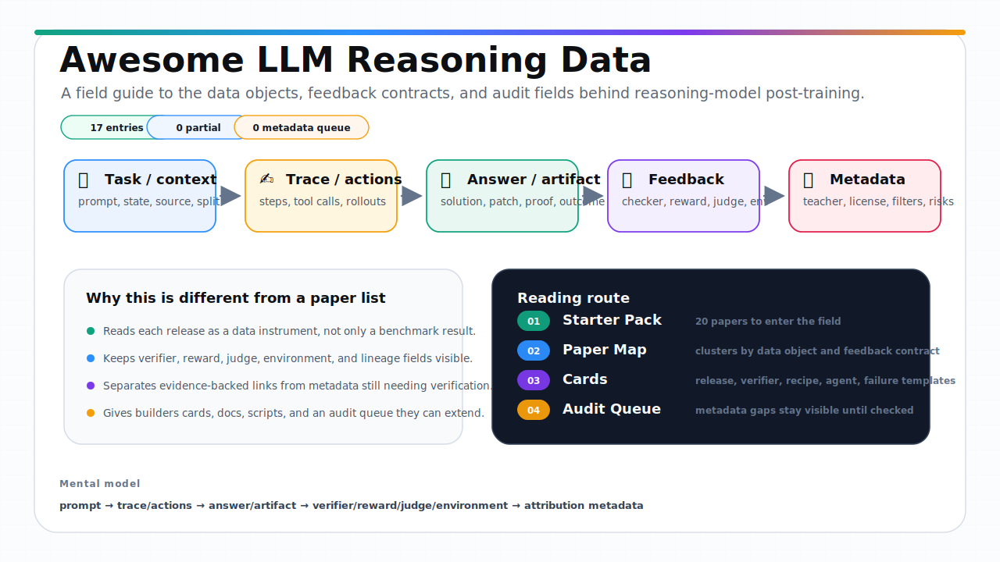
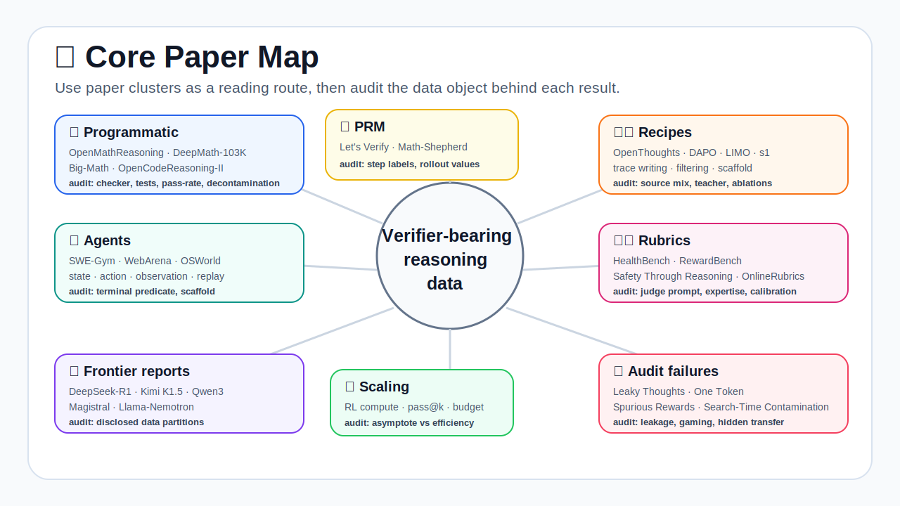
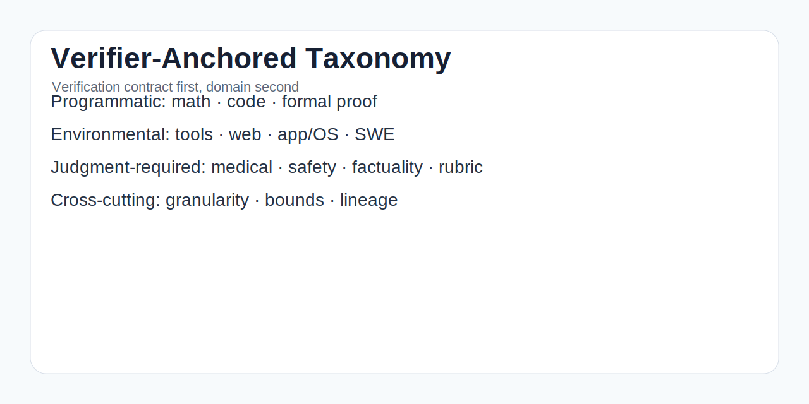
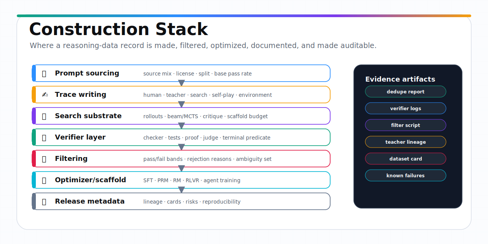
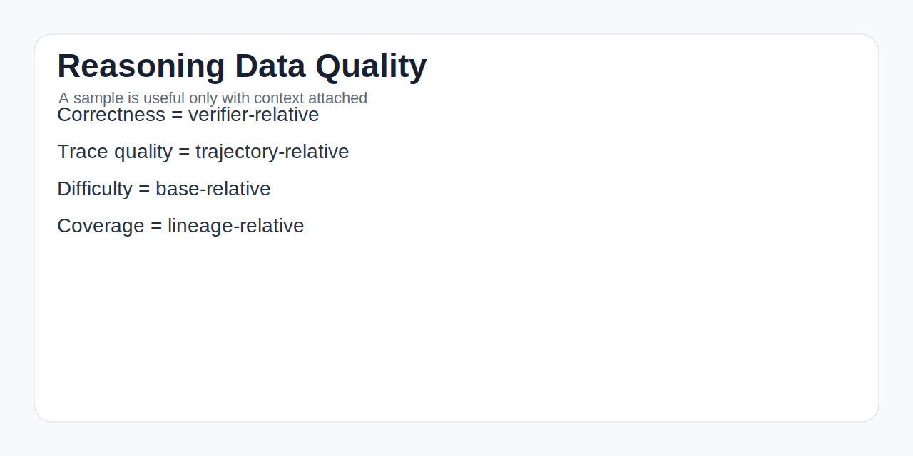
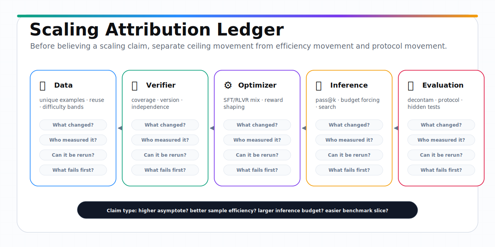

<h1>🌟 Awesome LLM Reasoning Data</h1>

> A learning repository for understanding post-training reasoning data: what it is, how it is built, how it is verified, how it enters training, and how to audit it.

  

**Awesome LLM Reasoning Data** is designed as a field-learning repository, not just a paper list.
If you want to understand large-model post-training reasoning data, you should be able to start here, learn the core vocabulary, follow a reading path, inspect representative papers, open paper-card sources, and gradually build a mental model of the whole area.

The repository is organized around one practical question:

> When a model becomes better at reasoning after post-training, what data record, feedback signal, verifier, reward, environment, or judge actually made that possible?

To answer that, the repo combines four layers:

- 🧭 **Learning guides** that explain concepts and reading paths.
- 📚 **Paper maps** that organize work by subfield rather than by publication date.
- 🗂️ **Card-local paper sources** that support bilingual review, local editing, and hot-plug migration by copying the canonical library.
- 🔎 **Searchable structured metadata** so readers can filter by verifier type, training use, curation level, and artifact availability.

Companion paper: [A Primer in Post-Training Reasoning Data](https://arxiv.org/abs/2606.02113).

Project website: [Awesome-LLM-Reasoning-Data.github.io](https://renbing-sumeru.github.io/Awesome-LLM-Reasoning-Data/).

---

## 🔥 Latest Updates

| Date | Update | Why it matters |
|---|---|---|
| 2026-06-15 | Promoted the atlas to **29 verified entries**, **29 bilingual paper-card sources**, and **0 high-curation entries**. | The front page can now be attractive without hiding uncertainty or inventing unverified links. |
| 2026-06-15 | Completed two artifact-verification rounds: **19 code**, **12 data**, **5 Hugging Face**, and **8 project** links are pinned. | Readers can jump from a paper to reusable artifacts when official sources exist. |
| 2026-06-15 | Rebuilt the searchable site, paper atlas, exports, QA reports, contribution workflow, and release notes from structured metadata. | Counts and public reports are reproducible instead of hand-maintained. |

> The atlas is intentionally conservative about metadata. If a paper/code/data/project link is not verified locally, it stays in [reports/needs_search.md](reports/needs_search.md) instead of being promoted into the verified lists.

## 🧭 Research Track Navigator

Most Awesome lists stop at "which papers exist." This atlas is organized around the extra questions that make post-training reasoning data reusable: **what data object is released, what verifies it, how it enters training, and how a reader should audit the claim**.

### 🧭 Background / Foundations

Build the shared vocabulary before opening dense primary papers.

| Track | Subfields | Best for | Entries | Jump |
|---|---|---|---:|---|
| 🧭 Foundations & Primers | 🧭 Post-training surveys 🧠 Reasoning LLM surveys 📦 Data documentation / datasheets 🧪 RLHF / reward-model surveys 🌐 Agent data / tool-use surveys 🧯 Contamination / evaluation surveys | beginners building the field map before primary papers | 0 | [Papers](papers/00_background_foundations/00_foundations_and_primers.md) |

### 🧬 Core Reasoning Data Types

Compare the actual records: demonstrations, preferences, verifiable outcomes, process labels, rollout traces, agent episodes, and rubrics.

| Track | Subfields | Best for | Entries | Jump |
|---|---|---|---:|---|
| 🧱 Instruction / Demo / Rationale | 🧱 Instruction tuning / SFT data 🧑‍🏫 Human demonstrations 🤖 Synthetic instruction data 🧠 Chain-of-thought / rationale data 🔁 Self-training / STaR ✂️ Long/short CoT distillation | demonstration, SFT, CoT, rationale, and teacher-trace data | 0 | [Papers](papers/01_core_reasoning_data_types/01_instruction_demonstration_rationale_data.md) |
| 🤝 Preference & Reward Feedback | 🤝 Human preference data / RLHF ⚖️ DPO / preference optimization 🎚️ Scalar reward / ORM data 🤖 RLAIF / synthetic feedback 🧪 Reward-model benchmarks 🧾 Rubric-conditioned rewards | RLHF, DPO, reward modeling, rubric rewards, and AI feedback | 0 | [Papers](papers/01_core_reasoning_data_types/02_preference_reward_feedback_data.md) |
| 🧮 Programmatic Verification | 📐 Math answer-verifiable data 🧮 Math RLVR datasets 💻 Code execution / unit-test data 🧾 Formal proof / Lean / theorem proving 🧪 Verifier robustness and answer extraction 🧰 Programmatic benchmarks | math, code, proof, and answer-verifiable reasoning data | 0 | [Papers](papers/01_core_reasoning_data_types/03_programmatically_verifiable_outcome_data.md) |
| 🪜 Process / Trace Supervision | 🪜 Human step-level labels 🧪 Process reward models 🔁 Rollout-value supervision 🛠️ Automatic process supervision ❌ First-error localization 📊 PRM benchmarks and evaluation | step-level labels, PRMs, rollout values, and first-error signals | 0 | [Papers](papers/01_core_reasoning_data_types/04_process_trace_supervision_data.md) |
| 🔁 Rollout / Search / TTC Trace | 🎲 Multiple rollouts / best-of-N 🌳 Search trees / MCTS 🔎 Rejection sampling traces 🧠 Self-consistency / repeated sampling ⏱️ Test-time compute logs ✂️ Long2short / distill-from-search | search-generated candidates, best-of-N, pass@k, and test-time compute traces | 29 | [Papers](papers/01_core_reasoning_data_types/05_rollout_search_test_time_trace_data.md) |
| 🌐 Environment & Agent Trajectories | 🛠️ Tool-use data 🌍 Web/browser agents 📱 App/mobile agents 🖥️ OS/desktop agents 🧑‍💻 SWE/repository agents 🔁 Replayable trajectory data 🧰 Agent benchmarks and terminal predicates | tool, web, OS, app, SWE, and replayable environment data | 0 | [Papers](papers/01_core_reasoning_data_types/06_environment_agent_trajectory_data.md) |
| ⚖️ Judgment / Rubric / Domain Expert | ⚖️ LLM-as-judge data 🧑‍⚖️ Human/expert judgment 🩺 Medical reasoning / health rubrics 🛡️ Safety reasoning data 🧾 Factuality / grounding ⚖️ Legal reasoning 🏦 Financial reasoning 🧪 Rubric reward models | LLM judges, expert rubrics, factuality, safety, medical, legal, and finance reasoning | 0 | [Papers](papers/01_core_reasoning_data_types/07_judgment_rubric_domain_expert_data.md) |

### 🛠️ Data Lifecycle

Follow the lifecycle from construction recipes to training use, scaling, benchmarks, frontier disclosures, and failure audits.

| Track | Subfields | Best for | Entries | Jump |
|---|---|---|---:|---|
| 🏗️ Construction & Open Releases | 🧱 Prompt sourcing ✍️ Teacher trace generation 🔎 Rejection sampling / search-generated data 🔁 Self-play / self-improvement 🧪 Filtering and verifier refresh 🏗️ Open reasoning data releases 🧬 Data lineage and release metadata | building, filtering, releasing, and reproducing reasoning datasets | 0 | [Papers](papers/02_data_lifecycle/08_data_construction_open_release_recipes.md) |
| 🎯 Training Usage & Objectives | 🧱 SFT / instruction tuning 📚 Distillation ⚖️ Preference optimization 🎚️ Reward modeling / ORM 🪜 PRM / process supervision 🏋️ RLVR / verifier RL 🌐 Agent training 🧪 Evaluation / reranking / audit | how data enters SFT, DPO, RM, PRM, RLVR, agents, evaluation, and audit | 0 | [Papers](papers/02_data_lifecycle/09_training_usage_optimization_objectives.md) |
| 📈 Scaling / RLVR / TTC | 📈 Data scaling 🔁 Data reuse and uniqueness ⏱️ Test-time compute 🎲 pass@k / sampling budget 🧪 Verifier scaling 🏋️ RLVR optimization scaling 🔍 Scaling attribution | data scale, RLVR, verifier scaling, pass@k, and inference budget claims | 0 | [Papers](papers/02_data_lifecycle/10_scaling_rlvr_test_time_compute.md) |
| 🧰 Benchmarks & Evaluation | 📐 Math benchmarks 💻 Code benchmarks 🧾 Proof benchmarks 🌐 Agent benchmarks ⚖️ Rubric/domain benchmarks 🧪 Reward-model benchmarks 🧯 Live / contamination-resistant benchmarks | evaluation surfaces and reusable feedback contracts | 0 | [Papers](papers/02_data_lifecycle/11_benchmarks_evaluation_surfaces.md) |
| 🚀 Frontier Disclosure Ledger | 🚀 DeepSeek-R1 family 🌙 Kimi reasoning reports 🐉 Qwen reasoning/math/code reports 🧠 Magistral / Phi / Nemotron style reports 🧪 RLVR recipe reports 🧬 What is disclosed vs hidden | reading frontier reports as partial data-recipe disclosures | 0 | [Papers](papers/02_data_lifecycle/12_frontier_reports_data_disclosure_ledger.md) |
| 🧯 Audit & Failure Modes | 🧯 Benchmark contamination 🔍 Search-time contamination 🧬 Hidden lineage / teacher leakage 🎮 Reward hacking 🧪 Verifier gaming ⚖️ LLM-as-judge attacks 🧨 Spurious rewards 📉 Reproducibility failures | leakage, contamination, verifier gaming, judge attacks, and reproducibility failures | 0 | [Papers](papers/02_data_lifecycle/13_audit_failure_contamination_verifier_attacks.md) |

## 📚 Detailed Paper Directory

Only entries with verified official primary links are listed here. If a subfield still lacks verified entries, it is explicitly marked as needs search instead of receiving invented links. The `data` and `feedback` hints tell you whether a paper is the right kind of post-training reasoning-data work to open next.

### 🧭 Background / Foundations

#### 🧭 Foundations & Primers

> beginners building the field map before primary papers · [Full track page](papers/00_background_foundations/00_foundations_and_primers.md)

| Subfield | What this subfield studies | Representative papers with official links | Key audit risk |
|---|---|---|---|
| [🧭 Post-training surveys](papers/00_background_foundations/00_foundations_and_primers.md#post-training-surveys) | field-level maps of post-training, reasoning models, and data-centric LLM practice | Needs verified primary-source additions; see [needs_search](reports/needs_search.md). | survey taxonomy hides concrete data objects |
| [🧠 Reasoning LLM surveys](papers/00_background_foundations/00_foundations_and_primers.md#reasoning-llm-surveys) | reasoning-model lineages, claims, and recurring evaluation patterns | Needs verified primary-source additions; see [needs_search](reports/needs_search.md). | model-centric framing obscures data and verifier details |
| [📦 Data documentation / datasheets](papers/00_background_foundations/00_foundations_and_primers.md#data-documentation-datasheets) | datasheets, data statements, lineage, license, and release metadata | Needs verified primary-source additions; see [needs_search](reports/needs_search.md). | reusable data lacks provenance or consent context |
| [🧪 RLHF / reward-model surveys](papers/00_background_foundations/00_foundations_and_primers.md#rlhf-reward-model-surveys) | background linking preference data, reward models, and reasoning rewards | Needs verified primary-source additions; see [needs_search](reports/needs_search.md). | generic alignment lessons are over-applied to verifiable reasoning |
| [🌐 Agent data / tool-use surveys](papers/00_background_foundations/00_foundations_and_primers.md#agent-data-tool-use-surveys) | orientation for tools, web tasks, OS tasks, and repository agents | Needs verified primary-source additions; see [needs_search](reports/needs_search.md). | agent traces are treated as transcripts rather than replayable episodes |
| [🧯 Contamination / evaluation surveys](papers/00_background_foundations/00_foundations_and_primers.md#contamination-evaluation-surveys) | reproducibility, contamination, model collapse, and benchmark refresh | Needs verified primary-source additions; see [needs_search](reports/needs_search.md). | benchmark deltas are accepted without overlap checks |

### 🧬 Core Reasoning Data Types

#### 🧱 Instruction / Demo / Rationale

> demonstration, SFT, CoT, rationale, and teacher-trace data · [Full track page](papers/01_core_reasoning_data_types/01_instruction_demonstration_rationale_data.md)

| Subfield | What this subfield studies | Representative papers with official links | Key audit risk |
|---|---|---|---|
| [🧱 Instruction tuning / SFT data](papers/01_core_reasoning_data_types/01_instruction_demonstration_rationale_data.md#instruction-tuning-sft-data) | instruction-response examples, demonstrations, and target behavior records | Needs verified primary-source additions; see [needs_search](reports/needs_search.md). | prompt sources and mixture weights are hidden |
| [🧑‍🏫 Human demonstrations](papers/01_core_reasoning_data_types/01_instruction_demonstration_rationale_data.md#human-demonstrations) | human-written solutions, explanations, rationales, and expert demonstrations | Needs verified primary-source additions; see [needs_search](reports/needs_search.md). | human trace policy and expertise are unclear |
| [🤖 Synthetic instruction data](papers/01_core_reasoning_data_types/01_instruction_demonstration_rationale_data.md#synthetic-instruction-data) | self-instruct, teacher-generated tasks, and synthetic instruction mixtures | Needs verified primary-source additions; see [needs_search](reports/needs_search.md). | synthetic prompts collapse diversity or inherit teacher artifacts |
| [🧠 Chain-of-thought / rationale data](papers/01_core_reasoning_data_types/01_instruction_demonstration_rationale_data.md#chain-of-thought-rationale-data) | rationales, CoT traces, self-consistency, and reasoning-style supervision | Needs verified primary-source additions; see [needs_search](reports/needs_search.md). | trace style is mistaken for faithful reasoning |
| [🔁 Self-training / STaR](papers/01_core_reasoning_data_types/01_instruction_demonstration_rationale_data.md#self-training-star) | bootstrapped traces, self-training, critique loops, and filtered self-improvement | Needs verified primary-source additions; see [needs_search](reports/needs_search.md). | feedback loop repeats hidden errors or shortcuts |
| [✂️ Long/short CoT distillation](papers/01_core_reasoning_data_types/01_instruction_demonstration_rationale_data.md#long-short-cot-distillation) | teacher long traces, distilled short traces, and reasoning compression | Needs verified primary-source additions; see [needs_search](reports/needs_search.md). | distillation loses uncertainty and failed attempts |

#### 🤝 Preference & Reward Feedback

> RLHF, DPO, reward modeling, rubric rewards, and AI feedback · [Full track page](papers/01_core_reasoning_data_types/02_preference_reward_feedback_data.md)

| Subfield | What this subfield studies | Representative papers with official links | Key audit risk |
|---|---|---|---|
| [🤝 Human preference data / RLHF](papers/01_core_reasoning_data_types/02_preference_reward_feedback_data.md#human-preference-data-rlhf) | human comparison data, helpful/harmless feedback, and RLHF reward targets | Needs verified primary-source additions; see [needs_search](reports/needs_search.md). | annotator assumptions and disagreement are hidden |
| [⚖️ DPO / preference optimization](papers/01_core_reasoning_data_types/02_preference_reward_feedback_data.md#dpo-preference-optimization) | pairwise data used directly for preference optimization | Needs verified primary-source additions; see [needs_search](reports/needs_search.md). | preference pairs are reused outside collection context |
| [🎚️ Scalar reward / ORM data](papers/01_core_reasoning_data_types/02_preference_reward_feedback_data.md#scalar-reward-orm-data) | outcome reward labels, scalar scores, and trained reward-model targets | Needs verified primary-source additions; see [needs_search](reports/needs_search.md). | scalar reward hides why an answer is better |
| [🤖 RLAIF / synthetic feedback](papers/01_core_reasoning_data_types/02_preference_reward_feedback_data.md#rlaif-synthetic-feedback) | model-generated preferences, critiques, and constitutional feedback | Needs verified primary-source additions; see [needs_search](reports/needs_search.md). | synthetic judge behavior is treated as human preference |
| [🧪 Reward-model benchmarks](papers/01_core_reasoning_data_types/02_preference_reward_feedback_data.md#reward-model-benchmarks) | rewardbench-style evaluation data and reward-model stress tests | Needs verified primary-source additions; see [needs_search](reports/needs_search.md). | benchmark preference does not predict downstream training value |
| [🧾 Rubric-conditioned rewards](papers/01_core_reasoning_data_types/02_preference_reward_feedback_data.md#rubric-conditioned-rewards) | rubric scores, critique-plus-score records, and domain-specific reward signals | Needs verified primary-source additions; see [needs_search](reports/needs_search.md). | rubric wording becomes an exploitable reward channel |

#### 🧮 Programmatic Verification

> math, code, proof, and answer-verifiable reasoning data · [Full track page](papers/01_core_reasoning_data_types/03_programmatically_verifiable_outcome_data.md)

| Subfield | What this subfield studies | Representative papers with official links | Key audit risk |
|---|---|---|---|
| [📐 Math answer-verifiable data](papers/01_core_reasoning_data_types/03_programmatically_verifiable_outcome_data.md#math-answer-verifiable-data) | math problems, final answers, solution traces, and answer checkers | Needs verified primary-source additions; see [needs_search](reports/needs_search.md). | answer extraction and normalization inflate scores |
| [🧮 Math RLVR datasets](papers/01_core_reasoning_data_types/03_programmatically_verifiable_outcome_data.md#math-rlvr-datasets) | math records used for rejection sampling, SFT, PRMs, and RLVR | Needs verified primary-source additions; see [needs_search](reports/needs_search.md). | data reuse and contamination are not reported |
| [💻 Code execution / unit-test data](papers/01_core_reasoning_data_types/03_programmatically_verifiable_outcome_data.md#code-execution-unit-test-data) | code problems, unit tests, generated tests, execution logs, and repair tasks | Needs verified primary-source additions; see [needs_search](reports/needs_search.md). | flaky or leaked tests become the reward |
| [🧾 Formal proof / Lean / theorem proving](papers/01_core_reasoning_data_types/03_programmatically_verifiable_outcome_data.md#formal-proof-lean-theorem-proving) | Lean, proof scripts, tactic environments, theorem statements, and proof checkers | Needs verified primary-source additions; see [needs_search](reports/needs_search.md). | proof succeeds only under an undocumented environment |
| [🧪 Verifier robustness and answer extraction](papers/01_core_reasoning_data_types/03_programmatically_verifiable_outcome_data.md#verifier-robustness-and-answer-extraction) | false positives, false negatives, checker brittleness, and adversarial formats | Needs verified primary-source additions; see [needs_search](reports/needs_search.md). | model learns verifier quirks instead of task skill |
| [🧰 Programmatic benchmarks](papers/01_core_reasoning_data_types/03_programmatically_verifiable_outcome_data.md#programmatic-benchmarks) | evaluation sets whose scoring can become a post-training signal | Needs verified primary-source additions; see [needs_search](reports/needs_search.md). | benchmark scoring is reused as reward without audit |

#### 🪜 Process / Trace Supervision

> step-level labels, PRMs, rollout values, and first-error signals · [Full track page](papers/01_core_reasoning_data_types/04_process_trace_supervision_data.md)

| Subfield | What this subfield studies | Representative papers with official links | Key audit risk |
|---|---|---|---|
| [🪜 Human step-level labels](papers/01_core_reasoning_data_types/04_process_trace_supervision_data.md#human-step-level-labels) | human-labeled intermediate steps and first-error annotations | Needs verified primary-source additions; see [needs_search](reports/needs_search.md). | step boundaries and label policy are ambiguous |
| [🧪 Process reward models](papers/01_core_reasoning_data_types/04_process_trace_supervision_data.md#process-reward-models) | PRMs, process verifiers, calibration, and reward-model training | Needs verified primary-source additions; see [needs_search](reports/needs_search.md). | process reward rises while final correctness does not |
| [🔁 Rollout-value supervision](papers/01_core_reasoning_data_types/04_process_trace_supervision_data.md#rollout-value-supervision) | rollout values, search-derived labels, and automated progress signals | Needs verified primary-source additions; see [needs_search](reports/needs_search.md). | rollout policy leaks solver strength into labels |
| [🛠️ Automatic process supervision](papers/01_core_reasoning_data_types/04_process_trace_supervision_data.md#automatic-process-supervision) | programmatic or model-generated process labels without dense human annotation | Needs verified primary-source additions; see [needs_search](reports/needs_search.md). | automatic labels silently inherit verifier bias |
| [❌ First-error localization](papers/01_core_reasoning_data_types/04_process_trace_supervision_data.md#first-error-localization) | where a solution first becomes invalid and how that signal is used | Needs verified primary-source additions; see [needs_search](reports/needs_search.md). | localized errors are not causally linked to correction |
| [📊 PRM benchmarks and evaluation](papers/01_core_reasoning_data_types/04_process_trace_supervision_data.md#prm-benchmarks-and-evaluation) | ProcessBench, PRMBench, Qwen PRM, and evaluation surfaces for process rewards | Needs verified primary-source additions; see [needs_search](reports/needs_search.md). | PRM benchmark success does not transfer to training use |

#### 🔁 Rollout / Search / TTC Trace

> search-generated candidates, best-of-N, pass@k, and test-time compute traces · [Full track page](papers/01_core_reasoning_data_types/05_rollout_search_test_time_trace_data.md)

| Subfield | What this subfield studies | Representative papers with official links | Key audit risk |
|---|---|---|---|
| [🎲 Multiple rollouts / best-of-N](papers/01_core_reasoning_data_types/05_rollout_search_test_time_trace_data.md#multiple-rollouts-best-of-n) | sets of sampled attempts and selected accepted answers | [V-STaR: Training Verifiers for Self-Taught Reasoners](https://arxiv.org/abs/2402.06457) (2024, COLM) · [Paper Card Source](paper_cards/library/cards/v-star-training-verifiers-for-self-taught-reasoners-2024/sources) data: problem, policy iteration, sampled solution, correctness label, positive-negative ver…; feedback: unit tests or exact-answer checks label generated solutions; DPO learns to… [Training Verifiers to Solve Math Word Problems](https://arxiv.org/abs/2110.14168) (2021, arXiv preprint arXiv:2110.14168) · [Paper Card Source](paper_cards/library/cards/training-verifiers-to-solve-math-word-problems-2021/sources) data: per-problem candidate sets containing a natural-language derivation, calculator annot…; feedback: a learned verifier predicts correctness from the problem and candidate solu… | only accepted traces are visible |
| [🌳 Search trees / MCTS](papers/01_core_reasoning_data_types/05_rollout_search_test_time_trace_data.md#search-trees-mcts) | tree search, MCTS, verifier-guided search, and path selection | [ReST-MCTS*](https://arxiv.org/abs/2406.03816) (2024, NeurIPS) · [Paper Card Source](paper_cards/library/cards/rest-mcts-2024/sources) data: searched reasoning trajectory with intermediate node states, final answer, verifier o…; feedback: process reward model guided by final-answer oracle feedback and MCTS-derive… [Monte Carlo Tree Search Boosts Reasoning via Iterative Preference Learning](https://arxiv.org/abs/2405.00451) (2024, arXiv) · [Paper Card Source](paper_cards/library/cards/monte-carlo-tree-search-boosts-reasoning-via-iterative-preference-learning-2024/sources) data: reasoning prompt; partial state; candidate next steps sharing a parent; search visit/…; feedback: Task answer validation supplies terminal evidence, while the language model… [Language Agent Tree Search Unifies Reasoning Acting and Planning in Language Models](https://arxiv.org/abs/2310.04406) (2023, arXiv) · [Paper Card Source](paper_cards/library/cards/language-agent-tree-search-unifies-reasoning-acting-and-planning-in-language-models-2023/sources) data: A search tree of observations, actions, self-reflections, value estimates, environmen…; feedback: External environment feedback together with LM-powered value functions and… [Reasoning with Language Model is Planning with World Model](https://arxiv.org/abs/2305.14992) (2023, EMNLP) · [Paper Card Source](paper_cards/library/cards/reasoning-with-language-model-is-planning-with-world-model-2023/sources) data: An MCTS reasoning tree containing states, candidate actions, predicted transitions, r…; feedback: Task-specific rewards and model-predicted state transitions guide MCTS sele… | tree policy or value model is hidden |
| [🔎 Rejection sampling traces](papers/01_core_reasoning_data_types/05_rollout_search_test_time_trace_data.md#rejection-sampling-traces) | accepted and rejected candidates produced during filtering | [Smaller, Weaker, Yet Better: Training LLM Reasoners via Compute-Optimal Sampling](https://arxiv.org/abs/2408.16737) (2025, ICLR 2025 Poster) · [Paper Card Source](paper_cards/library/cards/smaller-weaker-yet-better-training-llm-reasoners-via-compute-optimal-sampling-2025/sources) data: per-question candidate reasoning sets with final answers, correctness filters, genera…; feedback: final-answer matching is the default selector; Gemini models serve as judge… [Scaling Relationship on Learning Mathematical Reasoning with Large Language Models](https://arxiv.org/abs/2308.01825) (2023, arXiv) · [Paper Card Source](paper_cards/library/cards/scaling-relationship-on-learning-mathematical-reasoning-with-large-language-models-2023/sources) data: A generated reasoning path paired with final answer correctness and selection for the…; feedback: Final-answer correctness check retains correct reasoning paths. | rejected examples are not released |
| [🧠 Self-consistency / repeated sampling](papers/01_core_reasoning_data_types/05_rollout_search_test_time_trace_data.md#self-consistency-repeated-sampling) | vote-based or agreement-based reasoning from repeated samples | [Large Language Monkeys: Scaling Inference Compute with Repeated Sampling](https://arxiv.org/abs/2407.21787) (2024, arXiv preprint arXiv:2407.21787) · [Paper Card Source](paper_cards/library/cards/large-language-monkeys-scaling-inference-compute-with-repeated-sampling-2024/sources) data: candidate solution set for each problem, with final answers, code submissions, Lean p…; feedback: automatic unit tests or Lean checker where available; oracle answer checks,… [Competition-Level Code Generation with AlphaCode](https://arxiv.org/abs/2203.07814) (2022, Science 378(6624), 1092-1097) · [Paper Card Source](paper_cards/library/cards/competition-level-code-generation-with-alphacode-2022/sources) data: per-problem program pools with compilation status, example-test behavior, behavioral…; feedback: compilation and example-test filtering followed by clustering and model-bas… | sampling budget is not comparable |
| [⏱️ Test-time compute logs](papers/01_core_reasoning_data_types/05_rollout_search_test_time_trace_data.md#test-time-compute-logs) | thinking budgets, inference-time scaling, and runtime search traces | [s1: Simple test-time scaling](https://arxiv.org/abs/2501.19393) (2025, arXiv) · [Paper Card Source](paper_cards/library/cards/s1-simple-test-time-scaling-2025/sources) data: question, source dataset, teacher reasoning trace, difficulty score, diversity cluste…; feedback: teacher-generated trace quality, benchmark answer correctness, and curation… [Scaling LLM Test-Time Compute Optimally can be More Effective than Scaling Model Parameters](https://arxiv.org/abs/2408.03314) (2024, arXiv) · [Paper Card Source](paper_cards/library/cards/scaling-llm-test-time-compute-optimally-2024/sources) data: Prompt, generated candidate traces, verifier scores, selected answer, and compute bud…; feedback: Dense process-based verifier reward models plus answer-level evaluation. [Re-ReST: Reflection-Reinforced Self-Training for Language Agents](https://arxiv.org/abs/2406.01495) (2024, arXiv) · [Paper Card Source](paper_cards/library/cards/re-rest-reflection-reinforced-self-training-for-language-agents-2024/sources) data: Initial agent output, external feedback, reflection, refined output, and selected sel…; feedback: External feedback such as code unit-test results, plus reflector-generated… [Rewarding Progress: Scaling Automated Process Verifiers for LLM Reasoning](https://arxiv.org/abs/2410.08146) (2024, ICLR) · [Paper Card Source](paper_cards/library/cards/rewarding-progress-scaling-automated-process-verifiers-for-llm-reasoning-2024/sources) data: problem, reasoning state before a step, proposed step, state after the step, prover r…; feedback: progress is the change in future success probability before and after a ste… | training and inference budget effects are conflated |
| [✂️ Long2short / distill-from-search](papers/01_core_reasoning_data_types/05_rollout_search_test_time_trace_data.md#long2short-distill-from-search) | using long search traces to train shorter or cheaper behavior | [Efficient Long CoT Reasoning in Small Language Models](https://arxiv.org/abs/2505.18440) (2025, arXiv) · [Paper Card Source](paper_cards/library/cards/efficient-long-cot-reasoning-in-small-language-models-2025/sources) data: Pruned long reasoning trace, final answer, validity outcome, and selected student-tra…; feedback: Programmatic or answer-based correctness checks validate traces selected fo… [STaR: Bootstrapping Reasoning With Reasoning](https://arxiv.org/abs/2203.14465) (2022, NeurIPS) · [Paper Card Source](paper_cards/library/cards/star-bootstrapping-reasoning-with-reasoning-2022/sources) data: question, generated rationale, predicted answer, correctness decision, rationalizatio…; feedback: dataset ground-truth answer matching; failed examples may be regenerated wh… | teacher search artifacts become hidden data lineage |

#### 🌐 Environment & Agent Trajectories

> tool, web, OS, app, SWE, and replayable environment data · [Full track page](papers/01_core_reasoning_data_types/06_environment_agent_trajectory_data.md)

| Subfield | What this subfield studies | Representative papers with official links | Key audit risk |
|---|---|---|---|
| [🛠️ Tool-use data](papers/01_core_reasoning_data_types/06_environment_agent_trajectory_data.md#tool-use-data) | tool calls, function signatures, API banks, and tool-use traces | Needs verified primary-source additions; see [needs_search](reports/needs_search.md). | tool schemas change or hide execution failures |
| [🌍 Web/browser agents](papers/01_core_reasoning_data_types/06_environment_agent_trajectory_data.md#web-browser-agents) | web tasks, browser state, navigation traces, and page observations | Needs verified primary-source additions; see [needs_search](reports/needs_search.md). | web state is not replayable after collection |
| [📱 App/mobile agents](papers/01_core_reasoning_data_types/06_environment_agent_trajectory_data.md#app-mobile-agents) | mobile apps, app-world tasks, UI actions, and user simulators | Needs verified primary-source additions; see [needs_search](reports/needs_search.md). | UI state and app versions are not pinned |
| [🖥️ OS/desktop agents](papers/01_core_reasoning_data_types/06_environment_agent_trajectory_data.md#os-desktop-agents) | desktop/OS tasks, filesystem state, shell actions, and multi-app workflows | Needs verified primary-source additions; see [needs_search](reports/needs_search.md). | hidden environment state makes episodes non-reproducible |
| [🧑‍💻 SWE/repository agents](papers/01_core_reasoning_data_types/06_environment_agent_trajectory_data.md#swe-repository-agents) | GitHub issues, code patches, tests, commits, and repository repair episodes | Needs verified primary-source additions; see [needs_search](reports/needs_search.md). | repository commit, tests, and scaffold are not pinned |
| [🔁 Replayable trajectory data](papers/01_core_reasoning_data_types/06_environment_agent_trajectory_data.md#replayable-trajectory-data) | state-action-observation schemas, terminal predicates, and failure traces | Needs verified primary-source additions; see [needs_search](reports/needs_search.md). | success transcript cannot be replayed or audited |
| [🧰 Agent benchmarks and terminal predicates](papers/01_core_reasoning_data_types/06_environment_agent_trajectory_data.md#agent-benchmarks-and-terminal-predicates) | agent evaluation suites, task resets, terminal predicates, and success/failure labels | Needs verified primary-source additions; see [needs_search](reports/needs_search.md). | score is reported without a replayable predicate |

#### ⚖️ Judgment / Rubric / Domain Expert

> LLM judges, expert rubrics, factuality, safety, medical, legal, and finance reasoning · [Full track page](papers/01_core_reasoning_data_types/07_judgment_rubric_domain_expert_data.md)

| Subfield | What this subfield studies | Representative papers with official links | Key audit risk |
|---|---|---|---|
| [⚖️ LLM-as-judge data](papers/01_core_reasoning_data_types/07_judgment_rubric_domain_expert_data.md#llm-as-judge-data) | model judges, preference judgments, judge prompts, and evaluator models | Needs verified primary-source additions; see [needs_search](reports/needs_search.md). | judge is sensitive to style, position, or prompt attacks |
| [🧑‍⚖️ Human/expert judgment](papers/01_core_reasoning_data_types/07_judgment_rubric_domain_expert_data.md#human-expert-judgment) | human labels, expert adjudication, disagreement handling, and rubric design | Needs verified primary-source additions; see [needs_search](reports/needs_search.md). | expertise and adjudication policy are not disclosed |
| [🩺 Medical reasoning / health rubrics](papers/01_core_reasoning_data_types/07_judgment_rubric_domain_expert_data.md#medical-reasoning-health-rubrics) | health, biomedical, scientific, and evidence-grounded reasoning tasks | Needs verified primary-source additions; see [needs_search](reports/needs_search.md). | rubrics are not calibrated for high-stakes error |
| [🛡️ Safety reasoning data](papers/01_core_reasoning_data_types/07_judgment_rubric_domain_expert_data.md#safety-reasoning-data) | safety reasoning, refusals, jailbreaks, harmfulness, and guardrail data | Needs verified primary-source additions; see [needs_search](reports/needs_search.md). | safe-looking refusals replace correct domain reasoning |
| [🧾 Factuality / grounding](papers/01_core_reasoning_data_types/07_judgment_rubric_domain_expert_data.md#factuality-grounding) | claims, citations, retrieval grounding, fact checking, and evidence quality | Needs verified primary-source additions; see [needs_search](reports/needs_search.md). | citation style masks unsupported claims |
| [⚖️ Legal reasoning](papers/01_core_reasoning_data_types/07_judgment_rubric_domain_expert_data.md#legal-reasoning) | legal QA, statutes, case reasoning, contracts, and expert legal rubrics | Needs verified primary-source additions; see [needs_search](reports/needs_search.md). | splits leak templates or jurisdiction assumptions |
| [🏦 Financial reasoning](papers/01_core_reasoning_data_types/07_judgment_rubric_domain_expert_data.md#financial-reasoning) | financial QA, tabular/text numerical reasoning, filings, and analyst-style judgments | Needs verified primary-source additions; see [needs_search](reports/needs_search.md). | splits leak templates or memorized company facts |
| [🧪 Rubric reward models](papers/01_core_reasoning_data_types/07_judgment_rubric_domain_expert_data.md#rubric-reward-models) | rubrics as trainable rewards and domain-conditioned reward models | Needs verified primary-source additions; see [needs_search](reports/needs_search.md). | rubric scores are optimized without semantic robustness |

### 🛠️ Data Lifecycle

#### 🏗️ Construction & Open Releases

> building, filtering, releasing, and reproducing reasoning datasets · [Full track page](papers/02_data_lifecycle/08_data_construction_open_release_recipes.md)

| Subfield | What this subfield studies | Representative papers with official links | Key audit risk |
|---|---|---|---|
| [🧱 Prompt sourcing](papers/02_data_lifecycle/08_data_construction_open_release_recipes.md#prompt-sourcing) | question pools, seed sources, licenses, difficulty, and base-model pass rates | Needs verified primary-source additions; see [needs_search](reports/needs_search.md). | prompt sources are mixed without attribution |
| [✍️ Teacher trace generation](papers/02_data_lifecycle/08_data_construction_open_release_recipes.md#teacher-trace-generation) | teacher models, trace policies, sampling settings, and distillation targets | Needs verified primary-source additions; see [needs_search](reports/needs_search.md). | teacher identity or sampling protocol is hidden |
| [🔎 Rejection sampling / search-generated data](papers/02_data_lifecycle/08_data_construction_open_release_recipes.md#rejection-sampling-search-generated-data) | candidate generation, search budget, filtering, and accepted/rejected examples | Needs verified primary-source additions; see [needs_search](reports/needs_search.md). | only accepted traces are released |
| [🔁 Self-play / self-improvement](papers/02_data_lifecycle/08_data_construction_open_release_recipes.md#self-play-self-improvement) | self-improvement, co-evolution, generator-verifier cycles, and curricula | Needs verified primary-source additions; see [needs_search](reports/needs_search.md). | feedback loop amplifies hidden shortcuts |
| [🧪 Filtering and verifier refresh](papers/02_data_lifecycle/08_data_construction_open_release_recipes.md#filtering-and-verifier-refresh) | answer filters, judge filters, decontamination, and verifier updates | Needs verified primary-source additions; see [needs_search](reports/needs_search.md). | filter thresholds become hidden objectives |
| [🏗️ Open reasoning data releases](papers/02_data_lifecycle/08_data_construction_open_release_recipes.md#open-reasoning-data-releases) | open datasets, code, HF releases, recipes, ablations, and reproducibility | Needs verified primary-source additions; see [needs_search](reports/needs_search.md). | dataset is open but recipe details are not |
| [🧬 Data lineage and release metadata](papers/02_data_lifecycle/08_data_construction_open_release_recipes.md#data-lineage-and-release-metadata) | datasheets, splits, lineage, licensing, versioning, and known failures | Needs verified primary-source additions; see [needs_search](reports/needs_search.md). | reuse loses the release context |

#### 🎯 Training Usage & Objectives

> how data enters SFT, DPO, RM, PRM, RLVR, agents, evaluation, and audit · [Full track page](papers/02_data_lifecycle/09_training_usage_optimization_objectives.md)

| Subfield | What this subfield studies | Representative papers with official links | Key audit risk |
|---|---|---|---|
| [🧱 SFT / instruction tuning](papers/02_data_lifecycle/09_training_usage_optimization_objectives.md#sft-instruction-tuning) | data used as supervised target behavior | Needs verified primary-source additions; see [needs_search](reports/needs_search.md). | target text hides verifier and source assumptions |
| [📚 Distillation](papers/02_data_lifecycle/09_training_usage_optimization_objectives.md#distillation) | teacher outputs, traces, or policies distilled into a student | Needs verified primary-source additions; see [needs_search](reports/needs_search.md). | teacher lineage is hidden |
| [⚖️ Preference optimization](papers/02_data_lifecycle/09_training_usage_optimization_objectives.md#preference-optimization) | pairwise feedback for DPO/IPO/KTO-style objectives | Needs verified primary-source additions; see [needs_search](reports/needs_search.md). | pair context does not match downstream use |
| [🎚️ Reward modeling / ORM](papers/02_data_lifecycle/09_training_usage_optimization_objectives.md#reward-modeling-orm) | scalar or pairwise data used to train outcome rewards | Needs verified primary-source additions; see [needs_search](reports/needs_search.md). | reward can be overoptimized |
| [🪜 PRM / process supervision](papers/02_data_lifecycle/09_training_usage_optimization_objectives.md#prm-process-supervision) | step-level or trace-level signals used to train process rewards | Needs verified primary-source additions; see [needs_search](reports/needs_search.md). | PRM rewards trace style |
| [🏋️ RLVR / verifier RL](papers/02_data_lifecycle/09_training_usage_optimization_objectives.md#rlvr-verifier-rl) | programmatic or verifier rewards used in RL | Needs verified primary-source additions; see [needs_search](reports/needs_search.md). | verifier false positives become policy incentives |
| [🌐 Agent training](papers/02_data_lifecycle/09_training_usage_optimization_objectives.md#agent-training) | environment episodes, tool traces, or terminal rewards for agent policies | Needs verified primary-source additions; see [needs_search](reports/needs_search.md). | environment cannot be replayed |
| [🧪 Evaluation / reranking / audit](papers/02_data_lifecycle/09_training_usage_optimization_objectives.md#evaluation-reranking-audit) | data used for scoring, selection, reporting, or failure analysis | Needs verified primary-source additions; see [needs_search](reports/needs_search.md). | evaluation data becomes training data |

#### 📈 Scaling / RLVR / TTC

> data scale, RLVR, verifier scaling, pass@k, and inference budget claims · [Full track page](papers/02_data_lifecycle/10_scaling_rlvr_test_time_compute.md)

| Subfield | What this subfield studies | Representative papers with official links | Key audit risk |
|---|---|---|---|
| [📈 Data scaling](papers/02_data_lifecycle/10_scaling_rlvr_test_time_compute.md#data-scaling) | number, diversity, difficulty, and uniqueness of examples | Needs verified primary-source additions; see [needs_search](reports/needs_search.md). | unique examples and repeated rollouts are conflated |
| [🔁 Data reuse and uniqueness](papers/02_data_lifecycle/10_scaling_rlvr_test_time_compute.md#data-reuse-and-uniqueness) | reuse counts, deduplication, repeated prompts, and train/test overlap | Needs verified primary-source additions; see [needs_search](reports/needs_search.md). | same source examples are counted as fresh data |
| [⏱️ Test-time compute](papers/02_data_lifecycle/10_scaling_rlvr_test_time_compute.md#test-time-compute) | sampling, search, self-critique, thinking budgets, and inference-time scaling | Needs verified primary-source additions; see [needs_search](reports/needs_search.md). | different inference budgets are compared |
| [🎲 pass@k / sampling budget](papers/02_data_lifecycle/10_scaling_rlvr_test_time_compute.md#pass-k-sampling-budget) | pass@k, repeated sampling, best-of-N, and budget-aware evaluation | Needs verified primary-source additions; see [needs_search](reports/needs_search.md). | reported gains hide selection or budget changes |
| [🧪 Verifier scaling](papers/02_data_lifecycle/10_scaling_rlvr_test_time_compute.md#verifier-scaling) | how verifier strength, refresh, and coverage scale with training | Needs verified primary-source additions; see [needs_search](reports/needs_search.md). | verifier becomes stale or easy to exploit |
| [🏋️ RLVR optimization scaling](papers/02_data_lifecycle/10_scaling_rlvr_test_time_compute.md#rlvr-optimization-scaling) | policy optimization, reward contracts, curriculum, and rollout policy | Needs verified primary-source additions; see [needs_search](reports/needs_search.md). | optimizer/scaffold gains are mistaken for data gains |
| [🔍 Scaling attribution](papers/02_data_lifecycle/10_scaling_rlvr_test_time_compute.md#scaling-attribution) | separating data, verifier, optimizer, model, and inference-budget effects | Needs verified primary-source additions; see [needs_search](reports/needs_search.md). | ablation tables do not isolate the source of improvement |

#### 🧰 Benchmarks & Evaluation

> evaluation surfaces and reusable feedback contracts · [Full track page](papers/02_data_lifecycle/11_benchmarks_evaluation_surfaces.md)

| Subfield | What this subfield studies | Representative papers with official links | Key audit risk |
|---|---|---|---|
| [📐 Math benchmarks](papers/02_data_lifecycle/11_benchmarks_evaluation_surfaces.md#math-benchmarks) | math problem sets, answer extraction, verifier compatibility, and difficulty | Needs verified primary-source additions; see [needs_search](reports/needs_search.md). | short-answer normalization hides reasoning errors |
| [💻 Code benchmarks](papers/02_data_lifecycle/11_benchmarks_evaluation_surfaces.md#code-benchmarks) | coding tasks, generated tests, hidden tests, repair tasks, and live coding | Needs verified primary-source additions; see [needs_search](reports/needs_search.md). | unit tests are brittle, leaked, or too narrow |
| [🧾 Proof benchmarks](papers/02_data_lifecycle/11_benchmarks_evaluation_surfaces.md#proof-benchmarks) | formal proof datasets, proof assistants, theorem statements, and checking | Needs verified primary-source additions; see [needs_search](reports/needs_search.md). | proof checker version and imports are not pinned |
| [🌐 Agent benchmarks](papers/02_data_lifecycle/11_benchmarks_evaluation_surfaces.md#agent-benchmarks) | web, tool, OS, app, and SWE environments with terminal predicates | Needs verified primary-source additions; see [needs_search](reports/needs_search.md). | benchmark episodes cannot be replayed |
| [⚖️ Rubric/domain benchmarks](papers/02_data_lifecycle/11_benchmarks_evaluation_surfaces.md#rubric-domain-benchmarks) | medical, safety, legal, finance, science, factuality, and expert rubrics | Needs verified primary-source additions; see [needs_search](reports/needs_search.md). | rubric or judge expertise is insufficiently disclosed |
| [🧪 Reward-model benchmarks](papers/02_data_lifecycle/11_benchmarks_evaluation_surfaces.md#reward-model-benchmarks) | reward model, LLM-judge, PRM, and rubric evaluation suites | Needs verified primary-source additions; see [needs_search](reports/needs_search.md). | benchmark reward preference does not reflect training value |
| [🧯 Live / contamination-resistant benchmarks](papers/02_data_lifecycle/11_benchmarks_evaluation_surfaces.md#live-contamination-resistant-benchmarks) | live, refreshed, hidden, or contamination-aware evaluation | Needs verified primary-source additions; see [needs_search](reports/needs_search.md). | static benchmark becomes a training target |

#### 🚀 Frontier Disclosure Ledger

> reading frontier reports as partial data-recipe disclosures · [Full track page](papers/02_data_lifecycle/12_frontier_reports_data_disclosure_ledger.md)

| Subfield | What this subfield studies | Representative papers with official links | Key audit risk |
|---|---|---|---|
| [🚀 DeepSeek-R1 family](papers/02_data_lifecycle/12_frontier_reports_data_disclosure_ledger.md#deepseek-r1-family) | RLVR, distillation, reasoning traces, and public recipe disclosure | Needs verified primary-source additions; see [needs_search](reports/needs_search.md). | report describes outcomes but not enough data partitions |
| [🌙 Kimi reasoning reports](papers/02_data_lifecycle/12_frontier_reports_data_disclosure_ledger.md#kimi-reasoning-reports) | long-context reasoning, RL compute, and frontier inference budgets | Needs verified primary-source additions; see [needs_search](reports/needs_search.md). | test-time compute is mixed with training-data effects |
| [🐉 Qwen reasoning/math/code reports](papers/02_data_lifecycle/12_frontier_reports_data_disclosure_ledger.md#qwen-reasoning-math-code-reports) | math, code, PRM, and open-weight reasoning model families | Needs verified primary-source additions; see [needs_search](reports/needs_search.md). | release cards do not separate SFT, RLVR, and evaluation data |
| [🧠 Magistral / Phi / Nemotron style reports](papers/02_data_lifecycle/12_frontier_reports_data_disclosure_ledger.md#magistral-phi-nemotron-style-reports) | open-weight reasoning reports with partial data and reward disclosures | Needs verified primary-source additions; see [needs_search](reports/needs_search.md). | model-card claims cannot be mapped to concrete data objects |
| [🧪 RLVR recipe reports](papers/02_data_lifecycle/12_frontier_reports_data_disclosure_ledger.md#rlvr-recipe-reports) | reports that expose reward contracts, rollout policies, or RL scaffolds | Needs verified primary-source additions; see [needs_search](reports/needs_search.md). | RL gains are attributed without verifier coverage |
| [🧬 What is disclosed vs hidden](papers/02_data_lifecycle/12_frontier_reports_data_disclosure_ledger.md#what-is-disclosed-vs-hidden) | data sources, filters, lineage, safety mixtures, and undisclosed partitions | Needs verified primary-source additions; see [needs_search](reports/needs_search.md). | opaque mixtures are reused as open recipes |

#### 🧯 Audit & Failure Modes

> leakage, contamination, verifier gaming, judge attacks, and reproducibility failures · [Full track page](papers/02_data_lifecycle/13_audit_failure_contamination_verifier_attacks.md)

| Subfield | What this subfield studies | Representative papers with official links | Key audit risk |
|---|---|---|---|
| [🧯 Benchmark contamination](papers/02_data_lifecycle/13_audit_failure_contamination_verifier_attacks.md#benchmark-contamination) | train/test overlap, stale evaluations, and benchmark refresh | Needs verified primary-source additions; see [needs_search](reports/needs_search.md). | memorized items are reported as reasoning progress |
| [🔍 Search-time contamination](papers/02_data_lifecycle/13_audit_failure_contamination_verifier_attacks.md#search-time-contamination) | contamination introduced by search, tools, retrieval, or inference scaffolds | Needs verified primary-source additions; see [needs_search](reports/needs_search.md). | test-time tool access leaks answer traces |
| [🧬 Hidden lineage / teacher leakage](papers/02_data_lifecycle/13_audit_failure_contamination_verifier_attacks.md#hidden-lineage-teacher-leakage) | teacher-model traces, synthetic data inheritance, and hidden trait transfer | Needs verified primary-source additions; see [needs_search](reports/needs_search.md). | student behavior inherits undisclosed teacher artifacts |
| [🎮 Reward hacking](papers/02_data_lifecycle/13_audit_failure_contamination_verifier_attacks.md#reward-hacking) | ways reward models, tests, or judges can be optimized as shortcuts | Needs verified primary-source additions; see [needs_search](reports/needs_search.md). | reward rises while real quality falls |
| [🧪 Verifier gaming](papers/02_data_lifecycle/13_audit_failure_contamination_verifier_attacks.md#verifier-gaming) | models exploiting checkers, answer formats, or judge blind spots | Needs verified primary-source additions; see [needs_search](reports/needs_search.md). | verifier-passing examples are semantically wrong |
| [⚖️ LLM-as-judge attacks](papers/02_data_lifecycle/13_audit_failure_contamination_verifier_attacks.md#llm-as-judge-attacks) | one-token attacks, position bias, verbosity bias, and prompt attacks | Needs verified primary-source additions; see [needs_search](reports/needs_search.md). | judge score changes for non-semantic reasons |
| [🧨 Spurious rewards](papers/02_data_lifecycle/13_audit_failure_contamination_verifier_attacks.md#spurious-rewards) | shortcut rewards, memorization-triggered rewards, and wrong-behavior correlations | Needs verified primary-source additions; see [needs_search](reports/needs_search.md). | reward improves while model learns a shortcut |
| [📉 Reproducibility failures](papers/02_data_lifecycle/13_audit_failure_contamination_verifier_attacks.md#reproducibility-failures) | decoding, evaluation, scaffold, and data reporting failures | Needs verified primary-source additions; see [needs_search](reports/needs_search.md). | reported gains disappear under controlled reruns |

## 🧭 Contents

- 📚 Main Research Tracks
  - 🧭 Background / Foundations
    - 🧭 Foundations & Primers: [Foundations & Primers](papers/00_background_foundations/00_foundations_and_primers.md)
      - [🧭 Post-training surveys](papers/00_background_foundations/00_foundations_and_primers.md#post-training-surveys)
      - [🧠 Reasoning LLM surveys](papers/00_background_foundations/00_foundations_and_primers.md#reasoning-llm-surveys)
      - [📦 Data documentation / datasheets](papers/00_background_foundations/00_foundations_and_primers.md#data-documentation-datasheets)
      - [🧪 RLHF / reward-model surveys](papers/00_background_foundations/00_foundations_and_primers.md#rlhf-reward-model-surveys)
      - [🌐 Agent data / tool-use surveys](papers/00_background_foundations/00_foundations_and_primers.md#agent-data-tool-use-surveys)
      - [🧯 Contamination / evaluation surveys](papers/00_background_foundations/00_foundations_and_primers.md#contamination-evaluation-surveys)
  - 🧬 Core Reasoning Data Types
    - 🧱 Instruction / Demo / Rationale: [Instruction / Demo / Rationale](papers/01_core_reasoning_data_types/01_instruction_demonstration_rationale_data.md)
      - [🧱 Instruction tuning / SFT data](papers/01_core_reasoning_data_types/01_instruction_demonstration_rationale_data.md#instruction-tuning-sft-data)
      - [🧑‍🏫 Human demonstrations](papers/01_core_reasoning_data_types/01_instruction_demonstration_rationale_data.md#human-demonstrations)
      - [🤖 Synthetic instruction data](papers/01_core_reasoning_data_types/01_instruction_demonstration_rationale_data.md#synthetic-instruction-data)
      - [🧠 Chain-of-thought / rationale data](papers/01_core_reasoning_data_types/01_instruction_demonstration_rationale_data.md#chain-of-thought-rationale-data)
      - [🔁 Self-training / STaR](papers/01_core_reasoning_data_types/01_instruction_demonstration_rationale_data.md#self-training-star)
      - [✂️ Long/short CoT distillation](papers/01_core_reasoning_data_types/01_instruction_demonstration_rationale_data.md#long-short-cot-distillation)
    - 🤝 Preference & Reward Feedback: [Preference & Reward Feedback](papers/01_core_reasoning_data_types/02_preference_reward_feedback_data.md)
      - [🤝 Human preference data / RLHF](papers/01_core_reasoning_data_types/02_preference_reward_feedback_data.md#human-preference-data-rlhf)
      - [⚖️ DPO / preference optimization](papers/01_core_reasoning_data_types/02_preference_reward_feedback_data.md#dpo-preference-optimization)
      - [🎚️ Scalar reward / ORM data](papers/01_core_reasoning_data_types/02_preference_reward_feedback_data.md#scalar-reward-orm-data)
      - [🤖 RLAIF / synthetic feedback](papers/01_core_reasoning_data_types/02_preference_reward_feedback_data.md#rlaif-synthetic-feedback)
      - [🧪 Reward-model benchmarks](papers/01_core_reasoning_data_types/02_preference_reward_feedback_data.md#reward-model-benchmarks)
      - [🧾 Rubric-conditioned rewards](papers/01_core_reasoning_data_types/02_preference_reward_feedback_data.md#rubric-conditioned-rewards)
    - 🧮 Programmatic Verification: [Programmatic Verification](papers/01_core_reasoning_data_types/03_programmatically_verifiable_outcome_data.md)
      - [📐 Math answer-verifiable data](papers/01_core_reasoning_data_types/03_programmatically_verifiable_outcome_data.md#math-answer-verifiable-data)
      - [🧮 Math RLVR datasets](papers/01_core_reasoning_data_types/03_programmatically_verifiable_outcome_data.md#math-rlvr-datasets)
      - [💻 Code execution / unit-test data](papers/01_core_reasoning_data_types/03_programmatically_verifiable_outcome_data.md#code-execution-unit-test-data)
      - [🧾 Formal proof / Lean / theorem proving](papers/01_core_reasoning_data_types/03_programmatically_verifiable_outcome_data.md#formal-proof-lean-theorem-proving)
      - [🧪 Verifier robustness and answer extraction](papers/01_core_reasoning_data_types/03_programmatically_verifiable_outcome_data.md#verifier-robustness-and-answer-extraction)
      - [🧰 Programmatic benchmarks](papers/01_core_reasoning_data_types/03_programmatically_verifiable_outcome_data.md#programmatic-benchmarks)
    - 🪜 Process / Trace Supervision: [Process / Trace Supervision](papers/01_core_reasoning_data_types/04_process_trace_supervision_data.md)
      - [🪜 Human step-level labels](papers/01_core_reasoning_data_types/04_process_trace_supervision_data.md#human-step-level-labels)
      - [🧪 Process reward models](papers/01_core_reasoning_data_types/04_process_trace_supervision_data.md#process-reward-models)
      - [🔁 Rollout-value supervision](papers/01_core_reasoning_data_types/04_process_trace_supervision_data.md#rollout-value-supervision)
      - [🛠️ Automatic process supervision](papers/01_core_reasoning_data_types/04_process_trace_supervision_data.md#automatic-process-supervision)
      - [❌ First-error localization](papers/01_core_reasoning_data_types/04_process_trace_supervision_data.md#first-error-localization)
      - [📊 PRM benchmarks and evaluation](papers/01_core_reasoning_data_types/04_process_trace_supervision_data.md#prm-benchmarks-and-evaluation)
    - 🔁 Rollout / Search / TTC Trace: [Rollout / Search / TTC Trace](papers/01_core_reasoning_data_types/05_rollout_search_test_time_trace_data.md)
      - [🎲 Multiple rollouts / best-of-N](papers/01_core_reasoning_data_types/05_rollout_search_test_time_trace_data.md#multiple-rollouts-best-of-n)
      - [🌳 Search trees / MCTS](papers/01_core_reasoning_data_types/05_rollout_search_test_time_trace_data.md#search-trees-mcts)
      - [🔎 Rejection sampling traces](papers/01_core_reasoning_data_types/05_rollout_search_test_time_trace_data.md#rejection-sampling-traces)
      - [🧠 Self-consistency / repeated sampling](papers/01_core_reasoning_data_types/05_rollout_search_test_time_trace_data.md#self-consistency-repeated-sampling)
      - [⏱️ Test-time compute logs](papers/01_core_reasoning_data_types/05_rollout_search_test_time_trace_data.md#test-time-compute-logs)
      - [✂️ Long2short / distill-from-search](papers/01_core_reasoning_data_types/05_rollout_search_test_time_trace_data.md#long2short-distill-from-search)
    - 🌐 Environment & Agent Trajectories: [Environment & Agent Trajectories](papers/01_core_reasoning_data_types/06_environment_agent_trajectory_data.md)
      - [🛠️ Tool-use data](papers/01_core_reasoning_data_types/06_environment_agent_trajectory_data.md#tool-use-data)
      - [🌍 Web/browser agents](papers/01_core_reasoning_data_types/06_environment_agent_trajectory_data.md#web-browser-agents)
      - [📱 App/mobile agents](papers/01_core_reasoning_data_types/06_environment_agent_trajectory_data.md#app-mobile-agents)
      - [🖥️ OS/desktop agents](papers/01_core_reasoning_data_types/06_environment_agent_trajectory_data.md#os-desktop-agents)
      - [🧑‍💻 SWE/repository agents](papers/01_core_reasoning_data_types/06_environment_agent_trajectory_data.md#swe-repository-agents)
      - [🔁 Replayable trajectory data](papers/01_core_reasoning_data_types/06_environment_agent_trajectory_data.md#replayable-trajectory-data)
      - [🧰 Agent benchmarks and terminal predicates](papers/01_core_reasoning_data_types/06_environment_agent_trajectory_data.md#agent-benchmarks-and-terminal-predicates)
    - ⚖️ Judgment / Rubric / Domain Expert: [Judgment / Rubric / Domain Expert](papers/01_core_reasoning_data_types/07_judgment_rubric_domain_expert_data.md)
      - [⚖️ LLM-as-judge data](papers/01_core_reasoning_data_types/07_judgment_rubric_domain_expert_data.md#llm-as-judge-data)
      - [🧑‍⚖️ Human/expert judgment](papers/01_core_reasoning_data_types/07_judgment_rubric_domain_expert_data.md#human-expert-judgment)
      - [🩺 Medical reasoning / health rubrics](papers/01_core_reasoning_data_types/07_judgment_rubric_domain_expert_data.md#medical-reasoning-health-rubrics)
      - [🛡️ Safety reasoning data](papers/01_core_reasoning_data_types/07_judgment_rubric_domain_expert_data.md#safety-reasoning-data)
      - [🧾 Factuality / grounding](papers/01_core_reasoning_data_types/07_judgment_rubric_domain_expert_data.md#factuality-grounding)
      - [⚖️ Legal reasoning](papers/01_core_reasoning_data_types/07_judgment_rubric_domain_expert_data.md#legal-reasoning)
      - [🏦 Financial reasoning](papers/01_core_reasoning_data_types/07_judgment_rubric_domain_expert_data.md#financial-reasoning)
      - [🧪 Rubric reward models](papers/01_core_reasoning_data_types/07_judgment_rubric_domain_expert_data.md#rubric-reward-models)
  - 🛠️ Data Lifecycle
    - 🏗️ Construction & Open Releases: [Construction & Open Releases](papers/02_data_lifecycle/08_data_construction_open_release_recipes.md)
      - [🧱 Prompt sourcing](papers/02_data_lifecycle/08_data_construction_open_release_recipes.md#prompt-sourcing)
      - [✍️ Teacher trace generation](papers/02_data_lifecycle/08_data_construction_open_release_recipes.md#teacher-trace-generation)
      - [🔎 Rejection sampling / search-generated data](papers/02_data_lifecycle/08_data_construction_open_release_recipes.md#rejection-sampling-search-generated-data)
      - [🔁 Self-play / self-improvement](papers/02_data_lifecycle/08_data_construction_open_release_recipes.md#self-play-self-improvement)
      - [🧪 Filtering and verifier refresh](papers/02_data_lifecycle/08_data_construction_open_release_recipes.md#filtering-and-verifier-refresh)
      - [🏗️ Open reasoning data releases](papers/02_data_lifecycle/08_data_construction_open_release_recipes.md#open-reasoning-data-releases)
      - [🧬 Data lineage and release metadata](papers/02_data_lifecycle/08_data_construction_open_release_recipes.md#data-lineage-and-release-metadata)
    - 🎯 Training Usage & Objectives: [Training Usage & Objectives](papers/02_data_lifecycle/09_training_usage_optimization_objectives.md)
      - [🧱 SFT / instruction tuning](papers/02_data_lifecycle/09_training_usage_optimization_objectives.md#sft-instruction-tuning)
      - [📚 Distillation](papers/02_data_lifecycle/09_training_usage_optimization_objectives.md#distillation)
      - [⚖️ Preference optimization](papers/02_data_lifecycle/09_training_usage_optimization_objectives.md#preference-optimization)
      - [🎚️ Reward modeling / ORM](papers/02_data_lifecycle/09_training_usage_optimization_objectives.md#reward-modeling-orm)
      - [🪜 PRM / process supervision](papers/02_data_lifecycle/09_training_usage_optimization_objectives.md#prm-process-supervision)
      - [🏋️ RLVR / verifier RL](papers/02_data_lifecycle/09_training_usage_optimization_objectives.md#rlvr-verifier-rl)
      - [🌐 Agent training](papers/02_data_lifecycle/09_training_usage_optimization_objectives.md#agent-training)
      - [🧪 Evaluation / reranking / audit](papers/02_data_lifecycle/09_training_usage_optimization_objectives.md#evaluation-reranking-audit)
    - 📈 Scaling / RLVR / TTC: [Scaling / RLVR / TTC](papers/02_data_lifecycle/10_scaling_rlvr_test_time_compute.md)
      - [📈 Data scaling](papers/02_data_lifecycle/10_scaling_rlvr_test_time_compute.md#data-scaling)
      - [🔁 Data reuse and uniqueness](papers/02_data_lifecycle/10_scaling_rlvr_test_time_compute.md#data-reuse-and-uniqueness)
      - [⏱️ Test-time compute](papers/02_data_lifecycle/10_scaling_rlvr_test_time_compute.md#test-time-compute)
      - [🎲 pass@k / sampling budget](papers/02_data_lifecycle/10_scaling_rlvr_test_time_compute.md#pass-k-sampling-budget)
      - [🧪 Verifier scaling](papers/02_data_lifecycle/10_scaling_rlvr_test_time_compute.md#verifier-scaling)
      - [🏋️ RLVR optimization scaling](papers/02_data_lifecycle/10_scaling_rlvr_test_time_compute.md#rlvr-optimization-scaling)
      - [🔍 Scaling attribution](papers/02_data_lifecycle/10_scaling_rlvr_test_time_compute.md#scaling-attribution)
    - 🧰 Benchmarks & Evaluation: [Benchmarks & Evaluation](papers/02_data_lifecycle/11_benchmarks_evaluation_surfaces.md)
      - [📐 Math benchmarks](papers/02_data_lifecycle/11_benchmarks_evaluation_surfaces.md#math-benchmarks)
      - [💻 Code benchmarks](papers/02_data_lifecycle/11_benchmarks_evaluation_surfaces.md#code-benchmarks)
      - [🧾 Proof benchmarks](papers/02_data_lifecycle/11_benchmarks_evaluation_surfaces.md#proof-benchmarks)
      - [🌐 Agent benchmarks](papers/02_data_lifecycle/11_benchmarks_evaluation_surfaces.md#agent-benchmarks)
      - [⚖️ Rubric/domain benchmarks](papers/02_data_lifecycle/11_benchmarks_evaluation_surfaces.md#rubric-domain-benchmarks)
      - [🧪 Reward-model benchmarks](papers/02_data_lifecycle/11_benchmarks_evaluation_surfaces.md#reward-model-benchmarks)
      - [🧯 Live / contamination-resistant benchmarks](papers/02_data_lifecycle/11_benchmarks_evaluation_surfaces.md#live-contamination-resistant-benchmarks)
    - 🚀 Frontier Disclosure Ledger: [Frontier Disclosure Ledger](papers/02_data_lifecycle/12_frontier_reports_data_disclosure_ledger.md)
      - [🚀 DeepSeek-R1 family](papers/02_data_lifecycle/12_frontier_reports_data_disclosure_ledger.md#deepseek-r1-family)
      - [🌙 Kimi reasoning reports](papers/02_data_lifecycle/12_frontier_reports_data_disclosure_ledger.md#kimi-reasoning-reports)
      - [🐉 Qwen reasoning/math/code reports](papers/02_data_lifecycle/12_frontier_reports_data_disclosure_ledger.md#qwen-reasoning-math-code-reports)
      - [🧠 Magistral / Phi / Nemotron style reports](papers/02_data_lifecycle/12_frontier_reports_data_disclosure_ledger.md#magistral-phi-nemotron-style-reports)
      - [🧪 RLVR recipe reports](papers/02_data_lifecycle/12_frontier_reports_data_disclosure_ledger.md#rlvr-recipe-reports)
      - [🧬 What is disclosed vs hidden](papers/02_data_lifecycle/12_frontier_reports_data_disclosure_ledger.md#what-is-disclosed-vs-hidden)
    - 🧯 Audit & Failure Modes: [Audit & Failure Modes](papers/02_data_lifecycle/13_audit_failure_contamination_verifier_attacks.md)
      - [🧯 Benchmark contamination](papers/02_data_lifecycle/13_audit_failure_contamination_verifier_attacks.md#benchmark-contamination)
      - [🔍 Search-time contamination](papers/02_data_lifecycle/13_audit_failure_contamination_verifier_attacks.md#search-time-contamination)
      - [🧬 Hidden lineage / teacher leakage](papers/02_data_lifecycle/13_audit_failure_contamination_verifier_attacks.md#hidden-lineage-teacher-leakage)
      - [🎮 Reward hacking](papers/02_data_lifecycle/13_audit_failure_contamination_verifier_attacks.md#reward-hacking)
      - [🧪 Verifier gaming](papers/02_data_lifecycle/13_audit_failure_contamination_verifier_attacks.md#verifier-gaming)
      - [⚖️ LLM-as-judge attacks](papers/02_data_lifecycle/13_audit_failure_contamination_verifier_attacks.md#llm-as-judge-attacks)
      - [🧨 Spurious rewards](papers/02_data_lifecycle/13_audit_failure_contamination_verifier_attacks.md#spurious-rewards)
      - [📉 Reproducibility failures](papers/02_data_lifecycle/13_audit_failure_contamination_verifier_attacks.md#reproducibility-failures)
- 🧩 Browse by Data Object
  - Prompt-answer, trace-answer, step label, rollout value, preference pair, reward record, agent trajectory, rubric record
- 🛠️ Browse by Training Use
  - SFT, distillation, reward modeling, process supervision, RLVR, agent training, evaluation, audit

## 🧩 Browse by Four Views

Post-training reasoning data is multi-axis. A math paper can be a benchmark, an SFT trace release, a PRM source, an RLVR verifier, and a contamination risk at the same time. Use these four views before deciding where a paper belongs.

| View | Question | Examples | Use it when... |
|---|---|---|---|
| 🔍 By feedback contract | Who decides correctness? | programmatic, environmental, judgment-required, mixed | you need to understand the verifier/reward/judge/environment behind a paper. |
| 📦 By data object | What is serialized? | answer, trace, step label, preference pair, reward, trajectory, rubric | you need to compare what the dataset actually stores. |
| 🛠️ By training use | How does it enter post-training? | SFT, distillation, PRM, RM, RLHF, RLVR, agent training, evaluation | you need to map papers to an engineering pipeline. |
| 🧪 By task domain | Where does it operate? | math, code, proof, tools, SWE, web, medical, safety, legal, finance | you need a domain-specific literature route. |

## 🔎 Browse by Research Question

| Research question | Best entry |
|---|---|
| What counts as post-training reasoning data? | [docs/01](docs/01_what_is_post_training_reasoning_data.md) + [Foundations](papers/00_background_foundations/00_foundations_and_primers.md) |
| How do we verify reasoning data? | [Programmatic](papers/01_core_reasoning_data_types/03_programmatically_verifiable_outcome_data.md) + [Process supervision](papers/01_core_reasoning_data_types/04_process_trace_supervision_data.md) + [Verifiers](docs/06_verifiers_and_rewards.md) |
| How are open reasoning datasets constructed? | [Construction recipes](papers/02_data_lifecycle/08_data_construction_open_release_recipes.md) + [Card library](paper_cards/library/cards/) |
| What data does RLVR actually need? | [Programmatic verification](papers/01_core_reasoning_data_types/03_programmatically_verifiable_outcome_data.md) + [Scaling/RLVR](papers/02_data_lifecycle/10_scaling_rlvr_test_time_compute.md) |
| How should agent trajectories be serialized? | [Agent data](papers/01_core_reasoning_data_types/06_environment_agent_trajectory_data.md) + [docs/07](docs/07_agent_trajectory_data.md) |
| How do frontier reports disclose or hide data recipes? | [Frontier reports](papers/02_data_lifecycle/12_frontier_reports_data_disclosure_ledger.md) |
| How do contamination and verifier gaming affect claims? | [Audit/failure modes](papers/02_data_lifecycle/13_audit_failure_contamination_verifier_attacks.md) |
| Which benchmarks are still useful for reasoning data? | [Benchmarks and evaluation](papers/02_data_lifecycle/11_benchmarks_evaluation_surfaces.md) |

---

## 🎯 What You Can Learn Here

| Learning goal | What this repo gives you |
|---|---|
| 🧠 Build the mental model | Understand why reasoning data is not just `prompt -> answer`, but a record with traces, actions, feedback, and metadata. |
| 🧮 Understand verifiable reasoning data | Learn how math answers, code tests, theorem provers, and executable environments create training and evaluation signals. |
| 🪜 Understand process supervision | Compare outcome rewards, step labels, process reward models, rollout values, and first-error localization. |
| 🏗️ Understand data construction recipes | Track prompt sourcing, teacher generation, search, filtering, deduplication, decontamination, and release metadata. |
| 🌐 Understand agent trajectory data | Learn what must be stored for tool use, browser tasks, app worlds, OS tasks, and repository-level SWE episodes. |
| ⚖️ Understand judges and rubrics | Study rubric-conditioned evaluation, open evaluator models, reward models, human preference data, and judge attacks. |
| 📈 Understand scaling and RLVR claims | Separate data scale, verifier quality, optimization scaffold, and inference budget when reading frontier reports. |
| 🧯 Learn how to audit failures | Look for leakage, contamination, verifier gaming, reward hacking, hidden lineage, and benchmark fragility. |

## 🧑‍💻 Who Is This For?

| Reader | Best path through the repo |
|---|---|
| New student / newcomer | Start with the 60-second model, then read the Starter Pack and the first two docs pages. |
| Researcher entering post-training | Use the paper atlas to locate subfields, then read reviewed paper-card sources before opening full papers. |
| Dataset builder | Follow the construction stack and release-card checklist before building or releasing data. |
| RLVR / verifier engineer | Use the verifier audit sections, process-supervision papers, and programmatic benchmark sources. |
| Agent researcher | Follow the agent trajectory section and compare SWE-bench, SWE-bench Verified, ReAct, Toolformer, and environment entries. |
| Reading group organizer | Use the Starter Pack and category pages as a week-by-week syllabus. |
| Open-source contributor | Add verified links, metadata, paper-card sources, or missing artifacts through the contribution workflow. |

---

## 🚀 60-second Version

> **Post-training reasoning data** is the data used after pretraining to teach, reinforce, or audit reasoning behavior.
>
> A useful sample is usually not only:
>
> `prompt -> answer`
>
> but:
>
> `task/context -> trace/actions -> answer/artifact -> verifier/reward/judge/environment -> metadata`
>
> This repo helps you compare those records across math, code, proof, agents, rubric judging, frontier model reports, scaling studies, and failure audits.

Read this repository if you want to answer questions like:

- 🧪 What exactly verified the answer: unit tests, a proof checker, a reward model, an LLM judge, a rubric, or an environment?
- 🪜 Was feedback attached to the final answer, each step, a rollout set, a state-action transition, or a full episode?
- 🧬 Which teacher, base model, prompt source, filtering rule, split, license, and contamination check produced the released data?
- 📈 Did a result improve the asymptote, the sample efficiency, the inference budget curve, or only the reported pass rate?
- 🧯 Where can the verifier fail, leak, overfit, reward-hack, or silently encode lineage artifacts?

---

## 📌 Contents

| Section | What you will learn | Go |
|---|---|---|
| 🧭 Start Here | Zero-to-field overview and reading paths | [docs/00](docs/00_start_here.md) |
| 🎯 What You Can Learn | The repository as a learning roadmap | [jump](#-what-you-can-learn-here) |
| 🧑‍💻 Who It Is For | Paths for students, builders, researchers, and auditors | [jump](#-who-is-this-for) |
| 🧠 60-second Model | The verifier-bearing sample mental model | [jump](#-60-second-version) |
| 🔥 Latest Updates | What changed recently in this atlas | [jump](#latest-updates) |
| 🧭 Research Tracks | Browse the field like an Awesome paper atlas | [jump](#-research-track-navigator) |
| 📚 Detailed Paper Directory | Subfield-level paper links with data/feedback hints | [jump](#-detailed-paper-directory) |
| 🧩 Four Views | Feedback contract, data object, training use, and domain | [jump](#-browse-by-four-views) |
| 🔎 Research Questions | Jump from a question to the right paper track | [jump](#-browse-by-research-question) |
| 📊 Snapshot | Current verified/card/artifact coverage | [jump](#snapshot-stats) |
| 🛣️ Learning Roadmap | Learn the field in 6 stages | [jump](#-learning-roadmap) |
| 🧭 Starter Pack | 1 papers to read first | [jump](#-starter-pack-1-must-read-papers) |
| 🧮 Core Paper Map | The compact map from data objects to papers | [jump](#-core-paper-map) |
| 🗺️ Category Map | Programmatic, environmental, judgment-required, scaling, audit | [jump](#-category-map) |
| 🧰 Build Data | Construction stack for reasoning datasets | [jump](#-how-to-build-a-reasoning-dataset) |
| 🧪 Audit Verifiers | How to inspect rewards, judges, checkers, and rubrics | [jump](#-how-to-audit-a-verifier) |
| 🌐 Agent Trajectories | State/action/replay fields for tools, web, OS, SWE | [jump](#-how-to-audit-agent-trajectory-data) |
| 📈 Scaling Claims | RLVR, reuse, pass@k, test-time compute, inference budget | [jump](#-how-to-interpret-scaling-claims) |
| 🧩 Repo Structure | How files, docs, paper-card sources, and reports fit together | [jump](#-repository-structure) |
| 📚 Paper Atlas | Category pages, paper-card sources, exports, searchable website | [jump](#-full-paper-atlas) |
| 🌱 Roadmap | High-impact priorities for making the atlas more citable | [ROADMAP](ROADMAP.md) |
| 🤝 Contribute | Add papers with metadata, not only links | [CONTRIBUTING](CONTRIBUTING.md) |

## Snapshot Stats

| Metric | Count |
|---|---:|
| Total structured entries | 29 |
| Verified official primary links | 29 |
| Entries with paper/arXiv/venue/DOI links | 29 |
| Complete bilingual paper-card sources | 29 |
| Source directories | 29 |
| L5 audit-ready entries | 0 |
| Needs search / metadata | 0 |
| Official code links | 19 |
| Official data links | 12 |
| Hugging Face links | 5 |
| Project links | 8 |

## Start Here

| I want to... | Go to |
|---|---|
| 🧭 understand the field | [docs/00_start_here.md](docs/00_start_here.md) |
| 📚 find papers by subfield | [papers/README.md](papers/README.md) |
| 🧮 study math/code/proof data | [papers/01_core_reasoning_data_types/03_programmatically_verifiable_outcome_data.md](papers/01_core_reasoning_data_types/03_programmatically_verifiable_outcome_data.md) |
| 🪜 study process supervision | [papers/01_core_reasoning_data_types/04_process_trace_supervision_data.md](papers/01_core_reasoning_data_types/04_process_trace_supervision_data.md) |
| 🌐 study agent trajectories | [papers/01_core_reasoning_data_types/06_environment_agent_trajectory_data.md](papers/01_core_reasoning_data_types/06_environment_agent_trajectory_data.md) |
| 🚀 study frontier model reports | [papers/02_data_lifecycle/12_frontier_reports_data_disclosure_ledger.md](papers/02_data_lifecycle/12_frontier_reports_data_disclosure_ledger.md) |
| 🔎 use the searchable atlas | [live atlas](https://renbing-sumeru.github.io/Awesome-LLM-Reasoning-Data/) |
| 📊 inspect link coverage | [reports/link_coverage.md](reports/link_coverage.md) |
| 🤝 contribute a paper/card | [CONTRIBUTING.md](CONTRIBUTING.md) |

## 🛣️ Learning Roadmap

This repository should work like a small open course. You do not need to read every paper first. Use the route below and open papers only when a concept becomes important.

| Stage | Learn | Main resources | Output you should have |
|---:|---|---|---|
| 1 | Vocabulary and mental model | [60-second version](#-60-second-version), [docs/00](docs/00_start_here.md), [docs/01](docs/01_what_is_post_training_reasoning_data.md) | You can explain the difference between answer data, trace data, reward data, verifier data, and trajectory data. |
| 2 | Feedback contracts | [docs/02](docs/02_verifier_anchored_taxonomy.md), [docs/06](docs/06_verifiers_and_rewards.md), [Card library](paper_cards/library/cards/) | You can identify whether a work uses programmatic, environmental, judgment-required, or mixed verification. |
| 3 | Core papers | [Starter Pack](#-starter-pack-1-must-read-papers), [papers/README.md](papers/README.md), [paper_cards/README.md](paper_cards/README.md) | You can locate the canonical papers for math, code, process supervision, agents, RLVR, and audit. |
| 4 | Data construction | [docs/05](docs/05_construction_cookbook.md), [Card library](paper_cards/library/cards/) | You can describe prompt sourcing, teacher generation, filtering, verifier pinning, and release metadata. |
| 5 | Specialized tracks | [programmatic data](papers/01_core_reasoning_data_types/03_programmatically_verifiable_outcome_data.md), [agents](papers/01_core_reasoning_data_types/06_environment_agent_trajectory_data.md), [rubrics](papers/01_core_reasoning_data_types/07_judgment_rubric_domain_expert_data.md), [scaling](papers/02_data_lifecycle/10_scaling_rlvr_test_time_compute.md) | You can choose a subfield and follow its top papers and audit questions. |
| 6 | Audit and contribution | [docs/09](docs/09_audit_and_failure_modes.md), [reports/link_coverage.md](reports/link_coverage.md), [CONTRIBUTING.md](CONTRIBUTING.md) | You can tell what is verified, what is missing, and how to improve an entry without hallucinating links. |

## 🧭 Starter Pack: 1 Must-Read Papers

Read these 1 papers as a learning path, not as a citation dump. The rightmost columns tell you what question each paper should answer before you move on.

| # | Paper / report | Lens | Start with this question | Paper Card Source |
|---:|---|---|---|---|
| 1 | [Tree of Thoughts: Deliberate Problem Solving with Large Language Models](https://arxiv.org/abs/2305.10601) | 📚 waypoint | What data object, verifier, and audit risk does this work expose? | [Paper Card Source](paper_cards/library/cards/tree-of-thoughts-2023/sources) |

Next steps:

- Newcomer: read [docs/00_start_here.md](docs/00_start_here.md) and [docs/01_what_is_post_training_reasoning_data.md](docs/01_what_is_post_training_reasoning_data.md).
- Builder: read [docs/05_construction_cookbook.md](docs/05_construction_cookbook.md) and compare Card-local sources in [paper_cards/library/cards/](paper_cards/library/cards/).
- Auditor: read [docs/09_audit_and_failure_modes.md](docs/09_audit_and_failure_modes.md) and compare reviewed paper-card sources from [paper_cards/README.md](paper_cards/README.md).

---

## 🧮 Core Paper Map

  

| Cluster | Representative entries | What to inspect |
|---|---|---|
| 🧮 Programmatic math/code/proof | OpenMathInstruct-2, DeepSeek-Prover-V2, SciCode | answer checker, unit tests, proof checker, pass-rate bands, decontamination |
| 🪜 Process supervision and PRMs | Let's Verify Step by Step, Math-Shepherd, [Rewarding Progress](https://arxiv.org/abs/2410.08146) | step labels, rollout values, first-error localization, reward-model calibration |
| 🏗️ Open construction recipes | OpenThoughts, Self-RAG, Magicoder | prompt source, teacher trace, filtering rule, optimizer/scaffold, ablation fields |
| 🚀 Frontier and model reports | [DeepSeek-R1](https://arxiv.org/abs/2501.12948), Qwen2.5-Math, Tulu 3 | disclosed data partitions, reward contract, RLVR setup, distillation path |
| 🌐 Agent and environment data | SWE-bench, SWE-bench Verified, ReAct | state/action/observation schema, terminal predicate, replayability, scaffold metadata |
| ⚖️ Judgment-required rubrics | HealthBench, RewardBench, Prometheus 2 | rubric provenance, judge prompts, adjudication, domain expertise, calibration |
| 🧯 Audit and failure modes | LiveBench, A Sober Look, TruthfulQA | leakage, contamination, verifier gaming, judge attack, hidden trait transfer |

---

## 🗺️ Category Map

  

A reasoning-data taxonomy should start from the feedback contract, not only the academic domain. The same math problem can be an SFT trace, an RLVR answer record, a PRM step record, a rejection-sampling candidate, or a contamination probe.

| Axis | Values | Reader question |
|---|---|---|
| 🧪 Verification contract | programmatic, environmental, judgment-required, mixed, unknown | Who or what says the sample is correct? |
| 🪜 Granularity | answer, step, transition, full episode, rollout set, scalar reward | Where does feedback attach? |
| 🧩 Data object | prompt-answer, trace-answer, PRM record, preference pair, trajectory, rubric record | What fields must be serialized? |
| 🧬 Lineage | human, teacher model, search, self-play, environment, synthetic mix | Where did the behavior come from? |
| 🧰 Training use | SFT, distillation, reward modeling, RLVR, agent training, evaluation, audit | How could this data enter a post-training pipeline? |
| 🧯 Risk | leakage, contamination, verifier failure, judge attack, reward hacking, license ambiguity | What can make the gain misleading? |

---

## 🧰 How to Build a Reasoning Dataset

Use the construction stack from [docs/05_construction_cookbook.md](docs/05_construction_cookbook.md):

  

| Layer | Builder checklist | Common evidence |
|---|---|---|
| 1. 📥 Prompt sourcing | Describe source mix, license, split, difficulty, and base-model pass rate. | prompt pool, dedupe report, contamination checks |
| 2. ✍️ Trace writing | Say whether traces are human-written, teacher-generated, search-generated, or self-played. | teacher model, sampling temperature, rollout count |
| 3. 🔍 Search substrate | Record beam/search/MCTS/self-critique/scaffold details. | search budget, candidate count, pruning rules |
| 4. 🧪 Verifier layer | Pin the checker, judge, environment, rubric, or reward model. | tests, proof checker version, judge prompt, rubric |
| 5. 🧹 Filtering | Keep pass/fail bands, rejection reasons, and ambiguous cases. | filter script, verifier logs, disagreement set |
| 6. 🏋️ Optimizer/scaffold | State whether data is used for SFT, distillation, RLVR, PRM, or agent training. | loss, reward, rollout policy, curriculum |
| 7. 🧬 Release metadata | Preserve attribution, lineage, splits, license, and known failure modes. | card, datasheet, citation, changelog |

> Minimal release question: Could a different team reproduce the data object, rerun the verifier, and explain what would fail if the verifier were wrong?

---

## 🧪 How to Audit a Verifier

A verifier is not just a score. It is a data-producing instrument.

  

| Verifier type | Audit focus | Red flag |
|---|---|---|
| 🧮 Answer checker | canonicalization, tolerance, symbolic equivalence | formatting hacks count as reasoning gains |
| 💻 Unit tests | hidden tests, flaky tests, generated tests, coverage | model learns test style rather than task skill |
| 🧾 Proof checker | version, imports, tactic environment, timeout | proof succeeds only under an undocumented environment |
| 🪜 PRM | step boundary, label policy, calibration, rollout values | reward rises while final correctness falls |
| ⚖️ Rubric judge | rubric source, domain expertise, adjudication, prompt | judge is sensitive to wording or verbosity |
| 🧑‍⚖️ LLM-as-judge | model version, prompt, decoding, attack suite | one token or style cue flips the verdict |
| 🌐 Environment | terminal predicate, reset, observation schema, replay | success transcript cannot be replayed |

---

## 🌐 How to Audit Agent Trajectory Data

Agent data is more than a cleaned success transcript. A trainable or auditable episode should expose the environment contract.

| Field | Why it matters |
|---|---|
| 🧭 Task and initial state | Defines what the agent was actually asked to solve. |
| 👀 Observation stream | Separates visible context from hidden evaluator state. |
| 🛠️ Action schema | Makes tool, browser, OS, code, or API calls inspectable. |
| ⏱️ Budget | Records step limit, time, token budget, and retries. |
| 🧪 Terminal predicate | States exactly how success or failure is decided. |
| 🔁 Replay metadata | Lets another team re-run the episode and verify the result. |
| 🧱 Scaffold metadata | Captures planner, memory, retrieval, tool wrapper, and guardrails. |
| 🧯 Failure trace | Keeps near-misses and verifier failures instead of deleting them. |

---

## 📈 How to Interpret Scaling Claims

Scaling claims become much clearer when you treat the training data, verifier, and inference budget as part of the same ledger.

  

| Claim | Ask for | Watch out |
|---|---|---|
| RLVR improves reasoning | reward contract, verifier coverage, base-model pass rate | reward hacking or easy-example filtering |
| More data improves performance | unique examples, reuse count, source mixture | repeated prompts counted as fresh data |
| Test-time compute scales | pass@k, pass@(k,T), budget, search topology | hidden inference budget changes |
| Distillation transfers reasoning | teacher identity, trace policy, filtering | teacher leakage or style imitation |
| Frontier report shows recipe | data partitions, curricula, ablations | optimizer details without data details |

---

## 🧩 Repository Structure

| Path | What it is for |
|---|---|
| [docs/](docs/) | Conceptual lessons: mental model, taxonomy, construction cookbook, verifiers, agent trajectories, scaling, and failure modes. |
| [papers/](papers/README.md) | Field navigation map: category pages with read-first tables, full paper lists, audit checklists, related paper-card sources, and open gaps. |
| [paper_cards/](paper_cards/README.md) | Bilingual paper-card source files and local review workflow. |
| [paper_cards/library/cards/](paper_cards/library/cards/) | Structured source of truth: each Card owns its paper metadata, local review records, and bilingual sources. |
| [docs/index.html](docs/index.html) | Searchable web atlas generated from structured data. |
| [reports/](reports/) | Public QA and coverage: link coverage, needs-search, release notes, quality audits, and live-link reports. |
| [exports/](exports/) | CSV, JSON, and BibTeX exports for readers who want to reuse the atlas data. |
| [scripts/](scripts/) | Reproducible generators and validators for README, paper pages, paper-card sources, site data, exports, and QA. |
| [ROADMAP.md](ROADMAP.md) | Public priorities for making the atlas more useful, citable, and contribution-friendly. |

## 🧪 How to Use This Repo in Practice

| If your question is... | Use this path |
|---|---|
| "I am new. What should I read first?" | Start with [docs/00](docs/00_start_here.md), then the [Starter Pack](#-starter-pack-1-must-read-papers). |
| "I want to build a reasoning dataset." | Read [docs/05](docs/05_construction_cookbook.md), then inspect relevant paper-card sources. |
| "I want to know whether a benchmark is reusable." | Open the relevant paper-card source, then check its verifier, data split, contamination risk, and official links. |
| "I want to understand RLVR." | Follow programmatic math/code/proof papers, verifier/reward sources, and scaling/RLVR category pages. |
| "I want to study agents." | Follow [agent papers](papers/01_core_reasoning_data_types/06_environment_agent_trajectory_data.md), then inspect action schema, terminal predicate, and replay fields. |
| "I want to contribute." | Pick an item from [needs_search](reports/needs_search.md), verify official links, then add structured metadata and bilingual paper-card sources. |

---

## 🌱 High-Citation Roadmap

The repository becomes more useful and citable when it improves depth, trust, and reuse rather than raw length. The public roadmap is in [ROADMAP.md](ROADMAP.md).

| Priority | What to improve next | Why it helps readers cite or reuse the atlas |
|---:|---|---|
| P0 | Keep public hygiene clean: no private planning files, prompt/spec artifacts, or local OS metadata. | Readers should see a maintained research resource, not a build workspace. |
| P1 | Promote high-impact entries into reviewed bilingual paper-card sources. | Deep paper-card sources are what make the repo useful beyond a paper list. |
| P1 | Add official code, data, Hugging Face, and project links for already verified papers. | Builders can jump from survey reading to reusable artifacts. |
| P1 | Strengthen thin subfields before adding long-tail seeds. | Researchers can trust the taxonomy as a balanced field map. |
| P2 | Improve bilingual polish and paper-specific citation metadata. | The atlas becomes easier to share in reading groups, surveys, and course notes. |

---

## 📚 Full Paper Atlas

The long categorized lists live in [papers/](papers/README.md). Each category page includes a category explanation, read-first table, full paper list, audit checklist, related paper-card sources, and open gaps.

- [Foundations and Primers](papers/00_background_foundations/00_foundations_and_primers.md)
- [Instruction, Demonstration, and Rationale Data](papers/01_core_reasoning_data_types/01_instruction_demonstration_rationale_data.md)
- [Preference and Reward Feedback Data](papers/01_core_reasoning_data_types/02_preference_reward_feedback_data.md)
- [Programmatically Verifiable Outcome Data](papers/01_core_reasoning_data_types/03_programmatically_verifiable_outcome_data.md)
- [Process and Trace Supervision Data](papers/01_core_reasoning_data_types/04_process_trace_supervision_data.md)
- [Rollout, Search, and Test-Time Trace Data](papers/01_core_reasoning_data_types/05_rollout_search_test_time_trace_data.md)
- [Environment and Agent Trajectory Data](papers/01_core_reasoning_data_types/06_environment_agent_trajectory_data.md)
- [Judgment, Rubric, and Domain-Expert Data](papers/01_core_reasoning_data_types/07_judgment_rubric_domain_expert_data.md)
- [Data Construction and Open Release Recipes](papers/02_data_lifecycle/08_data_construction_open_release_recipes.md)
- [Training Usage and Optimization Objectives](papers/02_data_lifecycle/09_training_usage_optimization_objectives.md)
- [Scaling, RLVR, and Test-Time Compute](papers/02_data_lifecycle/10_scaling_rlvr_test_time_compute.md)
- [Benchmarks and Evaluation Surfaces](papers/02_data_lifecycle/11_benchmarks_evaluation_surfaces.md)
- [Frontier Reports and Data Disclosure Ledger](papers/02_data_lifecycle/12_frontier_reports_data_disclosure_ledger.md)
- [Audit, Failure, Contamination, and Verifier Attacks](papers/02_data_lifecycle/13_audit_failure_contamination_verifier_attacks.md)

## 🗂️ Paper-Card Sources

Paper-card sources turn citations into reviewable bilingual sections. The full assembled cards are generated by Python and are not maintained by hand.

- [Paper-card workflow](paper_cards/README.md)
- [Card library](paper_cards/library/cards/)

## 🔎 Searchable Website

Open [the live atlas](https://renbing-sumeru.github.io/Awesome-LLM-Reasoning-Data/) or [docs/index.html](docs/index.html) locally. The site loads generated JSON on hosted pages and includes [docs/assets/atlas-data.js](docs/assets/atlas-data.js) as a local fallback for browsers that block direct JSON loading. It supports search plus filters for year, venue, source role, verification contract, supervision granularity, training use, curation level, status, and artifact availability.

## 🧱 Curation Levels

| Level | Meaning |
|---|---|
| `L0_seeded` | Only a title or bibliography seed is known. |
| `L1_link_verified` | Official paper, arXiv, venue, or DOI link is pinned. |
| `L2_artifact_verified` | Code, data, project, or model artifact links are also checked. |
| `L3_summary_ready` | One-line summary and why-it-matters rationale are present. |
| `L4_carded` | A local card explains data object, verifier, use, and audit fields. |
| `L5_audit_ready` | The card includes concrete risks, missing fields, and audit questions. |

## 🤝 Contributing

Please do not submit only a paper title. A useful contribution includes official links, source role, verification contract, supervision granularity, training use, a one-line summary, a why-it-matters rationale, and card/audit fields when available. Start with [CONTRIBUTING.md](CONTRIBUTING.md).

## 📖 Citation

If this atlas helps your related work, dataset construction, verifier design, or reading group, please cite the companion paper and link this repository. See [CITATION.cff](CITATION.cff).

## 📄 License

MIT. See [LICENSE](LICENSE).
