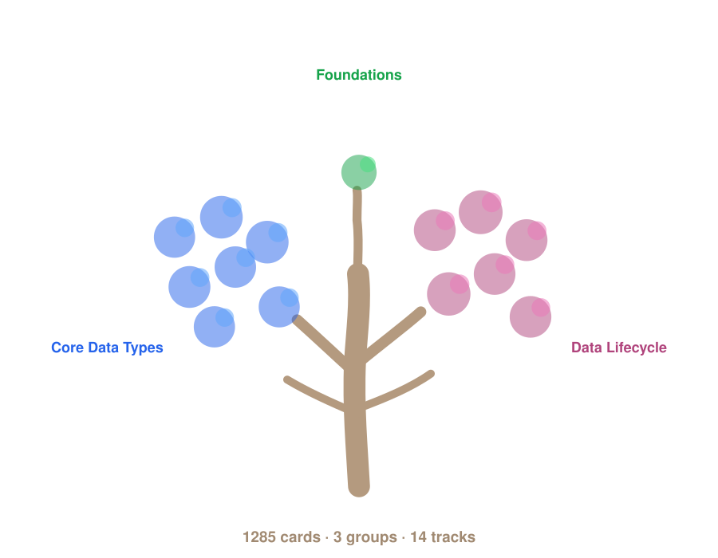

# 🌟 Awesome LLM Reasoning Data

[简体中文](README_zh.md)

> A curated, bilingual card atlas for post-training reasoning data: what data object a paper releases, and what verifies it.

  

Every entry is a full reading card rather than a citation: nine sections written from the primary source, plus the classification that makes the card reusable — who checks the answer, at what granularity, and which objective consumes it.

> When a model becomes better at reasoning after post-training, what data record, feedback signal, verifier, reward, environment, or judge actually made that possible?

- 📄 Companion paper: [A Primer in Post-Training Reasoning Data](https://arxiv.org/abs/2606.02113)
- 🌐 Project website: [https://renbing-sumeru.github.io/Awesome-LLM-Reasoning-Data/](https://renbing-sumeru.github.io/Awesome-LLM-Reasoning-Data/)
- 🤖 Ask the Atlas: [https://renbing-sumeru.github.io/Awesome-LLM-Reasoning-Data/ask/](https://renbing-sumeru.github.io/Awesome-LLM-Reasoning-Data/ask/)
- 🗂️ Research tracks: [papers/README.md](papers/README.md)

## 🚀 How to Use This Repo

A useful reasoning-data sample is rarely `prompt → answer`. It is usually:

  

Pick the path that matches your goal:

| Your goal | Suggested route |
|---|---|
| New to the field | Walk the [Learning Path](#-learning-path) from Stage 1, starting with [00 · Start here](docs/00_start_here.md) |
| Building a dataset | Follow the [construction cookbook](docs/05_construction_cookbook.md), then take the *Build a dataset* [reading path](#reading-paths) |
| Designing a verifier | Start from [verifiers and rewards](docs/06_verifiers_and_rewards.md) and the *Design a verifier* [reading path](#reading-paths) |
| Auditing a claim | Read [audit and failure modes](docs/09_audit_and_failure_modes.md), then the *Audit a claim* [reading path](#reading-paths) |
| Looking for a specific paper | Search the [project website](https://renbing-sumeru.github.io/Awesome-LLM-Reasoning-Data/), or grep [library/cards/](library/cards/) |
| Reusing the collection | Load [exports/papers.csv](exports/papers.csv), [papers.json](exports/papers.json), or [papers.bib](exports/papers.bib) — every published card, regenerated from the library |
| Contributing | Read [CONTRIBUTING.md](CONTRIBUTING.md) and pick up open work from [reports/library_report.md](reports/library_report.md) |

## 🔥 Latest Updates

| Date | Update |
|---|---|
| 2026-08-17 | All **14 tracks** are integrated. The library holds **1285 published cards** with **23130 bilingual sections**. |
| 2026-08-17 | Collapsed papers filed under more than one entry_id, folded the facet vocabulary onto `library/vocabulary.yaml`, and made every Chinese field Chinese-only. |
| 2026-08-17 | Rebuilt the site, READMEs, and track pages from the library, so every count here is reproducible. **241 cards** stay unpublished by review. |

> Review stays conservative: a card any curator rejected, or that nobody ruled on, stays out of the published pool instead of being promoted.

📊 Snapshot

| Metric | Count |
|---|---:|
| Published cards | 1285 |
| Tracks with cards | 14 / 14 |
| Must-read cards | 676 |
| Bilingual sections | 23130 |
| Held back by review | 241 |

## 📚 Contents

Fourteen tracks in three groups. Each track page carries a read-first table, the full card list, and an audit checklist.

### 🧭 1 · Background / Foundations `00`

<blockquote>

<code>00</code> <b><a href="papers/00_background_foundations/00_foundations_and_primers.md">🧭 Foundations & Primers</a></b> · 56 cards

Surveys, primers, classic post-training lineages, data documentation, and evaluation background for readers entering the field.

- Best for: Use this track when you need the map before the terrain: vocabulary, taxonomies, historical lineages, and recurring audit questions.
- Verified by: Unknown 39, Programmatic 8, Mixed 6, Judgment required 4

</blockquote>

### 🧬 2 · Core Reasoning Data Types `01–07`

<blockquote>

<code>01</code> <b><a href="papers/01_core_reasoning_data_types/01_instruction_demonstration_rationale_data.md">🧱 Instruction / Demo / Rationale</a></b> · 101 cards

Instruction-response examples, human demonstrations, synthetic instructions, rationales, chain-of-thought traces, and teacher-written reasoning targets.

- Best for: Use this track to understand how reasoning behavior is serialized before preference, verifier, or environment feedback is added.
- Verified by: Mixed 82, Programmatic 35, Judgment required 30, Environmental 6

<code>02</code> <b><a href="papers/01_core_reasoning_data_types/02_preference_reward_feedback_data.md">🤝 Preference & Reward Feedback</a></b> · 113 cards

Human preferences, AI feedback, reward models, DPO-style pairs, scalar rewards, critiques, and rubric-conditioned feedback records.

- Best for: Use this track to compare preference and reward signals before they become training objectives or evaluation proxies.
- Verified by: Judgment required 90, Mixed 17, Programmatic 10, Environmental 1

<code>03</code> <b><a href="papers/01_core_reasoning_data_types/03_programmatically_verifiable_outcome_data.md">🧮 Programmatic Verification</a></b> · 114 cards

Math answers, code execution, unit tests, proof checkers, symbolic predicates, answer extraction, and verifier robustness studies.

- Best for: Use this track for the cleanest verifier-bearing reasoning records: final answers or artifacts checked by code, rules, tests, or formal systems.
- Verified by: Programmatic 108, Mixed 12, Environmental 6, Judgment required 4

<code>04</code> <b><a href="papers/01_core_reasoning_data_types/04_process_trace_supervision_data.md">🪜 Process / Trace Supervision</a></b> · 106 cards

Step-level labels, process reward models, rollout values, first-error localization, automatic process supervision, and PRM evaluation.

- Best for: Use this track to move from final-answer feedback to intermediate feedback attached to reasoning steps or trace states.
- Verified by: Judgment required 91, Mixed 15, Programmatic 6, Environmental 3

<code>05</code> <b><a href="papers/01_core_reasoning_data_types/05_rollout_search_test_time_trace_data.md">🔁 Rollout / Search / TTC Trace</a></b> · 103 cards

Multiple rollouts, search trees, best-of-N samples, self-consistency traces, MCTS records, selected/rejected candidates, and test-time compute logs.

- Best for: Use this track when the important data is not one answer but a set of sampled attempts, search paths, selector scores, or inference-budget traces.
- Verified by: Mixed 46, Programmatic 40, Judgment required 19, Environmental 8, Unknown 4

<code>06</code> <b><a href="papers/01_core_reasoning_data_types/06_environment_agent_trajectory_data.md">🌐 Environment & Agent Trajectories</a></b> · 100 cards

Tool calls, web/browser tasks, app and OS agents, repository-level SWE episodes, replayable trajectories, and terminal predicates.

- Best for: Use this track to understand how interactive environments become post-training data sources and feedback contracts.
- Verified by: Mixed 62, Programmatic 35, Environmental 34, Judgment required 13, Unknown 1

<code>07</code> <b><a href="papers/01_core_reasoning_data_types/07_judgment_rubric_domain_expert_data.md">⚖️ Judgment / Rubric / Domain Expert</a></b> · 101 cards

LLM-as-judge data, human/expert judgment, medical and safety rubrics, factuality, legal and financial reasoning, and rubric reward models.

- Best for: Use this track when correctness needs a rubric, expert judgment, grounding evidence, or calibrated evaluator rather than a cheap programmatic checker.
- Verified by: Judgment required 91, Mixed 17, Programmatic 4, Environmental 1

</blockquote>

### 🛠️ 3 · Data Lifecycle `08–13`

<blockquote>

<code>08</code> <b><a href="papers/02_data_lifecycle/08_data_construction_open_release_recipes.md">🏗️ Construction & Open Releases</a></b> · 107 cards

Prompt sourcing, teacher traces, rejection sampling, self-play, filtering, verifier refresh, open releases, lineage, and release metadata.

- Best for: Use this track to learn how reasoning datasets are actually built, filtered, packaged, and released.
- Verified by: Mixed 61, Programmatic 43, Judgment required 19, Environmental 12

<code>09</code> <b><a href="papers/02_data_lifecycle/09_training_usage_optimization_objectives.md">🎯 Training Usage & Objectives</a></b> · 125 cards

How data enters SFT, distillation, preference optimization, reward modeling, PRM training, RLVR, agent training, evaluation, reranking, and audit.

- Best for: Use this track to connect a data object to the objective or system component that consumes it.
- Verified by: Judgment required 59, Mixed 40, Programmatic 23, Unknown 7, Environmental 3

<code>10</code> <b><a href="papers/02_data_lifecycle/10_scaling_rlvr_test_time_compute.md">📈 Scaling / RLVR / TTC</a></b> · 107 cards

Data scaling, data reuse, RLVR optimization, verifier scaling, pass@k, sampling budgets, test-time compute, and scaling attribution.

- Best for: Use this track to interpret claims about how much data, verifier strength, RL, and inference budget contribute to reasoning gains.
- Verified by: Mixed 76, Programmatic 21, Judgment required 9, Unknown 3, Environmental 1

<code>11</code> <b><a href="papers/02_data_lifecycle/11_benchmarks_evaluation_surfaces.md">🧰 Benchmarks & Evaluation</a></b> · 121 cards

Math, code, proof, agent, rubric/domain, reward-model, live, hidden, and contamination-resistant benchmarks.

- Best for: Use this track to understand what an evaluation surface measures and whether it can safely become a feedback source.
- Verified by: Programmatic 68, Mixed 38, Environmental 33, Judgment required 18

<code>12</code> <b><a href="papers/02_data_lifecycle/12_frontier_reports_data_disclosure_ledger.md">🚀 Frontier Disclosure Ledger</a></b> · 104 cards

DeepSeek-R1, Kimi, Qwen, Magistral, Phi, Nemotron, RLVR reports, and what each frontier-style report discloses or hides about data.

- Best for: Use this track to read frontier model reports as partial data-disclosure documents rather than only model-performance announcements.
- Verified by: Mixed 82, Unknown 11, Programmatic 10, Judgment required 5, Environmental 2

<code>13</code> <b><a href="papers/02_data_lifecycle/13_audit_failure_contamination_verifier_attacks.md">🧯 Audit & Failure Modes</a></b> · 104 cards

Benchmark contamination, search-time leakage, hidden lineage, reward hacking, verifier gaming, LLM-as-judge attacks, spurious rewards, and reproducibility failures.

- Best for: Use this track when you want to know how reasoning-data claims can fail and how to audit them before reuse.
- Verified by: Mixed 88, Unknown 7, Judgment required 7, Programmatic 4, Environmental 2

</blockquote>

## 🛤️ Learning Path

Four stages, in reading order. Each stage starts from the learning guides, then hands over to the matching reading path above.

**🌱 Stage 1 · Build the mental model** — what the field studies and how the data is organized

- [00 · Start here](docs/00_start_here.md)
- [01 · What is post-training reasoning data?](docs/01_what_is_post_training_reasoning_data.md)
- [02 · Verifier-anchored taxonomy](docs/02_verifier_anchored_taxonomy.md)
- Stage reading path: [Start here](#reading-paths) · 22 matching cards

**🔬 Stage 2 · Know the data objects** — what a well-formed sample looks like and how quality is measured

- [03 · Reasoning data objects](docs/03_reasoning_data_objects.md)
- [04 · Data quality](docs/04_data_quality.md)
- Stage reading path: [Design a verifier](#reading-paths) · 199 matching cards

**⚙️ Stage 3 · Construct, verify, and train** — how data is produced, scored, trained on, and scaled

- [05 · Construction cookbook](docs/05_construction_cookbook.md)
- [06 · Verifiers and rewards](docs/06_verifiers_and_rewards.md)
- [07 · Agent trajectory data](docs/07_agent_trajectory_data.md)
- [08 · Scaling and test-time compute](docs/08_scaling_and_test_time_compute.md)
- Stage reading path: [Build a dataset](#reading-paths) · 374 matching cards

**🕵️ Stage 4 · Audit and practice** — how to catch leakage and gaming, then apply it in engineering

- [09 · Audit and failure modes](docs/09_audit_and_failure_modes.md)
- [10 · Industry onboarding path](docs/10_industry_onboarding_path.md)
- Stage reading path: [Audit a claim](#reading-paths) · 72 matching cards

### Reading paths

Routes through the collection for different goals. Each is a live query over the library, so it stays in sync as cards land.

<b>Start here</b> · 22 matching cards

Build the vocabulary before opening dense primary papers.

1. [LiveBench: A Challenging, Contamination-Limited LLM Benchmark](https://arxiv.org/abs/2406.19314) (2025) — LiveBench combines dated task releases, periodic replacement, and objective scoring so model results can be audited against a specific contamination-limited benchmark version.
2. [Pre-train, Prompt, and Predict: A Systematic Survey of Prompting Methods in Natural Language Processing](https://dl.acm.org/doi/10.1145/3560815) (2022) — A high-impact systematic survey of the prompt designs that later reasoning prompting builds on.
3. [A Comprehensive Survey of Process Reward Models: Data Generation, Model Construction, and Usage](https://aclanthology.org/2026.acl-long.163/) (2026) — A 2026 ACL survey that traces process reward models from labeled reasoning data through construction to search and reinforcement-learning use.
4. [A Survey of Frontiers in LLM Reasoning: Inference Scaling, Learning to Reason, and Agentic Systems](https://mlanthology.org/tmlr/2025/ke2025tmlr-survey/) (2025) — A TMLR survey that maps reasoning by when it is achieved and which system components perform it.
5. [Stop Overthinking: A Survey on Efficient Reasoning for Large Language Models](https://arxiv.org/abs/2503.16419) (2025) — A TMLR survey of how to reduce redundant reasoning without treating trace length as the only goal.
6. [A Survey on Evaluation of Large Language Models](https://dl.acm.org/doi/10.1145/3641289) (2024) — A high-impact survey that turns “evaluate an LLM” into concrete choices about target, dataset, protocol, and metric.
7. [Rethinking Benchmark Comparability: A Survey of Reasoning Benchmarks for Large Language Models](https://www.preprints.org/manuscript/202605.0806) (2026) — A 2026 survey that explains why two “reasoning benchmark” scores are often not measuring the same thing.
8. [Revealing the Seen, Imagining the Beyond: A Survey of Image-Grounded Chain-of-Thought Reasoning in Multimodal LLMs](https://aclanthology.org/2026.acl-long.2087/) (2026) — An ACL survey of multimodal reasoning processes that alternate between text and visual state updates.
9. [A Survey of Reasoning with Foundation Models: Concepts, Methodologies, and Outlook](https://dl.acm.org/doi/10.1145/3729218) (2025) — A 2025 survey that connects reasoning tasks to the models, data, methods, and benchmarks used to study them.
10. [A Survey of Reinforcement Learning for Large Reasoning Models](https://arxiv.org/abs/2509.08827) (2025) — A TsinghuaC3I survey of the reinforcement-learning machinery that turns language models into reasoning models.
11. [A Survey on Efficient Large Language Model Training: From Data-centric Perspectives](https://aclanthology.org/2025.acl-long.1493/) (2025) — A 2025 ACL survey that treats data selection, quality, synthesis, compression, and self-evolution as distinct levers in efficient post-training.
12. [Efficient Inference for Large Reasoning Models: A Survey](https://arxiv.org/abs/2503.23077) (2025) — An NUS-led survey of efficient inference methods for long reasoning models.
13. [Evaluating Step-by-step Reasoning Traces: A Survey](https://aclanthology.org/2025.findings-emnlp.94/) (2025) — A survey that turns “is this chain of thought good?” into four auditable evaluation dimensions.
14. [Harnessing the Reasoning Economy: A Survey of Efficient Reasoning for Large Language Models](https://arxiv.org/abs/2503.24377) (2025) — A 2025 survey of how to reduce redundant reasoning without confusing fewer tokens with better reasoning.
15. [Large Language Model Post-Training: A Unified View of Off-Policy and On-Policy Learning](https://arxiv.org/abs/2604.07941) (2026) — A 2026 framework that maps post-training by who supplied the trajectory and which behavioral bottleneck a stage addresses.
16. [The Periodic Table of LLM Reasoning: A Structured Survey of Reasoning Paradigms, Methods, and Failure Modes](https://arxiv.org/abs/2606.11470) (2026) — A 2026 reasoning survey that maps paradigms, method families, benchmarks, and failure modes before readers enter data-specific tracks.
17. [Towards a Mechanistic Understanding of Large Reasoning Models: A Survey of Training, Inference, and Failures](https://aclanthology.org/2026.acl-long.889/) (2026) — An ACL survey of what evidence explains how large reasoning models learn, reason, and fail.
18. [A Comprehensive Survey of Reward Models: Taxonomy, Applications, Challenges, and Future](https://arxiv.org/abs/2504.12328) (2025) — A 2025 reward-model map that separates feedback collection, reward fitting, and downstream use.
19. [A Survey on Post-training of Large Language Models](https://arxiv.org/abs/2503.06072) (2025) — A 2025 map of post-training that connects data, feedback, reasoning, and system stages before readers enter specialized tracks.
20. [Breaking the Reasoning Barrier A Survey on LLM Complex Reasoning through the Lens of Self-Evolution](https://aclanthology.org/2025.findings-acl.386/) (2025) — An ACL survey of growing reasoning ability by jointly improving training data and models.

<b>Build a dataset</b> · 374 matching cards

Follow how reasoning datasets are sourced, generated, filtered, and released.

1. [Training Software Engineering Agents and Verifiers with SWE-Gym](https://proceedings.mlr.press/v267/pan25g.html) (2025) — SWE-Gym releases 2,438 unit-test-validated Python repository tasks plus OpenHands and Moatless trajectories, policies, and outcome verifiers built through rejection sampling and Best@k selection.
2. [An Illusion of Progress? Assessing the Current State of Web Agents](https://arxiv.org/abs/2504.01382) (2025) — Online-Mind2Web releases 300 mutable live-site tasks, evaluation code and task-level labels plus WebJudge-7B, but not a complete immutable corpus of all paper trajectories or the external website states needed for exact replay.
3. [AgentTrek: Agent Trajectory Synthesis via Guiding Replay with Web Tutorials](https://proceedings.iclr.cc/paper_files/paper/2025/hash/c681fb2bf1d785fbc766f3ea14758aab-Abstract-Conference.html) (2025) — AgentTrek mines and structures RedPajama tutorials, executes them through GPT-4o-guided BrowserGym replay on 127 sites, and filters trajectories with a GPT-4o evaluator for GUI-agent SFT.
4. [TinyV: Reducing False Negatives in Verification Improves RL for LLM Reasoning](https://openreview.net/pdf?id=scPETXuAiY) (2025) — TinyV refreshes a rule-based verifier by re-judging rejected answers with two large models, augmenting equivalent-answer variants, training a small binary judge, and querying it only after Prime rejection.
5. [AgentRewardBench: Evaluating Automatic Evaluations of Web Agent Trajectories](https://arxiv.org/abs/2504.08942) (2025) — AgentRewardBench releases 1,302 web-agent episodes with expert success, side-effect, optimality, and repetition labels plus 15 automatic-evaluator outputs per episode, but it supports offline audit rather than licensed deterministic replay.
6. [InSTA: Towards Internet-Scale Training For Agents](https://arxiv.org/abs/2502.06776) (2025) — InSTA combines an LLM safety and task proposer, one live Playwright exploration loop, LLM-agent rollouts, and LLM success judgment to construct internet-scale web-agent SFT data.
7. [MathCoder2: Better Math Reasoning from Continued Pretraining on Model-translated Mathematical Code](https://proceedings.iclr.cc/paper_files/paper/2025/file/bea94fe9c5573e74294657f692069d89-Paper-Conference.pdf) (2025) — MathCoder2 translates selected mathematical documents into conditions-expression-result-Python records, execution-filters and flattens them into MathCode-Pile, then uses the mixture for continued pretraining before separate supervised math post-training.
8. [Open-Reasoner-Zero: An Open Source Approach to Scaling Up Reinforcement Learning on the Base Model](https://proceedings.neurips.cc/paper_files/paper/2025/file/ed873d79e7c268c020c4b4db13a2812a-Paper-Conference.pdf) (2025) — Open-Reasoner-Zero starts PPO directly from Qwen2.5 Base, samples 64 responses per prompt, scores boxed mathematical answers programmatically, and trains a token-value critic, while releasing prompts, code, and weights but withholding exact run trajectories, failures, and immutable manifests.
9. [s1: Simple test-time scaling](https://aclanthology.org/2025.emnlp-main.1025/) (2025) — s1 filters a 59,029-question mixed-source pool by generation quality, Qwen difficulty, Claude-labeled diversity, and trace length into the 1,000-example Gemini-distilled s1K, then combines SFT with inference-time budget forcing.
10. [WebSailor-V2: Bridging the Chasm to Proprietary Agents via Synthetic Data and Scalable Reinforcement Learning](https://openreview.net/pdf?id=HuP16O5SJf) (2025) — WebSailor-V2 reports 30K-plus synthetic instruction pairs, rejection-sampled ReAct SFT, and on-policy RL across offline-Wikipedia and managed live-web environments, but releases no V2 data, code, verifier, or complete trajectories.
11. [On Data Engineering for Scaling LLM Terminal Capabilities](https://arxiv.org/abs/2602.21193) (2026) — Releases exactly 366,154 train-only terminal SFT episodes from dataset adapters and skill-based synthesis, while the paper's no-filter recipe retains incomplete and failed behavior but the public rows expose no normalized outcome or reward.
12. [Herald: A Natural Language Annotated Lean 4 Dataset](https://proceedings.iclr.cc/paper_files/paper/2025/file/8c2bb821410066459be64d03a4dc5719-Paper-Conference.pdf) (2025) — Herald dependency-orders Mathlib informalization, retrieves from 1,000 manual examples, and augments statements through tactic states and LLM rewrites, but omits the construction code, exact source revision, row lineage, rejects, and decontamination evidence.
13. [WebSailor: Navigating Super-human Reasoning for Web Agent](https://arxiv.org/abs/2507.02592) (2025) — WebSailor trains web-search agents with just over 2,000 successful reconstructed ReAct trajectories and DUPO's mixed format/answer reward, but officially releases only 20 QA examples—not the complete successful or failed trajectories.
14. [Long-Horizon-Terminal-Bench: Testing the Limits of Agents on Long-Horizon Terminal Tasks with Dense Reward-Based Grading](https://arxiv.org/abs/2607.08964) (2026) — LHTB releases 46 test-only containerized terminal tasks with deterministic end-of-rollout subtask rewards, but not the paper's model trajectories, and its current GitHub exposure of tests/solutions conflicts with the HF held-out policy.
15. [MathSmith: Towards Extremely Hard Mathematical Reasoning by Forging Synthetic Problems with a Reinforced Policy](https://arxiv.org/abs/2508.05592) (2026) — Trains and releases Qwen3-8B problem synthesizers that turn PlanetMath-derived concepts into rationales and hard math problems using structural, trace-length, and same-teacher consistency rewards.
16. [Odysseys: Benchmarking Web Agents on Realistic Long Horizon Tasks](https://arxiv.org/abs/2604.24964) (2026) — Odysseys releases 200 live-web tasks with 1,225 rubric checkpoints and an OSWorld/Gemini scoring pipeline, but not the 2,380 source histories, complete model trajectories, human labels, frozen sites, or deterministic replay state.
17. [SWE-CI: Evaluating Agent Capabilities in Maintaining Codebases via Continuous Integration](https://arxiv.org/abs/2603.03823) (2026) — SWE-CI evaluates 100 long-horizon repository evolutions from 68 public Python repositories through a 20-epoch Architect-Programmer CI loop and now releases tasks, Docker environments, code, and 115 GB of trajectories, with material split-version, verifier, completeness, replay, rights, privacy, and secret risks.
18. [SWE-rebench V2: Language-Agnostic SWE Task Collection at Scale](https://arxiv.org/abs/2602.23866) (2026) — SWE-rebench V2 releases 32,079 prebuilt, test-verifiable repository repair environments across 20 languages plus 126,300 PR-derived training tasks, built by an automated setup, oracle-extraction, LLM-filtering, and metadata pipeline.
19. [Multi-modal Agent Tuning: Building a VLM-Driven Agent for Efficient Tool Usage](https://proceedings.iclr.cc/paper_files/paper/2025/hash/238747e153a84f50b43fd50fa8504f33-Abstract-Conference.html) (2025) — Multi-modal Agent Tuning synthesizes queries and files, executes GPT-4o-mini-controlled ReAct trajectories, applies query-file and trajectory judges, and fine-tunes VLM controllers on thought-and-code supervision.
20. [PaperBench: Evaluating AI's Ability to Replicate AI Research](https://proceedings.mlr.press/v267/starace25a.html) (2025) — PaperBench evaluates 20 from-scratch ML-paper replications with 8,316 weighted rubric leaves, fresh-container execution, and an o3-mini judge, but releases no complete 646-run trajectory/submission corpus and remains exposed to judge, contamination, rights, replay, and secret-handling risks.

<b>Design a verifier</b> · 199 matching cards

Compare programmatic checkers, process reward models, rubrics, and judges.

1. [Training Software Engineering Agents and Verifiers with SWE-Gym](https://proceedings.mlr.press/v267/pan25g.html) (2025) — SWE-Gym releases 2,438 unit-test-validated Python repository tasks plus OpenHands and Moatless trajectories, policies, and outcome verifiers built through rejection sampling and Best@k selection.
2. [An Illusion of Progress? Assessing the Current State of Web Agents](https://arxiv.org/abs/2504.01382) (2025) — Online-Mind2Web releases 300 mutable live-site tasks, evaluation code and task-level labels plus WebJudge-7B, but not a complete immutable corpus of all paper trajectories or the external website states needed for exact replay.
3. [TinyV: Reducing False Negatives in Verification Improves RL for LLM Reasoning](https://openreview.net/pdf?id=scPETXuAiY) (2025) — TinyV refreshes a rule-based verifier by re-judging rejected answers with two large models, augmenting equivalent-answer variants, training a small binary judge, and querying it only after Prime rejection.
4. [AgentRewardBench: Evaluating Automatic Evaluations of Web Agent Trajectories](https://arxiv.org/abs/2504.08942) (2025) — AgentRewardBench releases 1,302 web-agent episodes with expert success, side-effect, optimality, and repetition labels plus 15 automatic-evaluator outputs per episode, but it supports offline audit rather than licensed deterministic replay.
5. [InSTA: Towards Internet-Scale Training For Agents](https://arxiv.org/abs/2502.06776) (2025) — InSTA combines an LLM safety and task proposer, one live Playwright exploration loop, LLM-agent rollouts, and LLM success judgment to construct internet-scale web-agent SFT data.
6. [Open-Reasoner-Zero: An Open Source Approach to Scaling Up Reinforcement Learning on the Base Model](https://proceedings.neurips.cc/paper_files/paper/2025/file/ed873d79e7c268c020c4b4db13a2812a-Paper-Conference.pdf) (2025) — Open-Reasoner-Zero starts PPO directly from Qwen2.5 Base, samples 64 responses per prompt, scores boxed mathematical answers programmatically, and trains a token-value critic, while releasing prompts, code, and weights but withholding exact run trajectories, failures, and immutable manifests.
7. [WebSailor: Navigating Super-human Reasoning for Web Agent](https://arxiv.org/abs/2507.02592) (2025) — WebSailor trains web-search agents with just over 2,000 successful reconstructed ReAct trajectories and DUPO's mixed format/answer reward, but officially releases only 20 QA examples—not the complete successful or failed trajectories.
8. [Long-Horizon-Terminal-Bench: Testing the Limits of Agents on Long-Horizon Terminal Tasks with Dense Reward-Based Grading](https://arxiv.org/abs/2607.08964) (2026) — LHTB releases 46 test-only containerized terminal tasks with deterministic end-of-rollout subtask rewards, but not the paper's model trajectories, and its current GitHub exposure of tests/solutions conflicts with the HF held-out policy.
9. [Absolute Zero: Reinforced Self-play Reasoning with Zero Data](https://papers.nips.cc/paper_files/paper/2025/file/9837dc00ff67d176373268ed48042d49-Paper-Conference.pdf) (2025) — Absolute Zero turns a growing buffer of self-proposed Python triplets into an online RLVR curriculum, rewarding proposer learnability from eight solver attempts and solver correctness by execution, while releasing the recipe and seeds but not the complete paper-run trajectories.
10. [PaperBench: Evaluating AI's Ability to Replicate AI Research](https://proceedings.mlr.press/v267/starace25a.html) (2025) — PaperBench evaluates 20 from-scratch ML-paper replications with 8,316 weighted rubric leaves, fresh-container execution, and an o3-mini judge, but releases no complete 646-run trajectory/submission corpus and remains exposed to judge, contamination, rights, replay, and secret-handling risks.
11. [SWE Data Construction, Automatically!](https://conf.researchr.org/details/fse-2026/fse-2026-research-papers/70/SWE-Data-Construction-Automatically-) (2026) — SWE-Factory converts issue and pull-request pairs into runnable coding-agent tasks through binary-test recovery, four-agent Docker and test-script generation, execution feedback, and gold-patch fail-to-pass validation, then samples Kimi-K2 trajectories for supervised fine-tuning.
12. [SiriuS: Self-improving Multi-agent Systems via Bootstrapped Reasoning](https://papers.nips.cc/paper_files/paper/2025/file/b45279ac82cb017a5f55ea7d3653193a-Paper-Conference.pdf) (2025) — SiriuS turns terminally successful interactions into per-role SFT records and repairs failed QA episodes through critique, regeneration, rephrasing, and downstream replay, but does not release the libraries.
13. [WebRL: Training LLM Web Agents via Self-Evolving Online Curriculum Reinforcement Learning](https://openreview.net/forum?id=oVKEAFjEqv) (2025) — WebRL trains browser agents over 8 curriculum phases using failure-derived GPT-4o tasks, binary ORM-labeled rollouts, KL-constrained updates, and confidence-filtered successful replay, while releasing only a partial data corpus.
14. [WEBSERV: A Full-Stack and RL-Ready Web Environment for Training Web Agents at Scale](https://arxiv.org/abs/2510.16252) (2025) — WebServ releases 726 success-filtered Claude browser traces and the code for resettable Incus-backed GRPO training, but not failed traces, record-level outcomes, Qwen RL rollouts, checkpoints, or a pinned environment bundle.
15. [Efficient PRM Training Data Synthesis via Formal Verification](https://aclanthology.org/2026.findings-acl.403/) (2026) — FOVER-40K pairs formal reasoning traces with Boolean step labels produced by Z3 and Isabelle, then trains Llama- and Qwen-based PRMs for process-level verification and Best-of-K selection.
16. [DAPO: An Open-Source LLM Reinforcement Learning System at Scale](https://arxiv.org/abs/2503.14476) (2025) — DAPO couples a 17K integer-answer math prompt recipe with rule-scored online rollouts, dynamic group filtering, token-level loss, and length shaping, but the current public split and source lineage require audit before reuse.
17. [RATIONALYST: Pre-training Process-Supervision for Improving Reasoning](https://aclanthology.org/2025.acl-long.1288/) (2025) — Reports a 79K implicit-rationale mixture filtered by future-token predictiveness and trains an 8B process supervisor, while the linked 15178-row dataset leaves the full release unreconciled.
18. [SeRL: Self-play Reinforcement Learning for Large Language Models with Limited Data](https://papers.nips.cc/paper_files/paper/2025/file/95c2cbe23fb6d28a4ae908aa7f3de5bf-Paper-Conference.pdf) (2025) — SeRL generates questions from a 500-example seed, filters them by diversity and self-consensus difficulty, and trains on sixteen-response agreement rewards, while releasing code and prompt snapshots rather than complete paper-run trajectories.
19. [AgentSynth: Scalable Task Generation for Generalist Computer-Use Agents](https://openreview.net/pdf?id=CoBxmXThM6) (2026) — AgentSynth releases verified computer-use task sequences and trajectories whose difficulty scales by composing simple subtasks.
20. [Embodied-Reasoner: Synergizing Visual Search, Reasoning, and Action for Embodied Interactive Tasks](https://aclanthology.org/2026.acl-long.1910/) (2026) — Embodied-Reasoner releases 9,390 AI2-THOR Observation-Thought-Action episodes built from GPT-4o imitation traces, environment-filtered self-exploration, and failure-aware reflection tuning, with about 64K images and 8M thought tokens.

<b>Agent trajectories</b> · 138 matching cards

Understand how interactive environments become training data and feedback.

1. [Training Software Engineering Agents and Verifiers with SWE-Gym](https://proceedings.mlr.press/v267/pan25g.html) (2025) — SWE-Gym releases 2,438 unit-test-validated Python repository tasks plus OpenHands and Moatless trajectories, policies, and outcome verifiers built through rejection sampling and Best@k selection.
2. [An Illusion of Progress? Assessing the Current State of Web Agents](https://arxiv.org/abs/2504.01382) (2025) — Online-Mind2Web releases 300 mutable live-site tasks, evaluation code and task-level labels plus WebJudge-7B, but not a complete immutable corpus of all paper trajectories or the external website states needed for exact replay.
3. [AgentTrek: Agent Trajectory Synthesis via Guiding Replay with Web Tutorials](https://proceedings.iclr.cc/paper_files/paper/2025/hash/c681fb2bf1d785fbc766f3ea14758aab-Abstract-Conference.html) (2025) — AgentTrek mines and structures RedPajama tutorials, executes them through GPT-4o-guided BrowserGym replay on 127 sites, and filters trajectories with a GPT-4o evaluator for GUI-agent SFT.
4. [InSTA: Towards Internet-Scale Training For Agents](https://arxiv.org/abs/2502.06776) (2025) — InSTA combines an LLM safety and task proposer, one live Playwright exploration loop, LLM-agent rollouts, and LLM success judgment to construct internet-scale web-agent SFT data.
5. [WebSailor-V2: Bridging the Chasm to Proprietary Agents via Synthetic Data and Scalable Reinforcement Learning](https://openreview.net/pdf?id=HuP16O5SJf) (2025) — WebSailor-V2 reports 30K-plus synthetic instruction pairs, rejection-sampled ReAct SFT, and on-policy RL across offline-Wikipedia and managed live-web environments, but releases no V2 data, code, verifier, or complete trajectories.
6. [WebSailor: Navigating Super-human Reasoning for Web Agent](https://arxiv.org/abs/2507.02592) (2025) — WebSailor trains web-search agents with just over 2,000 successful reconstructed ReAct trajectories and DUPO's mixed format/answer reward, but officially releases only 20 QA examples—not the complete successful or failed trajectories.
7. [Long-Horizon-Terminal-Bench: Testing the Limits of Agents on Long-Horizon Terminal Tasks with Dense Reward-Based Grading](https://arxiv.org/abs/2607.08964) (2026) — LHTB releases 46 test-only containerized terminal tasks with deterministic end-of-rollout subtask rewards, but not the paper's model trajectories, and its current GitHub exposure of tests/solutions conflicts with the HF held-out policy.
8. [SWE-CI: Evaluating Agent Capabilities in Maintaining Codebases via Continuous Integration](https://arxiv.org/abs/2603.03823) (2026) — SWE-CI evaluates 100 long-horizon repository evolutions from 68 public Python repositories through a 20-epoch Architect-Programmer CI loop and now releases tasks, Docker environments, code, and 115 GB of trajectories, with material split-version, verifier, completeness, replay, rights, privacy, and secret risks.
9. [SWE-rebench V2: Language-Agnostic SWE Task Collection at Scale](https://arxiv.org/abs/2602.23866) (2026) — SWE-rebench V2 releases 32,079 prebuilt, test-verifiable repository repair environments across 20 languages plus 126,300 PR-derived training tasks, built by an automated setup, oracle-extraction, LLM-filtering, and metadata pipeline.
10. [Multi-modal Agent Tuning: Building a VLM-Driven Agent for Efficient Tool Usage](https://proceedings.iclr.cc/paper_files/paper/2025/hash/238747e153a84f50b43fd50fa8504f33-Abstract-Conference.html) (2025) — Multi-modal Agent Tuning synthesizes queries and files, executes GPT-4o-mini-controlled ReAct trajectories, applies query-file and trajectory judges, and fine-tunes VLM controllers on thought-and-code supervision.
11. [PaperBench: Evaluating AI's Ability to Replicate AI Research](https://proceedings.mlr.press/v267/starace25a.html) (2025) — PaperBench evaluates 20 from-scratch ML-paper replications with 8,316 weighted rubric leaves, fresh-container execution, and an o3-mini judge, but releases no complete 646-run trajectory/submission corpus and remains exposed to judge, contamination, rights, replay, and secret-handling risks.
12. [SWE Data Construction, Automatically!](https://conf.researchr.org/details/fse-2026/fse-2026-research-papers/70/SWE-Data-Construction-Automatically-) (2026) — SWE-Factory converts issue and pull-request pairs into runnable coding-agent tasks through binary-test recovery, four-agent Docker and test-script generation, execution feedback, and gold-patch fail-to-pass validation, then samples Kimi-K2 trajectories for supervised fine-tuning.
13. [$\tau^2$-Bench: Evaluating Conversational Agents in a Dual-Control Environment](https://openreview.net/pdf?id=OC2z7iSQKa) (2025) — tau2-bench releases a dual-control telecom environment with 114 sampled tasks from 2,285 generated compositions, state/action-grounded rewards, and full success/failure evaluation trajectories, but exact reuse requires a paper-era version pin.
14. [ITBench: Evaluating AI Agents across Diverse Real-World IT Automation Tasks](https://proceedings.mlr.press/v267/jha25a.html) (2025) — ITBench packages live IT incidents and controls as tool-using agent episodes with explicit stop/success contracts, then extends them with versioned offline snapshots and SRE traces.
15. [SiriuS: Self-improving Multi-agent Systems via Bootstrapped Reasoning](https://papers.nips.cc/paper_files/paper/2025/file/b45279ac82cb017a5f55ea7d3653193a-Paper-Conference.pdf) (2025) — SiriuS turns terminally successful interactions into per-role SFT records and repairs failed QA episodes through critique, regeneration, rephrasing, and downstream replay, but does not release the libraries.
16. [TheAgentCompany: Benchmarking LLM Agents on Consequential Real World Tasks](https://proceedings.neurips.cc/paper_files/paper/2025/file/0d744742f6fac4d1134c019b7cef3c8a-Paper-Datasets_and_Benchmarks_Track.pdf) (2024) — TheAgentCompany pairs 175 simulated-company tasks with mixed checkpoint evaluators and releases model-generated results, screenshots, and full evaluation trajectories.
17. [MLGym: A New Framework and Benchmark for Advancing AI Research Agents](https://openreview.net/pdf/75f6e6aa5276a0b93fd3859ec7b41c92ee79cea8.pdf) (2025) — MLGym releases 13 containerized ML-research tasks and a current 676-run action/observation corpus with task-specific evaluator scores and replay code, but repeated validation exposes test feedback, native Gym reward remains zero, and the release is untagged and license-mixed.
18. [WebRL: Training LLM Web Agents via Self-Evolving Online Curriculum Reinforcement Learning](https://openreview.net/forum?id=oVKEAFjEqv) (2025) — WebRL trains browser agents over 8 curriculum phases using failure-derived GPT-4o tasks, binary ORM-labeled rollouts, KL-constrained updates, and confidence-filtered successful replay, while releasing only a partial data corpus.
19. [WEBSERV: A Full-Stack and RL-Ready Web Environment for Training Web Agents at Scale](https://arxiv.org/abs/2510.16252) (2025) — WebServ releases 726 success-filtered Claude browser traces and the code for resettable Incus-backed GRPO training, but not failed traces, record-level outcomes, Qwen RL rollouts, checkpoints, or a pinned environment bundle.
20. [CodeScout: An Effective Recipe for Reinforcement Learning of Code Search Agents](https://arxiv.org/abs/2603.17829) (2026) — Releases 54,845 full terminal-search RL rollouts for CodeScout-14B and CodeScout-4B, preserving grouped attempts, component localization rewards, and 8,281 zero-reward failures rather than publishing only successful trajectories.

<b>Scaling and test-time compute</b> · 187 matching cards

Separate data scale, verifier strength, optimizer, and inference budget.

1. [Training Software Engineering Agents and Verifiers with SWE-Gym](https://proceedings.mlr.press/v267/pan25g.html) (2025) — SWE-Gym releases 2,438 unit-test-validated Python repository tasks plus OpenHands and Moatless trajectories, policies, and outcome verifiers built through rejection sampling and Best@k selection.
2. [Open-Reasoner-Zero: An Open Source Approach to Scaling Up Reinforcement Learning on the Base Model](https://proceedings.neurips.cc/paper_files/paper/2025/file/ed873d79e7c268c020c4b4db13a2812a-Paper-Conference.pdf) (2025) — Open-Reasoner-Zero starts PPO directly from Qwen2.5 Base, samples 64 responses per prompt, scores boxed mathematical answers programmatically, and trains a token-value critic, while releasing prompts, code, and weights but withholding exact run trajectories, failures, and immutable manifests.
3. [s1: Simple test-time scaling](https://aclanthology.org/2025.emnlp-main.1025/) (2025) — s1 filters a 59,029-question mixed-source pool by generation quality, Qwen difficulty, Claude-labeled diversity, and trace length into the 1,000-example Gemini-distilled s1K, then combines SFT with inference-time budget forcing.
4. [WEBSERV: A Full-Stack and RL-Ready Web Environment for Training Web Agents at Scale](https://arxiv.org/abs/2510.16252) (2025) — WebServ releases 726 success-filtered Claude browser traces and the code for resettable Incus-backed GRPO training, but not failed traces, record-level outcomes, Qwen RL rollouts, checkpoints, or a pinned environment bundle.
5. [TreePO: Enhancing Policy Efficacy and Inference Efficiency with Tree Modeling](https://openreview.net/forum?id=npsWK8rgYO) (2026) — TreePO replaces independent math rollouts with shared-prefix segment trees and trains on terminal answer rewards through hierarchical subgroup advantages, releasing code, prompts, and checkpoints but not complete paper-run trees.
6. [DAPO: An Open-Source LLM Reinforcement Learning System at Scale](https://arxiv.org/abs/2503.14476) (2025) — DAPO couples a 17K integer-answer math prompt recipe with rule-scored online rollouts, dynamic group filtering, token-level loss, and length shaping, but the current public split and source lineage require audit before reuse.
7. [SoTA with Less: MCTS-Guided Sample Selection for Data-Efficient Visual Reasoning Self-Improvement](https://papers.nips.cc/paper_files/paper/2025/hash/ac3cea0be817ebac21299b77fd114ddf-Abstract-Conference.html) (2025) — ThinkLite-VL uses model-specific MCTS solve depth and unsolved-after-50 status to select 11K/7.5K visual-reasoning prompts from a 70K pool for one-stage GRPO self-improvement.
8. [Lookahead Tree-Based Rollouts for Enhanced Trajectory-Level Exploration in Reinforcement Learning with Verifiable Rewards](https://openreview.net/forum?id=4nLvUk8edu) (2026) — LATR generates diverse on-policy RLVR rollout groups by probability-gated branching, lookahead simulation, and similarity pruning, while its public data release contains processed Countdown and math prompt/reward rows rather than the raw rollout trees.
9. [QED-Nano: Teaching a Tiny Model to Prove Hard Theorems](https://arxiv.org/abs/2604.04898) (2026) — QED-Nano couples 128-attempt difficulty statistics, 16-rollout rubric-reward GRPO, and three-turn Reasoning-Cache training, while FineProofs-RL releases prompts, rubrics, and score arrays but not the proofs behind them.
10. [ThinkBooster: A Unified Framework for Seamless Test-Time Scaling of LLM Reasoning](https://aclanthology.org/2026.acl-demo.70/) (2026) — ThinkBooster is an MIT-licensed toolkit and ACL 2026 demo that generates and inspects prompt, candidate, step-score, selection, token, TFLOP, latency, and config traces for nine test-time reasoning strategies, but does not release the historical paper-run trace corpus.
11. [Co-Evolving LLM Coder and Unit Tester via Reinforcement Learning](https://arxiv.org/abs/2506.03136) (2025) — CURE alternates one policy between coder and tester roles, using a code-by-test execution matrix and private gold-test anchors to train both capabilities and to rank code at test time.
12. [L1: Controlling How Long A Reasoning Model Thinks With Reinforcement Learning](https://openreview.net/forum?id=4jdIxXBNve) (2025) — L1 trains DeepScaleR-based policies with programmatic final-answer and token-budget rewards so a prompt can request either an exact reasoning length or a maximum token ceiling.
13. [LIMOPro: Reasoning Refinement for Efficient and Effective Test-time Scaling](https://arxiv.org/abs/2505.19187) (2025) — LIMOPro prunes low-importance functional reasoning steps from training traces, producing models that retain or improve accuracy while spending fewer tokens at inference.
14. [Policy Guided Tree Search for Enhanced LLM Reasoning](https://proceedings.mlr.press/v267/li25bv.html) (2025) — PGTS trains a GPS graph policy with PPO to navigate LLaMA 3.1 reasoning trees through expand, branch, backtrack, and paper-defined terminate decisions under explicit depth, breadth, and search-step budgets.
15. [Thinking vs. Doing: Agents that Reason by Scaling Test-Time Interaction](https://arxiv.org/abs/2506.07976) (2025) — TTI turns terminally successful multimodal web episodes into state/action behavior-cloning data under an expanding interaction horizon, but its public release omits trajectories and does not reproduce a clean paper-aligned split/configuration.
16. [Value-Guided Search for Efficient Chain-of-Thought Reasoning](https://proceedings.neurips.cc/paper_files/paper/2025/hash/7a8a3a34ede2bae1fd2fb1876a7ba362-Abstract-Conference.html) (2025) — VGS releases 2.5M math roll-in/roll-out pairs with correct, incorrect, and incomplete outcome labels, trains a 1.5B token-level value model, and uses it to guide 4,096-token beam-search blocks plus weighted voting.
17. [Weaver: Shrinking the Generation-Verification Gap by Scaling Compute for Verification](https://arxiv.org/abs/2506.18203) (2025) — Weaver converts reward-model and LM-judge outputs over repeated candidates into posterior correctness scores for response selection, then distills those ensemble scores into compact verifiers.
18. [ReST-MCTS*: LLM Self-Training via Process Reward Guided Tree Search](https://arxiv.org/abs/2406.03816) (2024) — ReST-MCTS* uses value-guided tree search and terminal-answer verification to create positive policy trajectories and scalar partial-solution targets for mutual self-training.
19. [From Seeing to Thinking: Decoupling Perception and Reasoning Improves Post-Training of Vision-Language Models](https://openreview.net/forum?id=r7uOjvZdzO) (2026) — VLM-CapCurriculum releases 32,736 staged RLVR problems with 16 extracted Qwen3-VL-8B answers, per-answer correctness flags, and a pass rate per row, enabling capability-first and within-stage difficulty curricula without releasing the underlying full reasoning completions.
20. [OpenMMReasoner: Pushing the Frontiers for Multimodal Reasoning with an Open and General Recipe](https://arxiv.org/abs/2511.16334) (2026) — Separates an open 874K multimodal SFT conversation mixture from roughly 73K released RL training prompts and unreleased 16-way online GSPO rollouts, with mixed rule, learned-judge, and format rewards.

<b>Audit a claim</b> · 72 matching cards

Learn how reasoning-data claims fail before reusing one.

1. [TinyV: Reducing False Negatives in Verification Improves RL for LLM Reasoning](https://openreview.net/pdf?id=scPETXuAiY) (2025) — TinyV refreshes a rule-based verifier by re-judging rejected answers with two large models, augmenting equivalent-answer variants, training a small binary judge, and querying it only after Prime rejection.
2. [AgentRewardBench: Evaluating Automatic Evaluations of Web Agent Trajectories](https://arxiv.org/abs/2504.08942) (2025) — AgentRewardBench releases 1,302 web-agent episodes with expert success, side-effect, optimality, and repetition labels plus 15 automatic-evaluator outputs per episode, but it supports offline audit rather than licensed deterministic replay.
3. [Rethinking Data Selection at Scale: Random Selection is Almost All You Need](https://aclanthology.org/2025.findings-emnlp.146/) (2025) — The study selects 10K or 50K OpenHermes and English WildChat conversations with gradient, loss, uncertainty, diversity, compression, random, or token-length rules, then compares Qwen2-7B and Llama3-8B SFT across five benchmark families.
4. [Holistic Agent Leaderboard: The Missing Infrastructure for AI Agent Evaluation](https://openreview.net/forum?id=vUaY1t64ZZ) (2025) — HAL standardizes nine agent benchmarks into cost-aware run archives with task evaluator outputs and Weave call logs; the paper reports 21,730 rollouts/2.5B tokens, but the mutable 113 GB release lacks a dataset card, license, and frozen paper manifest.
5. [SoTA with Less: MCTS-Guided Sample Selection for Data-Efficient Visual Reasoning Self-Improvement](https://papers.nips.cc/paper_files/paper/2025/hash/ac3cea0be817ebac21299b77fd114ddf-Abstract-Conference.html) (2025) — ThinkLite-VL uses model-specific MCTS solve depth and unsolved-after-50 status to select 11K/7.5K visual-reasoning prompts from a 70K pool for one-stage GRPO self-improvement.
6. [Towards Data Contamination Detection for Modern Large Language Models: Limitations, Inconsistencies, and Oracle Challenges](https://aclanthology.org/2025.coling-main.338/) (2025) — Five prompt-, likelihood-, completion-, and order-based probes are compared on public benchmark slices; none consistently tracks known added fine-tuning exposure, and cross-method agreement is weak.
7. [OS-Harm: A Benchmark for Measuring Safety of Computer Use Agents](https://arxiv.org/abs/2506.14866) (2025) — OS-Harm evaluates computer-use agents on 150 OSWorld tasks spanning misuse, prompt injection, and model misbehavior, with multimodal episode logs and a GPT-4.1 AER judge whose safety/completion F1 against 150 human-labeled o4-mini traces is 0.76/0.79.
8. [Thought Anchors: Which LLM Reasoning Steps Matter?](https://arxiv.org/abs/2506.19143) (2025) — Thought Anchors releases MATH reasoning traces with sentence-level keep/remove continuation banks, correct and incorrect outcomes, answer- distribution importance metrics, and LLM-labeled dependencies for auditing which steps steer downstream reasoning.
9. [A benchmark of expert-level academic questions to assess AI capabilities](https://arxiv.org/abs/2501.14249) (2026) — Humanity's Last Exam releases an expert-written frontier academic benchmark with closed-ended multimodal and text questions graded by reference answers.
10. [Improving LLM Code Reasoning via Semantic Equivalence Self-Play with Formal Verification](https://aclanthology.org/2026.findings-acl.1615/) (2026) — Releases 28,253 runnable Haskell references and specifies proof/counterexample self-play, but not the central verified interaction corpus or adapters.
11. [Reasoning or Memorization? Unreliable Results of Reinforcement Learning Due to Data Contamination](https://ojs.aaai.org/index.php/AAAI/article/download/40687/44648) (2026) — RandomCalculation releases 20 levels of procedurally generated arithmetic prompt-answer pairs and uses two levels to test whether RLVR gains survive a lower-contamination control.
12. [The Llama 3 Herd of Models](https://ai.meta.com/research/publications/the-llama-3-herd-of-models/) (2024) — Llama 3.1 discloses a 15.6T-token 50/25/17/8 pretraining mix and six rounds of reward modeling, best-of-10–30 rejection sampling, SFT, and DPO, while releasing weights and guards but not corpora, preferences, reward models, candidates, or item lineage.
13. [CodeJudgeBench: Benchmarking LLM-as-a-Judge for Coding Tasks](https://aclanthology.org/2026.acl-long.888/) (2026) — Coding judge benchmark covering generation, repair, and unit-test judgments and their order sensitivity.
14. [On the Shelf Life of Finetuned LLM-Judges: Future Proofing, Backward Compatibility, and Question Generalization](https://openreview.net/forum?id=hzah1nToLx) (2026) — Audits whether a finetuned judge remains reliable as questions and model generations shift.
15. [On the Step Length Confounding in LLM Reasoning Data Selection](https://aclanthology.org/2026.findings-acl.918/) (2026) — ASLEC removes step-length bias from likelihood-based reasoning-data selection by dropping or regressing out first-token effects.
16. [R-Diverse: Mitigating Diversity Illusion in Self-Play LLM Training](https://openreview.net/forum?id=DZiuKVvrJW) (2026) — Adds skill-aware historical diversity penalties and replay to Challenger-Solver self-play, but releases no executable pipeline or generated records.
17. [Token-level Data Selection for Safe LLM Fine-tuning](https://arxiv.org/abs/2603.01185) (2026) — TOSS masks unsafe response tokens before SFT using a loss-difference signal from safety and utility reference models.
18. [Evaluating Test-Time Scaling LLMs for Legal Reasoning: OpenAI o1, DeepSeek-R1, and Beyond](https://aclanthology.org/2025.findings-emnlp.742/) (2025) — Legal-R1 retains legal reasoning traces whose answers match gold labels within up to three DeepSeek-R1 attempts, reporting 96,533 bilingual SFT records while the verified official repository remains empty.
19. [Gemma 3 Technical Report](https://arxiv.org/abs/2503.19786) (2025) — Gemma 3 discloses 2T-14T pretraining, 256 teacher logits per token, large-IT-teacher distillation, mixed human/code/math RL rewards, QAT, and open weights, but not corpora, preferences, RMs, teachers, rollouts, or verifiers.
20. [MathArena: Evaluating LLMs on Uncontaminated Math Competitions](https://arxiv.org/abs/2505.23281) (2025) — MathArena exposes newly released math competitions and current contest math as an auditable evaluation surface.

## 🌐 Project Website

The site is generated from the same library as this README, so every number on it matches the cards. It brings together:

| Module | What you can do |
|---|---|
| 🗂️ Track browsing | Fourteen tracks in three groups, each showing how many cards it holds |
| 🛤️ Reading paths | Six routes resolved live from the library, so a new card joins the route it belongs to |
| ⚖️ Contract filters | Narrow by source role, verification contract, supervision granularity, training use, and construction layer |
| 🔎 Full-text search | Search titles, authors, summaries, tags, and domains across every published card |
| 🃏 Card drawer | Open a card's nine sections in one language at a time, with every pinned artifact link |
| 🤖 Ask | A source-grounded assistant, reachable from any card or from the current search slice |

🧩 Repository layout

| Path | What it is for |
|---|---|
| [library/](library/cards/) | The only source of truth: one directory per card with metadata, a Chinese header, and nine bilingual reading sections. |
| [library/vocabulary.yaml](library/vocabulary.yaml) | Controlled vocabulary for the five classification facets, with the synonyms that fold onto it. |
| [library/reading_paths.yaml](library/reading_paths.yaml) | Each curated route stored as a facet query. |
| [atlas.yaml](atlas.yaml) | Publishing rules: integrated tracks, review exclusions, and whether the curated detail blocks are published. |
| [papers/](papers/README.md) | One browsable page per track in both languages, with a read-first table and an audit checklist. |
| [docs/](docs/) | The learning guides and the generated project website. |
| [scripts/](scripts/) | Generators and batch tooling; `scripts/atlas/` is the shared layer. |
| [exports/](exports/) | CSV, JSON, and BibTeX of every published card, for reuse outside this site. |
| [reports/](reports/) | What the library still owes: held-back cards, folded vocabulary, duplicates, and normalization edits. |
| [apps/ask-atlas/](apps/ask-atlas/) | The Ask backend. The published page runs without it. |

## 🤝 Contributing

Please do not submit only a paper title. A card carries official links, the five classification facets, a bilingual one-line summary, and nine bilingual reading sections written from the primary source. Start with [CONTRIBUTING.md](CONTRIBUTING.md); the open work is listed in [reports/library_report.md](reports/library_report.md) and [ROADMAP.md](ROADMAP.md).

🧱 Review verdicts

| Verdict | Meaning |
|---|---|
| `promoted` | A curator accepted the card; it publishes. |
| `candidate` | Under consideration but complete; it publishes. |
| `rejected` | A curator ruled it out; it stays in the library but never publishes. |
| no verdict | Nobody ruled on it, so it is treated as unreviewed and stays unpublished. |

## 📜 Citation

If this repository helps your related work, dataset construction, verifier design, or reading group, please cite the companion paper and link this repository. See [CITATION.cff](CITATION.cff).

## 📄 License

MIT. See [LICENSE](LICENSE).
