# 🌟 Awesome LLM Reasoning Data

[English](README.md)

> 后训练推理数据的双语卡片图谱：一篇论文发布了什么数据对象，又由什么来验证它。

  

每个条目都是一张完整的阅读卡片，而不是一条引用：九个章节全部依据一手论文写成，再加上让卡片可被复用的分类——答案由谁验证、验证到什么粒度、又被哪个训练目标消费。

> 当模型在后训练之后推理能力变强，究竟是哪份数据记录、哪种反馈信号、验证器、奖励、环境或评审让它成为可能？

- 📄 配套论文: [A Primer in Post-Training Reasoning Data](https://arxiv.org/abs/2606.02113)
- 🌐 项目网站: [https://renbing-sumeru.github.io/Awesome-LLM-Reasoning-Data/](https://renbing-sumeru.github.io/Awesome-LLM-Reasoning-Data/)
- 🤖 问答助手: [https://renbing-sumeru.github.io/Awesome-LLM-Reasoning-Data/ask/](https://renbing-sumeru.github.io/Awesome-LLM-Reasoning-Data/ask/)
- 🗂️ 研究方向: [papers/README_zh.md](papers/README_zh.md)

## 🚀 如何使用这个仓库

一份有用的推理数据样本很少只是 `prompt → answer`，它通常是：

  

选择与你目标匹配的路线：

| 你的目标 | 推荐路线 |
|---|---|
| 刚接触这个领域 | 从[学习路径](#-学习路径)的阶段 1 开始，先读 [00 · 从这里开始](docs/00_start_here.md) |
| 要构造一份数据集 | 先读[构造手册](docs/05_construction_cookbook.md)，再走「构造一份数据集」[阅读路径](#阅读路径) |
| 要设计验证器 | 从[验证器与奖励](docs/06_verifiers_and_rewards.md)开始，再走「设计验证器与奖励」[阅读路径](#阅读路径) |
| 要审计一个结论 | 先读[审计与失效模式](docs/09_audit_and_failure_modes.md)，再走「审计一个结论」[阅读路径](#阅读路径) |
| 在找某一篇具体论文 | 用[项目网站](https://renbing-sumeru.github.io/Awesome-LLM-Reasoning-Data/)检索，或直接 grep [library/cards/](library/cards/) |
| 想复用整个合集 | 加载 [exports/papers.csv](exports/papers.csv)、[papers.json](exports/papers.json) 或 [papers.bib](exports/papers.bib)——全部已发布卡片，由卡片库重新生成 |
| 想参与贡献 | 阅读 [CONTRIBUTING.md](CONTRIBUTING.md)，从 [reports/library_report.md](reports/library_report.md) 里挑一项待办 |

## 🔥 最近更新

| 日期 | 更新内容 |
|---|---|
| 2026-08-17 | **14 个方向**全部接入，卡片库有 **1285 张已发布卡片**、**23130 个双语章节**。 |
| 2026-08-17 | 合并了同一论文的重复条目，把各方向的词表归并到 `library/vocabulary.yaml`，并让每个中文字段不再混入英文。 |
| 2026-08-17 | 站点、README 与方向页全部由卡片库重建，因此这里的每个数字都可复现。**241 张卡片**因审核未通过而不发布。 |

> 审核保持保守：任一策展人标记为拒绝、或无人裁决的卡片，都不进入发布池，而不是被顺势收录。

📊 数据快照

| 指标 | 数量 |
|---|---:|
| 已发布卡片 | 1285 |
| 已接入方向 | 14 / 14 |
| 必读卡片 | 676 |
| 双语章节 | 23130 |
| 审核未通过 | 241 |

## 📚 目录

三大板块共十四个方向。每个方向页都包含必读表格、完整卡片列表与审计清单。

### 🧭 1 · 基础与入门 `00`

<blockquote>

<code>00</code> <b><a href="papers/00_background_foundations/00_foundations_and_primers_zh.md">🧭 基础入门与综述</a></b> · 56 张卡片

Surveys, primers, classic post-training lineages, data documentation, and evaluation background for readers entering the field.

- 适合读者: Use this track when you need the map before the terrain: vocabulary, taxonomies, historical lineages, and recurring audit questions.
- 验证方式: 未知 39, 程序化 8, 混合 6, 需评审 4

</blockquote>

### 🧬 2 · 核心推理数据类型 `01–07`

<blockquote>

<code>01</code> <b><a href="papers/01_core_reasoning_data_types/01_instruction_demonstration_rationale_data_zh.md">🧱 指令、示范与思维链数据</a></b> · 101 张卡片

Instruction-response examples, human demonstrations, synthetic instructions, rationales, chain-of-thought traces, and teacher-written reasoning targets.

- 适合读者: Use this track to understand how reasoning behavior is serialized before preference, verifier, or environment feedback is added.
- 验证方式: 混合 82, 程序化 35, 需评审 30, 环境判定 6

<code>02</code> <b><a href="papers/01_core_reasoning_data_types/02_preference_reward_feedback_data_zh.md">🤝 偏好与奖励反馈数据</a></b> · 113 张卡片

Human preferences, AI feedback, reward models, DPO-style pairs, scalar rewards, critiques, and rubric-conditioned feedback records.

- 适合读者: Use this track to compare preference and reward signals before they become training objectives or evaluation proxies.
- 验证方式: 需评审 90, 混合 17, 程序化 10, 环境判定 1

<code>03</code> <b><a href="papers/01_core_reasoning_data_types/03_programmatically_verifiable_outcome_data_zh.md">🧮 可程序验证的结果数据</a></b> · 114 张卡片

Math answers, code execution, unit tests, proof checkers, symbolic predicates, answer extraction, and verifier robustness studies.

- 适合读者: Use this track for the cleanest verifier-bearing reasoning records: final answers or artifacts checked by code, rules, tests, or formal systems.
- 验证方式: 程序化 108, 混合 12, 环境判定 6, 需评审 4

<code>04</code> <b><a href="papers/01_core_reasoning_data_types/04_process_trace_supervision_data_zh.md">🪜 过程与步骤监督数据</a></b> · 106 张卡片

Step-level labels, process reward models, rollout values, first-error localization, automatic process supervision, and PRM evaluation.

- 适合读者: Use this track to move from final-answer feedback to intermediate feedback attached to reasoning steps or trace states.
- 验证方式: 需评审 91, 混合 15, 程序化 6, 环境判定 3

<code>05</code> <b><a href="papers/01_core_reasoning_data_types/05_rollout_search_test_time_trace_data_zh.md">🔁 采样、搜索与推理时轨迹数据</a></b> · 103 张卡片

Multiple rollouts, search trees, best-of-N samples, self-consistency traces, MCTS records, selected/rejected candidates, and test-time compute logs.

- 适合读者: Use this track when the important data is not one answer but a set of sampled attempts, search paths, selector scores, or inference-budget traces.
- 验证方式: 混合 46, 程序化 40, 需评审 19, 环境判定 8, 未知 4

<code>06</code> <b><a href="papers/01_core_reasoning_data_types/06_environment_agent_trajectory_data_zh.md">🌐 环境与智能体轨迹数据</a></b> · 100 张卡片

Tool calls, web/browser tasks, app and OS agents, repository-level SWE episodes, replayable trajectories, and terminal predicates.

- 适合读者: Use this track to understand how interactive environments become post-training data sources and feedback contracts.
- 验证方式: 混合 62, 程序化 35, 环境判定 34, 需评审 13, 未知 1

<code>07</code> <b><a href="papers/01_core_reasoning_data_types/07_judgment_rubric_domain_expert_data_zh.md">⚖️ 评审、评分标准与领域专家数据</a></b> · 101 张卡片

LLM-as-judge data, human/expert judgment, medical and safety rubrics, factuality, legal and financial reasoning, and rubric reward models.

- 适合读者: Use this track when correctness needs a rubric, expert judgment, grounding evidence, or calibrated evaluator rather than a cheap programmatic checker.
- 验证方式: 需评审 91, 混合 17, 程序化 4, 环境判定 1

</blockquote>

### 🛠️ 3 · 数据生命周期 `08–13`

<blockquote>

<code>08</code> <b><a href="papers/02_data_lifecycle/08_data_construction_open_release_recipes_zh.md">🏗️ 数据构造与开源发布</a></b> · 107 张卡片

Prompt sourcing, teacher traces, rejection sampling, self-play, filtering, verifier refresh, open releases, lineage, and release metadata.

- 适合读者: Use this track to learn how reasoning datasets are actually built, filtered, packaged, and released.
- 验证方式: 混合 61, 程序化 43, 需评审 19, 环境判定 12

<code>09</code> <b><a href="papers/02_data_lifecycle/09_training_usage_optimization_objectives_zh.md">🎯 训练用途与优化目标</a></b> · 125 张卡片

How data enters SFT, distillation, preference optimization, reward modeling, PRM training, RLVR, agent training, evaluation, reranking, and audit.

- 适合读者: Use this track to connect a data object to the objective or system component that consumes it.
- 验证方式: 需评审 59, 混合 40, 程序化 23, 未知 7, 环境判定 3

<code>10</code> <b><a href="papers/02_data_lifecycle/10_scaling_rlvr_test_time_compute_zh.md">📈 规模化、RLVR 与推理时计算</a></b> · 107 张卡片

Data scaling, data reuse, RLVR optimization, verifier scaling, pass@k, sampling budgets, test-time compute, and scaling attribution.

- 适合读者: Use this track to interpret claims about how much data, verifier strength, RL, and inference budget contribute to reasoning gains.
- 验证方式: 混合 76, 程序化 21, 需评审 9, 未知 3, 环境判定 1

<code>11</code> <b><a href="papers/02_data_lifecycle/11_benchmarks_evaluation_surfaces_zh.md">🧰 基准与评测</a></b> · 121 张卡片

Math, code, proof, agent, rubric/domain, reward-model, live, hidden, and contamination-resistant benchmarks.

- 适合读者: Use this track to understand what an evaluation surface measures and whether it can safely become a feedback source.
- 验证方式: 程序化 68, 混合 38, 环境判定 33, 需评审 18

<code>12</code> <b><a href="papers/02_data_lifecycle/12_frontier_reports_data_disclosure_ledger_zh.md">🚀 前沿模型报告与数据披露</a></b> · 104 张卡片

DeepSeek-R1, Kimi, Qwen, Magistral, Phi, Nemotron, RLVR reports, and what each frontier-style report discloses or hides about data.

- 适合读者: Use this track to read frontier model reports as partial data-disclosure documents rather than only model-performance announcements.
- 验证方式: 混合 82, 未知 11, 程序化 10, 需评审 5, 环境判定 2

<code>13</code> <b><a href="papers/02_data_lifecycle/13_audit_failure_contamination_verifier_attacks_zh.md">🧯 审计、污染与失效模式</a></b> · 104 张卡片

Benchmark contamination, search-time leakage, hidden lineage, reward hacking, verifier gaming, LLM-as-judge attacks, spurious rewards, and reproducibility failures.

- 适合读者: Use this track when you want to know how reasoning-data claims can fail and how to audit them before reuse.
- 验证方式: 混合 88, 未知 7, 需评审 7, 程序化 4, 环境判定 2

</blockquote>

## 🛤️ 学习路径

四个阶段，按阅读顺序排列。每个阶段先读学习指南，再交给上面对应的阅读路径。

**🌱 阶段 1 · 建立心智模型** — 这个领域研究什么，数据如何组织

- [00 · 从这里开始](docs/00_start_here.md)
- [01 · 什么是后训练推理数据](docs/01_what_is_post_training_reasoning_data.md)
- [02 · 以验证器为锚的分类法](docs/02_verifier_anchored_taxonomy.md)
- 阶段阅读路径: [从这里开始](#阅读路径) · 22 张匹配卡片

**🔬 阶段 2 · 认识数据对象** — 一份规范样本长什么样，质量如何衡量

- [03 · 推理数据对象](docs/03_reasoning_data_objects.md)
- [04 · 数据质量](docs/04_data_quality.md)
- 阶段阅读路径: [设计验证器与奖励](#阅读路径) · 199 张匹配卡片

**⚙️ 阶段 3 · 构造、验证与训练** — 数据如何生成、打分、进入训练并规模化

- [05 · 构造手册](docs/05_construction_cookbook.md)
- [06 · 验证器与奖励](docs/06_verifiers_and_rewards.md)
- [07 · 智能体轨迹数据](docs/07_agent_trajectory_data.md)
- [08 · 规模化与推理时计算](docs/08_scaling_and_test_time_compute.md)
- 阶段阅读路径: [构造一份数据集](#阅读路径) · 374 张匹配卡片

**🕵️ 阶段 4 · 审计与实践** — 如何发现泄漏与作弊，再落到工程实践

- [09 · 审计与失效模式](docs/09_audit_and_failure_modes.md)
- [10 · 工业上手路径](docs/10_industry_onboarding_path.md)
- 阶段阅读路径: [审计一个结论](#阅读路径) · 72 张匹配卡片

### 阅读路径

面向不同目标的阅读路线。每条都是对卡片库的实时查询，会随卡片入库自动更新。

<b>从这里开始</b> · 22 张匹配卡片

在钻进一手论文之前，先建立这个领域的基本词汇和心智模型。

1. [LiveBench: A Challenging, Contamination-Limited LLM Benchmark](https://arxiv.org/abs/2406.19314) (2025) — LiveBench 把带日期的任务版本、定期替换和客观评分组合起来，让模型结果能够对应一个明确的抗污染 benchmark 版本接受审计。
2. [Pre-train, Prompt, and Predict: A Systematic Survey of Prompting Methods in Natural Language Processing](https://dl.acm.org/doi/10.1145/3560815) (2022) — 系统整理提示构造、预训练模型与微调策略的高引综述。
3. [A Comprehensive Survey of Process Reward Models: Data Generation, Model Construction, and Usage](https://aclanthology.org/2026.acl-long.163/) (2026) — 贯通过程数据生成、过程奖励模型构建与使用的 2026 年 ACL 综述。
4. [A Survey of Frontiers in LLM Reasoning: Inference Scaling, Learning to Reason, and Agentic Systems](https://mlanthology.org/tmlr/2025/ke2025tmlr-survey/) (2025) — 按实现阶段和系统架构组织大模型推理前沿的 TMLR 2025 综述。
5. [Stop Overthinking: A Survey on Efficient Reasoning for Large Language Models](https://arxiv.org/abs/2503.16419) (2025) — 从模型、输出与提示三层整理高效推理的 TMLR 2025 综述。
6. [A Survey on Evaluation of Large Language Models](https://dl.acm.org/doi/10.1145/3641289) (2024) — 把大模型评测拆成评什么、在哪里评、怎样评的高影响力综述。
7. [Rethinking Benchmark Comparability: A Survey of Reasoning Benchmarks for Large Language Models](https://www.preprints.org/manuscript/202605.0806) (2026) — 解释推理基准分数为何常常不可直接比较的 2026 综述。
8. [Revealing the Seen, Imagining the Beyond: A Survey of Image-Grounded Chain-of-Thought Reasoning in Multimodal LLMs](https://aclanthology.org/2026.acl-long.2087/) (2026) — 梳理文字理由与视觉状态交替更新的多模态推理过程的 ACL 综述。
9. [A Survey of Reasoning with Foundation Models: Concepts, Methodologies, and Outlook](https://dl.acm.org/doi/10.1145/3729218) (2025) — 把推理任务、模型、方法与基准放进同一张图的 2025 综述。
10. [A Survey of Reinforcement Learning for Large Reasoning Models](https://arxiv.org/abs/2509.08827) (2025) — 系统整理大推理模型强化学习、训练资源、奖励与应用的清华综述。
11. [A Survey on Efficient Large Language Model Training: From Data-centric Perspectives](https://aclanthology.org/2025.acl-long.1493/) (2025) — 一篇把数据选择、质量增强、合成、蒸馏压缩和自进化分开讨论的 2025 ACL 后训练综述。
12. [Efficient Inference for Large Reasoning Models: A Survey](https://arxiv.org/abs/2503.23077) (2025) — 把高效推理分为显式紧凑过程和隐式潜在过程的 NUS 综述。
13. [Evaluating Step-by-step Reasoning Traces: A Survey](https://aclanthology.org/2025.findings-emnlp.94/) (2025) — 将“推理链是否好”拆为事实性、有效性、连贯性与效用四个可审计维度的综述。
14. [Harnessing the Reasoning Economy: A Survey of Efficient Reasoning for Large Language Models](https://arxiv.org/abs/2503.24377) (2025) — 讨论如何减少冗长推理，同时不把少输出误当成更会推理的 2025 综述。
15. [Large Language Model Post-Training: A Unified View of Off-Policy and On-Policy Learning](https://arxiv.org/abs/2604.07941) (2026) — 一篇按轨迹来源和行为瓶颈重新组织后训练方法的 2026 综述。
16. [The Periodic Table of LLM Reasoning: A Structured Survey of Reasoning Paradigms, Methods, and Failure Modes](https://arxiv.org/abs/2606.11470) (2026) — 一篇把推理范式、方法趋势、评测与失效模式放入同一张表的 2026 综述。
17. [Towards a Mechanistic Understanding of Large Reasoning Models: A Survey of Training, Inference, and Failures](https://aclanthology.org/2026.acl-long.889/) (2026) — 从训练、推理过程与失效行为三条线理解大推理模型的 ACL 综述。
18. [A Comprehensive Survey of Reward Models: Taxonomy, Applications, Challenges, and Future](https://arxiv.org/abs/2504.12328) (2025) — 梳理反馈收集、奖励建模、奖励使用与评测边界的 2025 年奖励模型综述。
19. [A Survey on Post-training of Large Language Models](https://arxiv.org/abs/2503.06072) (2025) — 一篇把后训练中的数据、反馈、推理与系统阶段连成概念地图的 2025 综述。
20. [Breaking the Reasoning Barrier A Survey on LLM Complex Reasoning through the Lens of Self-Evolution](https://aclanthology.org/2025.findings-acl.386/) (2025) — 从数据演化、模型演化和循环改进理解复杂推理能力的 ACL 综述。

<b>构造一份数据集</b> · 374 张匹配卡片

跟着走一遍推理数据的选题、生成、过滤与发布流程。

1. [Training Software Engineering Agents and Verifiers with SWE-Gym](https://proceedings.mlr.press/v267/pan25g.html) (2025) — SWE-Gym 发布 2,438 个带仓库快照、容器环境和单元测试的 Python 工程任务，并把 491 条成功轨迹、5,564 条失败轨迹和 1,318/1,318 平衡 verifier 数据分开封装；但 Lite 数量、镜像 digest、轨迹谱系和各工件许可仍不一致。
2. [An Illusion of Progress? Assessing the Current State of Web Agents](https://arxiv.org/abs/2504.01382) (2025) — Online-Mind2Web 发布 300 个会随真实网站变化的任务、评测代码、任务级标签与 WebJudge-7B，但未形成包含六类论文智能体全部截图/动作及网站快照的不可变轨迹语料。
3. [AgentTrek: Agent Trajectory Synthesis via Guiding Replay with Web Tutorials](https://proceedings.iclr.cc/paper_files/paper/2025/hash/c681fb2bf1d785fbc766f3ea14758aab-Abstract-Conference.html) (2025) — AgentTrek 将 RedPajama 教程经筛选、结构化、live-browser guided replay 与 GPT-4o judgment 转为 GUI-agent SFT 数据；论文主张 23,430 个教程产生 10,398 条成功 trajectory，但当前 HF 只发布 52,594 条无 trajectory 映射的 text turn，未提供完整 multimodal/native traces、失败数据、license 或环境 manifest。
4. [TinyV: Reducing False Negatives in Verification Improves RL for LLM Reasoning](https://openreview.net/pdf?id=scPETXuAiY) (2025) — TinyV 先让 Prime Verifier 检查答案，仅在其拒绝时调用 1.5B 学习式验证器；公开对象包括 159,136 条平衡 SFT 数据、7,009 条困难提示和 250 条 HardVerify-Math，但 638K 前体池、实验所用 5K 清单、双裁判账本与 held-out 验证器评测未发布。
5. [AgentRewardBench: Evaluating Automatic Evaluations of Web Agent Trajectories](https://arxiv.org/abs/2504.08942) (2025) — AgentRewardBench 发布 1,302 条网页智能体完整轨迹、专家标签与每条轨迹 15 组自动评估输出，用于审计 LLM judge 和环境规则，但不提供已获许可的确定性环境重放。
6. [InSTA: Towards Internet-Scale Training For Agents](https://arxiv.org/abs/2502.06776) (2025) — InSTA 用 LLM 对 100 万个 Common Crawl 排名站点进行安全筛选与任务生成，再以 live Playwright rollout 和 LLM success judge 构造 web-agent SFT 数据；论文与 v2 的精确任务数为 146,746，但当前官方发布只有约 146K 条 task rows 与 recipe code，没有论文声称的完整 multimodal trajectories、失败样本、judge rationales 或 checkpoints。
7. [MathCoder2: Better Math Reasoning from Continued Pretraining on Model-translated Mathematical Code](https://proceedings.iclr.cc/paper_files/paper/2025/file/bea94fe9c5573e74294657f692069d89-Paper-Conference.pdf) (2025) — MathCoder2 将筛选后的数学网页翻译为“条件—表达式—结果—Python”记录，与网页、合成、代码和教材数据组成论文报告的 19,487,652 文档、19,184,073,343 token 的 MathCode-Pile；当前公开数据仍是只有 train split 的 partial text-only 版本，且执行过滤、谱系、许可、去污染和 checkpoint 绑定均不完整。
8. [Open-Reasoner-Zero: An Open Source Approach to Scaling Up Reinforcement Learning on the Base Model](https://proceedings.neurips.cc/paper_files/paper/2025/file/ed873d79e7c268c020c4b4db13a2812a-Paper-Conference.pdf) (2025) — Open-Reasoner-Zero 不经过 SFT 或蒸馏、直接从 Qwen2.5 Base 启动 PPO，按每题 64 条在线响应分配终局数学奖励并训练 token-value critic；但公开的是 prompt/参考答案、代码和权重，而不是论文运行的 rollout、失败轨迹、奖励或日志。
9. [s1: Simple test-time scaling](https://aclanthology.org/2025.emnlp-main.1025/) (2025) — s1 从 59,029 道混合来源题目经生成成功、格式、Qwen 难度与 Claude 领域筛选得到 1,000 条 Gemini 蒸馏 s1K，再用 inference-time budget forcing 控制思考长度；但 s1K 仅 53.6% 被 judge 判对，公开 full59K 还缺 43 行。
10. [WebSailor-V2: Bridging the Chasm to Proprietary Agents via Synthetic Data and Scalable Reinforcement Learning](https://openreview.net/pdf?id=HuP16O5SJf) (2025) — WebSailor-V2 报告了 3 万余条合成 instruction pair、经 rejection sampling 获得的 ReAct SFT 轨迹，以及跨离线 Wikipedia 与受管真实网络环境的 on-policy RL，但没有公开 V2 数据、代码、verifier 或完整成败轨迹。
11. [On Data Engineering for Scaling LLM Terminal Capabilities](https://arxiv.org/abs/2602.21193) (2026) — 公开 366,154 条 train-only 终端 SFT episode；论文研究的完整混合共 490,520 条，其中 124,366 条 seed-based 轨迹尚未确认发布，且公开行没有规范化 outcome、reward 或 test result。
12. [Herald: A Natural Language Annotated Lean 4 Dataset](https://proceedings.iclr.cc/paper_files/paper/2025/file/8c2bb821410066459be64d03a4dc5719-Paper-Conference.pdf) (2025) — Herald 按依赖层级对 Mathlib4 进行非形式化，检索 1,000 个人工示例，并通过 tactic state 与 LLM 改写扩充数据；它公开 579,883 条 statement rows 和 44,553 条 proof rows，但未公开完整构造代码、精确源版本、逐行 lineage、rejects 与去污染证据。
13. [WebSailor: Navigating Super-human Reasoning for Web Agent](https://arxiv.org/abs/2507.02592) (2025) — WebSailor 用 2,000 余条成功的重构 ReAct 轨迹和 DUPO 的混合格式/答案奖励训练网页搜索 agent，但官方目前只发布了 20 条 QA 示例，并未发布完整成功或失败轨迹。
14. [Long-Horizon-Terminal-Bench: Testing the Limits of Agents on Long-Horizon Terminal Tasks with Dense Reward-Based Grading](https://arxiv.org/abs/2607.08964) (2026) — LHTB 发布 46 个仅用于测试的容器化终端任务及确定性回合末子任务评分器，但未发布论文基线轨迹；当前 GitHub 公开全部任务的 tests/ 与 solution/，与 HF 的保留声明冲突。
15. [MathSmith: Towards Extremely Hard Mathematical Reasoning by Forging Synthetic Problems with a Reinforced Policy](https://arxiv.org/abs/2508.05592) (2026) — MathSmith 用 PlanetMath 衍生概念训练并发布 Qwen3-8B 出题器，以结构、教师推理长度和同教师答案一致性奖励生成题目与构造 rationale；这些信号仍不是独立数学验证。
16. [Odysseys: Benchmarking Web Agents on Realistic Long Horizon Tasks](https://arxiv.org/abs/2604.24964) (2026) — Odysseys 公开 200 个长程实时网页任务、1,225 条 rubric 和 200 份 OSWorld 配置及评分脚本，但没有公开来源浏览历史、完整模型轨迹、人工标签或可确定重放的网页状态。
17. [SWE-CI: Evaluating Agent Capabilities in Maintaining Codebases via Continuous Integration](https://arxiv.org/abs/2603.03823) (2026) — SWE-CI 以 68 个公开 Python 仓库中的 100 个长期演化任务构造最长 20 轮 Architect–Programmer CI 轨迹，并已发布任务、Docker 环境、代码及 115 GB 轨迹；但版本漂移、测试验证器、归档完整性、回放、权利、隐私和凭据隔离仍需审计。
18. [SWE-rebench V2: Language-Agnostic SWE Task Collection at Scale](https://arxiv.org/abs/2602.23866) (2026) — SWE-rebench V2 发布 32,079 个跨 20 种语言的预构建可执行仓库修复环境及 126,300 个 PR 衍生训练任务，并公开测试终态反馈与自动构造配方，但不可变回放、污染、权利与失败记录仍不完整。
19. [Multi-modal Agent Tuning: Building a VLM-Driven Agent for Efficient Tool Usage](https://proceedings.iclr.cc/paper_files/paper/2025/hash/238747e153a84f50b43fd50fa8504f33-Abstract-Conference.html) (2025) — Multi-modal Agent Tuning 用 GPT-4o mini 生成查询、文件与 ReAct 轨迹并经可执行代码门槛和双重同源 judge 筛选，公开 21,168 条 MM-Traj 记录；其构造 recipe 可供研究，但许可冲突、schema 失败、缺少拒绝账本与独立正确性核验阻断直接训练复用。
20. [PaperBench: Evaluating AI's Ability to Replicate AI Research](https://proceedings.mlr.press/v267/starace25a.html) (2025) — PaperBench 以 20 篇机器学习论文、8,316 个加权 rubric 叶节点和新鲜容器复现评估科研智能体，但官方并未发布覆盖 646 次论文实验的完整日志、快照、提交物、执行产物与逐叶裁判输出。

<b>设计验证器与奖励</b> · 199 张匹配卡片

对比程序化检查器、过程奖励模型、评分标准与大模型评审。

1. [Training Software Engineering Agents and Verifiers with SWE-Gym](https://proceedings.mlr.press/v267/pan25g.html) (2025) — SWE-Gym 发布 2,438 个带仓库快照、容器环境和单元测试的 Python 工程任务，并把 491 条成功轨迹、5,564 条失败轨迹和 1,318/1,318 平衡 verifier 数据分开封装；但 Lite 数量、镜像 digest、轨迹谱系和各工件许可仍不一致。
2. [An Illusion of Progress? Assessing the Current State of Web Agents](https://arxiv.org/abs/2504.01382) (2025) — Online-Mind2Web 发布 300 个会随真实网站变化的任务、评测代码、任务级标签与 WebJudge-7B，但未形成包含六类论文智能体全部截图/动作及网站快照的不可变轨迹语料。
3. [TinyV: Reducing False Negatives in Verification Improves RL for LLM Reasoning](https://openreview.net/pdf?id=scPETXuAiY) (2025) — TinyV 先让 Prime Verifier 检查答案，仅在其拒绝时调用 1.5B 学习式验证器；公开对象包括 159,136 条平衡 SFT 数据、7,009 条困难提示和 250 条 HardVerify-Math，但 638K 前体池、实验所用 5K 清单、双裁判账本与 held-out 验证器评测未发布。
4. [AgentRewardBench: Evaluating Automatic Evaluations of Web Agent Trajectories](https://arxiv.org/abs/2504.08942) (2025) — AgentRewardBench 发布 1,302 条网页智能体完整轨迹、专家标签与每条轨迹 15 组自动评估输出，用于审计 LLM judge 和环境规则，但不提供已获许可的确定性环境重放。
5. [InSTA: Towards Internet-Scale Training For Agents](https://arxiv.org/abs/2502.06776) (2025) — InSTA 用 LLM 对 100 万个 Common Crawl 排名站点进行安全筛选与任务生成，再以 live Playwright rollout 和 LLM success judge 构造 web-agent SFT 数据；论文与 v2 的精确任务数为 146,746，但当前官方发布只有约 146K 条 task rows 与 recipe code，没有论文声称的完整 multimodal trajectories、失败样本、judge rationales 或 checkpoints。
6. [Open-Reasoner-Zero: An Open Source Approach to Scaling Up Reinforcement Learning on the Base Model](https://proceedings.neurips.cc/paper_files/paper/2025/file/ed873d79e7c268c020c4b4db13a2812a-Paper-Conference.pdf) (2025) — Open-Reasoner-Zero 不经过 SFT 或蒸馏、直接从 Qwen2.5 Base 启动 PPO，按每题 64 条在线响应分配终局数学奖励并训练 token-value critic；但公开的是 prompt/参考答案、代码和权重，而不是论文运行的 rollout、失败轨迹、奖励或日志。
7. [WebSailor: Navigating Super-human Reasoning for Web Agent](https://arxiv.org/abs/2507.02592) (2025) — WebSailor 用 2,000 余条成功的重构 ReAct 轨迹和 DUPO 的混合格式/答案奖励训练网页搜索 agent，但官方目前只发布了 20 条 QA 示例，并未发布完整成功或失败轨迹。
8. [Long-Horizon-Terminal-Bench: Testing the Limits of Agents on Long-Horizon Terminal Tasks with Dense Reward-Based Grading](https://arxiv.org/abs/2607.08964) (2026) — LHTB 发布 46 个仅用于测试的容器化终端任务及确定性回合末子任务评分器，但未发布论文基线轨迹；当前 GitHub 公开全部任务的 tests/ 与 solution/，与 HF 的保留声明冲突。
9. [Absolute Zero: Reinforced Self-play Reasoning with Zero Data](https://papers.nips.cc/paper_files/paper/2025/file/9837dc00ff67d176373268ed48042d49-Paper-Conference.pdf) (2025) — Absolute Zero 让同一 policy 在线提出并求解 Python deduction、abduction 与 induction 任务，以执行结果和八次 solver 尝试构造 RLVR reward；其“zero data”仅指 RL 阶段无外部人工或蒸馏任务答案数据，完整 rollout 并未发布。
10. [PaperBench: Evaluating AI's Ability to Replicate AI Research](https://proceedings.mlr.press/v267/starace25a.html) (2025) — PaperBench 以 20 篇机器学习论文、8,316 个加权 rubric 叶节点和新鲜容器复现评估科研智能体，但官方并未发布覆盖 646 次论文实验的完整日志、快照、提交物、执行产物与逐叶裁判输出。
11. [SWE Data Construction, Automatically!](https://conf.researchr.org/details/fse-2026/fse-2026-research-papers/70/SWE-Data-Construction-Automatically-) (2026) — SWE-Factory 以四代理生成 Dockerfile 与评测脚本，并用 gold-patch fail-to-pass 退出码契约验证 issue-resolution 环境；它公开 671 条任务、2,809 条 messages-only 轨迹和 430 条 Gym 记录，但三者缺少逐行谱系与不可变环境绑定。
12. [SiriuS: Self-improving Multi-agent Systems via Bootstrapped Reasoning](https://papers.nips.cc/paper_files/paper/2025/file/b45279ac82cb017a5f55ea7d3653193a-Paper-Conference.pdf) (2025) — SiriuS 用终局成功筛选角色级 SFT 记录，并通过 ground-truth-guided critique、regeneration、rephrasing 与下游 replay 修复失败轨迹；当前只公开五条 physics sample input，未公开论文 experience library、失败账本、feedback、模型或日志。
13. [WebRL: Training LLM Web Agents via Self-Evolving Online Curriculum Reinforcement Learning](https://openreview.net/forum?id=oVKEAFjEqv) (2025) — WebRL 从 1,186 条 WebArena-Lite 种子示范出发，以失败驱动课程、学习型 ORM 和成功轨迹回放训练浏览器智能体；方法证据充分，但完整在线语料与复用许可仍未发布。
14. [WEBSERV: A Full-Stack and RL-Ready Web Environment for Training Web Agents at Scale](https://arxiv.org/abs/2510.16252) (2025) — WebServ 公开了 726 条经成功筛选的 Claude 浏览器轨迹及 Incus 隔离式 GRPO 训练代码，但未公开失败轨迹、逐条结果标签、Qwen 在线 RL rollout、模型检查点或可固定复现的环境镜像。
15. [Efficient PRM Training Data Synthesis via Formal Verification](https://aclanthology.org/2026.findings-acl.403/) (2026) — FoVer 用 Z3 与 Isabelle/HOL 为形式逻辑和形式证明轨迹生成二元步骤标签，组成 FOVER-40K 并训练用于步骤判错与 Best-of-K 选择的 PRM。
16. [DAPO: An Open-Source LLM Reinforcement Learning System at Scale](https://arxiv.org/abs/2503.14476) (2025) — DAPO 以 17K 整数答案数学题和每题 16 条在线 rollout 为对象，通过规则奖励、动态题组筛选、token-level loss 与长度塑形组织 RLVR；但当前公开 split 的重复块和来源谱系仍阻碍直接复用。
17. [RATIONALYST: Pre-training Process-Supervision for Improving Reasoning](https://aclanthology.org/2025.acl-long.1288/) (2025) — 论文报告用后续 token 可预测性筛得约 7.9 万条隐式 rationale，并训练 8B 过程监督器；但官方链接数据集只有 15,178 行，完整发布尚未对齐。
18. [SeRL: Self-play Reinforcement Learning for Large Language Models with Limited Data](https://papers.nips.cc/paper_files/paper/2025/file/95c2cbe23fb6d28a4ae908aa7f3de5bf-Paper-Conference.pdf) (2025) — SeRL 从 500 条 seed instructions 出发，在线生成问题，以 16 个响应的 Math-Verify 等价聚类和多数一致构造二元奖励，再用 Reinforce++ 更新同一 policy；但公开物只有代码与 prompt snapshots，缺少论文运行的完整 responses、rewards、failures、logs、checkpoints 与 manifests，并存在 paper/code 配置漂移和 2,802 条 exact duplicate prompts。
19. [AgentSynth: Scalable Task Generation for Generalist Computer-Use Agents](https://openreview.net/pdf?id=CoBxmXThM6) (2026) — AgentSynth 将可解的简单子任务链式组合为难度可控的长程计算机使用任务，并公开相应执行轨迹。
20. [Embodied-Reasoner: Synergizing Visual Search, Reasoning, and Action for Embodied Interactive Tasks](https://aclanthology.org/2026.acl-long.1910/) (2026) — Embodied-Reasoner 发布 9,390 条 AI2-THOR Observation-Thought-Action 轨迹，串联 GPT-4o 模仿数据、环境过滤自探索与失败感知反思调优。

<b>智能体轨迹数据</b> · 138 张匹配卡片

理解交互式环境如何变成训练数据与反馈信号。

1. [Training Software Engineering Agents and Verifiers with SWE-Gym](https://proceedings.mlr.press/v267/pan25g.html) (2025) — SWE-Gym 发布 2,438 个带仓库快照、容器环境和单元测试的 Python 工程任务，并把 491 条成功轨迹、5,564 条失败轨迹和 1,318/1,318 平衡 verifier 数据分开封装；但 Lite 数量、镜像 digest、轨迹谱系和各工件许可仍不一致。
2. [An Illusion of Progress? Assessing the Current State of Web Agents](https://arxiv.org/abs/2504.01382) (2025) — Online-Mind2Web 发布 300 个会随真实网站变化的任务、评测代码、任务级标签与 WebJudge-7B，但未形成包含六类论文智能体全部截图/动作及网站快照的不可变轨迹语料。
3. [AgentTrek: Agent Trajectory Synthesis via Guiding Replay with Web Tutorials](https://proceedings.iclr.cc/paper_files/paper/2025/hash/c681fb2bf1d785fbc766f3ea14758aab-Abstract-Conference.html) (2025) — AgentTrek 将 RedPajama 教程经筛选、结构化、live-browser guided replay 与 GPT-4o judgment 转为 GUI-agent SFT 数据；论文主张 23,430 个教程产生 10,398 条成功 trajectory，但当前 HF 只发布 52,594 条无 trajectory 映射的 text turn，未提供完整 multimodal/native traces、失败数据、license 或环境 manifest。
4. [InSTA: Towards Internet-Scale Training For Agents](https://arxiv.org/abs/2502.06776) (2025) — InSTA 用 LLM 对 100 万个 Common Crawl 排名站点进行安全筛选与任务生成，再以 live Playwright rollout 和 LLM success judge 构造 web-agent SFT 数据；论文与 v2 的精确任务数为 146,746，但当前官方发布只有约 146K 条 task rows 与 recipe code，没有论文声称的完整 multimodal trajectories、失败样本、judge rationales 或 checkpoints。
5. [WebSailor-V2: Bridging the Chasm to Proprietary Agents via Synthetic Data and Scalable Reinforcement Learning](https://openreview.net/pdf?id=HuP16O5SJf) (2025) — WebSailor-V2 报告了 3 万余条合成 instruction pair、经 rejection sampling 获得的 ReAct SFT 轨迹，以及跨离线 Wikipedia 与受管真实网络环境的 on-policy RL，但没有公开 V2 数据、代码、verifier 或完整成败轨迹。
6. [WebSailor: Navigating Super-human Reasoning for Web Agent](https://arxiv.org/abs/2507.02592) (2025) — WebSailor 用 2,000 余条成功的重构 ReAct 轨迹和 DUPO 的混合格式/答案奖励训练网页搜索 agent，但官方目前只发布了 20 条 QA 示例，并未发布完整成功或失败轨迹。
7. [Long-Horizon-Terminal-Bench: Testing the Limits of Agents on Long-Horizon Terminal Tasks with Dense Reward-Based Grading](https://arxiv.org/abs/2607.08964) (2026) — LHTB 发布 46 个仅用于测试的容器化终端任务及确定性回合末子任务评分器，但未发布论文基线轨迹；当前 GitHub 公开全部任务的 tests/ 与 solution/，与 HF 的保留声明冲突。
8. [SWE-CI: Evaluating Agent Capabilities in Maintaining Codebases via Continuous Integration](https://arxiv.org/abs/2603.03823) (2026) — SWE-CI 以 68 个公开 Python 仓库中的 100 个长期演化任务构造最长 20 轮 Architect–Programmer CI 轨迹，并已发布任务、Docker 环境、代码及 115 GB 轨迹；但版本漂移、测试验证器、归档完整性、回放、权利、隐私和凭据隔离仍需审计。
9. [SWE-rebench V2: Language-Agnostic SWE Task Collection at Scale](https://arxiv.org/abs/2602.23866) (2026) — SWE-rebench V2 发布 32,079 个跨 20 种语言的预构建可执行仓库修复环境及 126,300 个 PR 衍生训练任务，并公开测试终态反馈与自动构造配方，但不可变回放、污染、权利与失败记录仍不完整。
10. [Multi-modal Agent Tuning: Building a VLM-Driven Agent for Efficient Tool Usage](https://proceedings.iclr.cc/paper_files/paper/2025/hash/238747e153a84f50b43fd50fa8504f33-Abstract-Conference.html) (2025) — Multi-modal Agent Tuning 用 GPT-4o mini 生成查询、文件与 ReAct 轨迹并经可执行代码门槛和双重同源 judge 筛选，公开 21,168 条 MM-Traj 记录；其构造 recipe 可供研究，但许可冲突、schema 失败、缺少拒绝账本与独立正确性核验阻断直接训练复用。
11. [PaperBench: Evaluating AI's Ability to Replicate AI Research](https://proceedings.mlr.press/v267/starace25a.html) (2025) — PaperBench 以 20 篇机器学习论文、8,316 个加权 rubric 叶节点和新鲜容器复现评估科研智能体，但官方并未发布覆盖 646 次论文实验的完整日志、快照、提交物、执行产物与逐叶裁判输出。
12. [SWE Data Construction, Automatically!](https://conf.researchr.org/details/fse-2026/fse-2026-research-papers/70/SWE-Data-Construction-Automatically-) (2026) — SWE-Factory 以四代理生成 Dockerfile 与评测脚本，并用 gold-patch fail-to-pass 退出码契约验证 issue-resolution 环境；它公开 671 条任务、2,809 条 messages-only 轨迹和 430 条 Gym 记录，但三者缺少逐行谱系与不可变环境绑定。
13. [$\tau^2$-Bench: Evaluating Conversational Agents in a Dual-Control Environment](https://openreview.net/pdf?id=OC2z7iSQKa) (2025) — tau2-bench 发布双控制客服环境，从 2,285 个 telecom 完整组合中抽取 114 个评测任务，并保留状态/动作反馈及成功与失败轨迹；准确复用必须固定论文时代的 v0.1.0。
14. [ITBench: Evaluating AI Agents across Diverse Real-World IT Automation Tasks](https://proceedings.mlr.press/v267/jha25a.html) (2025) — ITBench把真实IT运维问题组织为可部署环境中的工具调用episode，并发布静态场景与SRE轨迹；其价值在于明确stop与success契约，但跨版本映射、回放、污染、隐私和许可仍未解决。
15. [SiriuS: Self-improving Multi-agent Systems via Bootstrapped Reasoning](https://papers.nips.cc/paper_files/paper/2025/file/b45279ac82cb017a5f55ea7d3653193a-Paper-Conference.pdf) (2025) — SiriuS 用终局成功筛选角色级 SFT 记录，并通过 ground-truth-guided critique、regeneration、rephrasing 与下游 replay 修复失败轨迹；当前只公开五条 physics sample input，未公开论文 experience library、失败账本、feedback、模型或日志。
16. [TheAgentCompany: Benchmarking LLM Agents on Consequential Real World Tasks](https://proceedings.neurips.cc/paper_files/paper/2025/file/0d744742f6fac4d1134c019b7cef3c8a-Paper-Datasets_and_Benchmarks_Track.pdf) (2024) — TheAgentCompany 将 175 个模拟公司任务、混合 checkpoint evaluator 与模型生成的结果、截图和完整评测轨迹连接起来，但轨迹日志许可、不可变环境版本、split、去污染、逐条 lineage、judge 校准和隐私同意仍未确认。
17. [MLGym: A New Framework and Benchmark for Advancing AI Research Agents](https://openreview.net/pdf/75f6e6aa5276a0b93fd3859ec7b41c92ee79cea8.pdf) (2025) — MLGym 将 13 个容器化 ML 研究任务表示为 thought/action/observation/state 与 evaluator score 轨迹；论文分析 624 条运行，而当前仓库为 676 对轨迹/结果文件，但无限 test-set validate、恒为 0 的 Gym reward、可变 latest 镜像与混合许可限制其复用。
18. [WebRL: Training LLM Web Agents via Self-Evolving Online Curriculum Reinforcement Learning](https://openreview.net/forum?id=oVKEAFjEqv) (2025) — WebRL 从 1,186 条 WebArena-Lite 种子示范出发，以失败驱动课程、学习型 ORM 和成功轨迹回放训练浏览器智能体；方法证据充分，但完整在线语料与复用许可仍未发布。
19. [WEBSERV: A Full-Stack and RL-Ready Web Environment for Training Web Agents at Scale](https://arxiv.org/abs/2510.16252) (2025) — WebServ 公开了 726 条经成功筛选的 Claude 浏览器轨迹及 Incus 隔离式 GRPO 训练代码，但未公开失败轨迹、逐条结果标签、Qwen 在线 RL rollout、模型检查点或可固定复现的环境镜像。
20. [CodeScout: An Effective Recipe for Reinforcement Learning of Code Search Agents](https://arxiv.org/abs/2603.17829) (2026) — CodeScout 发布 54,845 条 CodeScout-14B 与 CodeScout-4B 的完整终端代码搜索 RL rollout，保留多次尝试、分层定位奖励和 8,281 条零奖励失败轨迹；但公开行数超过论文名义预算，部分分组不完整，且数据许可与精确重放谱系仍为 unknown。

<b>规模化与推理时计算</b> · 187 张匹配卡片

把数据规模、验证器强度、优化器与推理预算这几个因素分开看。

1. [Training Software Engineering Agents and Verifiers with SWE-Gym](https://proceedings.mlr.press/v267/pan25g.html) (2025) — SWE-Gym 发布 2,438 个带仓库快照、容器环境和单元测试的 Python 工程任务，并把 491 条成功轨迹、5,564 条失败轨迹和 1,318/1,318 平衡 verifier 数据分开封装；但 Lite 数量、镜像 digest、轨迹谱系和各工件许可仍不一致。
2. [Open-Reasoner-Zero: An Open Source Approach to Scaling Up Reinforcement Learning on the Base Model](https://proceedings.neurips.cc/paper_files/paper/2025/file/ed873d79e7c268c020c4b4db13a2812a-Paper-Conference.pdf) (2025) — Open-Reasoner-Zero 不经过 SFT 或蒸馏、直接从 Qwen2.5 Base 启动 PPO，按每题 64 条在线响应分配终局数学奖励并训练 token-value critic；但公开的是 prompt/参考答案、代码和权重，而不是论文运行的 rollout、失败轨迹、奖励或日志。
3. [s1: Simple test-time scaling](https://aclanthology.org/2025.emnlp-main.1025/) (2025) — s1 从 59,029 道混合来源题目经生成成功、格式、Qwen 难度与 Claude 领域筛选得到 1,000 条 Gemini 蒸馏 s1K，再用 inference-time budget forcing 控制思考长度；但 s1K 仅 53.6% 被 judge 判对，公开 full59K 还缺 43 行。
4. [WEBSERV: A Full-Stack and RL-Ready Web Environment for Training Web Agents at Scale](https://arxiv.org/abs/2510.16252) (2025) — WebServ 公开了 726 条经成功筛选的 Claude 浏览器轨迹及 Incus 隔离式 GRPO 训练代码，但未公开失败轨迹、逐条结果标签、Qwen 在线 RL rollout、模型检查点或可固定复现的环境镜像。
5. [TreePO: Enhancing Policy Efficacy and Inference Efficiency with Tree Modeling](https://openreview.net/forum?id=npsWK8rgYO) (2026) — TreePO以共享前缀分段树替代独立数学rollout，并用终局答案奖励构造层级子组优势；官方发布了代码、提示与检查点，但没有发布可重建论文训练过程的完整树记录。
6. [DAPO: An Open-Source LLM Reinforcement Learning System at Scale](https://arxiv.org/abs/2503.14476) (2025) — DAPO 以 17K 整数答案数学题和每题 16 条在线 rollout 为对象，通过规则奖励、动态题组筛选、token-level loss 与长度塑形组织 RLVR；但当前公开 split 的重复块和来源谱系仍阻碍直接复用。
7. [SoTA with Less: MCTS-Guided Sample Selection for Data-Efficient Visual Reasoning Self-Improvement](https://papers.nips.cc/paper_files/paper/2025/hash/ac3cea0be817ebac21299b77fd114ddf-Abstract-Conference.html) (2025) — ThinkLite-VL 以模型特定的 MCTS 求解深度与 50 轮未解状态，从 69,997 条视觉推理候选中选出 11K/7.5K 提示用于 GRPO；价值在难度感知筛选，边界是判别器与决策谱系未完整公开。
8. [Lookahead Tree-Based Rollouts for Enhanced Trajectory-Level Exploration in Reinforcement Learning with Verifiable Rewards](https://openreview.net/forum?id=4nLvUk8edu) (2026) — LATR 在在线 RLVR 中以概率门控分支、前瞻模拟和相似度剪枝构造八路 rollout 组；其 ICLR 2026 配方可用于研究轨迹级探索，但公开数据只有 Countdown 与数学任务的预处理 prompt/reward 行，不含原始搜索树、被拒绝分支或逐样本奖励判定。
9. [QED-Nano: Teaching a Tiny Model to Prove Hard Theorems](https://arxiv.org/abs/2604.04898) (2026) — QED-Nano 将每题名义 128 次的离线难度估计、每题 16 次的 rubric-reward GRPO 与三轮 Reasoning Cache 训练连接起来；FineProofs-RL 发布题目、rubric 和分数数组，但不发布产生这些分数的证明文本或逐次评分意见。
10. [ThinkBooster: A Unified Framework for Seamless Test-Time Scaling of LLM Reasoning](https://aclanthology.org/2026.acl-demo.70/) (2026) — ThinkBooster 是一个采用 MIT 许可证的测试时推理工具包，为九种策略统一记录候选轨迹、步骤分数、选择、token、理论 TFLOPs、延迟与配置；公开发布只有两个 Claude Sonnet 4 调试器示例，而没有论文运行的逐样本轨迹语料。
11. [Co-Evolving LLM Coder and Unit Tester via Reinforcement Learning](https://arxiv.org/abs/2506.03136) (2025) — CURE 用代码与单元测试的执行矩阵共同训练生成器和测试器，并在测试时用生成测试选择代码。
12. [L1: Controlling How Long A Reasoning Model Thinks With Reinforcement Learning](https://openreview.net/forum?id=4jdIxXBNve) (2025) — L1 以正确性和长度约束奖励使推理长度成为提示词可控的测试时计算预算。
13. [LIMOPro: Reasoning Refinement for Efficient and Effective Test-time Scaling](https://arxiv.org/abs/2505.19187) (2025) — LIMOPro 从训练推理轨迹中剪去低重要性的功能性步骤，使模型在测试时以更少词元保持或提高准确率。
14. [Policy Guided Tree Search for Enhanced LLM Reasoning](https://proceedings.mlr.press/v267/li25bv.html) (2025) — PGTS 用 PPO 训练 GPS 图策略，在显式宽度、深度和搜索步数预算下导航 LLaMA 3.1 的部分推理树；代码可表示未访问或已放弃分支，但未发布论文运行的原始树、完整策略分布、checkpoint 或逐样本预算日志。
15. [Thinking vs. Doing: Agents that Reason by Scaling Test-Time Interaction](https://arxiv.org/abs/2506.07976) (2025) — TTI 以终局成功筛选在线多模态网页 episode，再对其中的 state-action 步骤做 behavior cloning 并逐步扩大交互 horizon；但公开发布没有 rollout 语料，且划分、judge 与训练配置存在审计缺口。
16. [Value-Guided Search for Efficient Chain-of-Thought Reasoning](https://proceedings.neurips.cc/paper_files/paper/2025/hash/7a8a3a34ede2bae1fd2fb1876a7ba362-Abstract-Conference.html) (2025) — VGS 公开 250 万条带正确、错误与未完成结果标签的数学 roll-in/roll-out 对，并用其训练 1.5B token-level value model 引导分块搜索；完整拒绝清单、历史搜索树及代码和模型许可证仍未公开。
17. [Weaver: Shrinking the Generation-Verification Gap by Scaling Compute for Verification](https://arxiv.org/abs/2506.18203) (2025) — Weaver 汇聚多个弱验证器的输出，用估计准确度的归一化分数筛选重复采样候选。
18. [ReST-MCTS*: LLM Self-Training via Process Reward Guided Tree Search](https://arxiv.org/abs/2406.03816) (2024) — ReST-MCTS* 用价值引导树搜索与终点答案核验生成正向策略轨迹和部分解标量目标，以联合迭代训练策略模型与过程价值模型。
19. [From Seeing to Thinking: Decoupling Perception and Reasoning Improves Post-Training of Vision-Language Models](https://openreview.net/forum?id=r7uOjvZdzO) (2026) — VLM-CapCurriculum 发布 32,736 条仅含 train split 的分阶段 RLVR 题目；每条保留 16 个抽取答案、逐答案正确性和 pass_rate，但不发布原始 completion 或思维链。
20. [OpenMMReasoner: Pushing the Frontiers for Multimodal Reasoning with an Open and General Recipe](https://arxiv.org/abs/2511.16334) (2026) — 公开约87.4万条多模态SFT对话与72,971条RL训练提示，训练时再在线采样16路回答并用规则/裁判正确性与格式奖励驱动GSPO，但rollout本身未发布。

<b>审计一个结论</b> · 72 张匹配卡片

在复用一份推理数据之前，先知道这类结论会怎么失效。

1. [TinyV: Reducing False Negatives in Verification Improves RL for LLM Reasoning](https://openreview.net/pdf?id=scPETXuAiY) (2025) — TinyV 先让 Prime Verifier 检查答案，仅在其拒绝时调用 1.5B 学习式验证器；公开对象包括 159,136 条平衡 SFT 数据、7,009 条困难提示和 250 条 HardVerify-Math，但 638K 前体池、实验所用 5K 清单、双裁判账本与 held-out 验证器评测未发布。
2. [AgentRewardBench: Evaluating Automatic Evaluations of Web Agent Trajectories](https://arxiv.org/abs/2504.08942) (2025) — AgentRewardBench 发布 1,302 条网页智能体完整轨迹、专家标签与每条轨迹 15 组自动评估输出，用于审计 LLM judge 和环境规则，但不提供已获许可的确定性环境重放。
3. [Rethinking Data Selection at Scale: Random Selection is Almost All You Need](https://aclanthology.org/2025.findings-emnlp.146/) (2025) — 该 Findings of EMNLP 2025 研究在 OpenHermes 与 English WildChat 两个大池上比较六种 self-scoring selector、五次 random control 及 10K/50K SFT subset，显示复杂选择很少稳定胜过随机；其 token-length+K-means 实用 recipe 虽强，但公开代码只处理前 100 个 embedding 并选择 cluster center，不能复现论文的按 cluster 比例选择最长样本。
4. [Holistic Agent Leaderboard: The Missing Infrastructure for AI Agent Evaluation](https://openreview.net/forum?id=vUaY1t64ZZ) (2025) — HAL 将九个异构 agent benchmark 统一为带任务 evaluator、成本与 Weave 调用轨迹的评测运行；但论文的 21,730 个 rollout、项目当前的 26,597 个 rollout 与 HF 当前 380 个加密 run archive 不能混为同一语料快照。
5. [SoTA with Less: MCTS-Guided Sample Selection for Data-Efficient Visual Reasoning Self-Improvement](https://papers.nips.cc/paper_files/paper/2025/hash/ac3cea0be817ebac21299b77fd114ddf-Abstract-Conference.html) (2025) — ThinkLite-VL 以模型特定的 MCTS 求解深度与 50 轮未解状态，从 69,997 条视觉推理候选中选出 11K/7.5K 提示用于 GRPO；价值在难度感知筛选，边界是判别器与决策谱系未完整公开。
6. [Towards Data Contamination Detection for Modern Large Language Models: Limitations, Inconsistencies, and Oracle Challenges](https://aclanthology.org/2025.coling-main.338/) (2025) — 该研究把五种污染检测器作为不同的审计接口，在八个基准与一个受控 LLaMA-2 指令微调 oracle 上比较；五种指标都未能稳定追踪已知新增暴露比例，方法间一致性也很弱。
7. [OS-Harm: A Benchmark for Measuring Safety of Computer Use Agents](https://arxiv.org/abs/2506.14866) (2025) — OS-Harm以150个OSWorld Ubuntu VM任务评测计算机使用智能体的误用、prompt injection与模型失当，并用GPT-4.1 AER输出安全/完成判定及首个违规步骤，但judge召回不足与50/51条注入配置漂移限制了复现。
8. [Thought Anchors: Which LLM Reasoning Steps Matter?](https://arxiv.org/abs/2506.19143) (2025) — Thought Anchors 公开了 MATH 正确与错误推理链、逐句保留/移除的反事实续写、强制回答续写及答案分布指标，用于审计哪些句子改变后续推理；HF 的 20,997 行是原始文件索引而非 rollout 数量。
9. [A benchmark of expert-level academic questions to assess AI capabilities](https://arxiv.org/abs/2501.14249) (2026) — Humanity's Last Exam 汇集全球专家编写的闭合式学术难题，用多选/短答参考答案评测 frontier model 的知识与推理边界。
10. [Improving LLM Code Reasoning via Semantic Equivalence Self-Play with Formal Verification](https://aclanthology.org/2026.findings-acl.1615/) (2026) — 公开 28,253 条可运行 Haskell 参考程序，并给出形式证明/执行反例自博弈方案，但未发布核心验证交互语料与适配器。
11. [Reasoning or Memorization? Unreliable Results of Reinforcement Learning Due to Data Contamination](https://ojs.aaai.org/index.php/AAAI/article/download/40687/44648) (2026) — 程序化生成20个算术难度层级，并以正确/随机/反向奖励对照区分低污染RLVR学习与基准记忆。
12. [The Llama 3 Herd of Models](https://ai.meta.com/research/publications/the-llama-3-herd-of-models/) (2024) — Llama 3.1 披露 15.6T token、50/25/17/8 预训练配比，以及六轮 reward model、best-of-10–30 rejection sampling、SFT 与 DPO；它开放权重、推理工具和 Llama Guard 3，但不开放语料、偏好、RM、候选或 item-level lineage。
13. [CodeJudgeBench: Benchmarking LLM-as-a-Judge for Coding Tasks](https://aclanthology.org/2026.acl-long.888/) (2026) — 用 5,352 个经验证候选对系统测试代码 LLM 判别器，并暴露顺序和来源敏感性。
14. [On the Shelf Life of Finetuned LLM-Judges: Future Proofing, Backward Compatibility, and Question Generalization](https://openreview.net/forum?id=hzah1nToLx) (2026) — 审计微调 judge 面对新旧生成器与未见问题时的保鲜期，并表明持续训练更平衡。
15. [On the Step Length Confounding in LLM Reasoning Data Selection](https://aclanthology.org/2026.findings-acl.918/) (2026) — ASLEC 通过丢弃或回归掉首词元效应，消除基于似然的推理数据选择中的步骤长度偏差。
16. [R-Diverse: Mitigating Diversity Illusion in Self-Play LLM Training](https://openreview.net/forum?id=DZiuKVvrJW) (2026) — 为 Challenger-Solver 自博弈加入程序级技能多样性和历史记忆惩罚，但未发布可执行流程或生成记录。
17. [Token-level Data Selection for Safe LLM Fine-tuning](https://arxiv.org/abs/2603.01185) (2026) — TOSS 依据安全与效用参考模型的损失差，在 SFT 前掩掉不安全回复词元。
18. [Evaluating Test-Time Scaling LLMs for Legal Reasoning: OpenAI o1, DeepSeek-R1, and Beyond](https://aclanthology.org/2025.findings-emnlp.742/) (2025) — Legal-R1在最多三次DeepSeek-R1尝试中保留答案匹配金标准的法律推理轨迹，报告形成96,533条中美法律SFT数据，但官方仓库核验时为空。
19. [Gemma 3 Technical Report](https://arxiv.org/abs/2503.19786) (2025) — Gemma 3 披露 1B/4B/12B/27B 的 2T–14T token 预训练、每 token 256 个 teacher logits、large-IT-teacher 蒸馏、human/code/math 混合 reward、QAT 与开放权重，但未公开 corpus、preference、RM、teacher、rollout 或 verifier。
20. [MathArena: Evaluating LLMs on Uncontaminated Math Competitions](https://arxiv.org/abs/2505.23281) (2025) — MathArena 把新发布的数学竞赛与当期赛题做成可审计的评测面。

## 🌐 项目网站

网站与这份 README 由同一个卡片库生成，因此上面的每个数字都与卡片一致。它整合了：

| 模块 | 你可以做什么 |
|---|---|
| 🗂️ 按方向浏览 | 三大板块十四个方向，每个方向显示自己的卡片数 |
| 🛤️ 阅读路径 | 六条路线由卡片库实时解析，新卡片入库后自动进入所属路线 |
| ⚖️ 契约筛选 | 按论文角色、验证契约、监督粒度、训练用途与构造环节收窄范围 |
| 🔎 全文检索 | 在全部已发布卡片的标题、作者、摘要、标签与领域中检索 |
| 🃏 卡片抽屉 | 一次只用一种语言展开卡片的九个章节，并列出全部已核验的产物链接 |
| 🤖 问答助手 | 有据可依的助手，可从任意卡片或当前筛选结果直接进入 |

🧩 仓库结构

| 路径 | 用途 |
|---|---|
| [library/](library/cards/) | 唯一的数据真源：每张卡片一个目录，含元数据、中文头与九个双语阅读章节。 |
| [library/vocabulary.yaml](library/vocabulary.yaml) | 五个分类维度的受控词表，以及归并到它的同义词。 |
| [library/reading_paths.yaml](library/reading_paths.yaml) | 每条策展路线以 facet 查询的形式存储。 |
| [atlas.yaml](atlas.yaml) | 发布规则：已接入的方向、审核排除项，以及策展细节区块是否公开。 |
| [papers/](papers/README_zh.md) | 每个方向一页、中英各一份，含必读表格与审计清单。 |
| [docs/](docs/) | 学习指南与生成的项目网站。 |
| [scripts/](scripts/) | 生成器与批次工具，`scripts/atlas/` 是共享层。 |
| [exports/](exports/) | 全部已发布卡片的 CSV、JSON 与 BibTeX，供站外复用。 |
| [reports/](reports/) | 卡片库尚欠的工作：未发布卡片、归并的词表、重复项与归一改动。 |
| [apps/ask-atlas/](apps/ask-atlas/) | Ask 后端。已发布的问答页面不依赖它即可运行。 |

## 🤝 参与贡献

请不要只提交一个论文标题。一张卡片需要官方链接、五个分类维度、双语一句话摘要，以及依据一手论文写成的九个双语阅读章节。请先阅读 [CONTRIBUTING.md](CONTRIBUTING.md)；待办事项列在 [reports/library_report.md](reports/library_report.md) 与 [ROADMAP.md](ROADMAP.md)。

🧱 审核裁决

| 裁决 | 含义 |
|---|---|
| `promoted` | 策展人已接受，进入发布池。 |
| `candidate` | 仍在考虑但内容完整，进入发布池。 |
| `rejected` | 策展人已否决，留在库中但不发布。 |
| 无裁决 | 无人裁决，视为未审核，不发布。 |

## 📜 引用

如果这个仓库对你的相关研究、数据集构造、验证器设计或读书会有帮助，请引用配套论文并链接本仓库，详见 [CITATION.cff](CITATION.cff)。

## 📄 许可

MIT，见 [LICENSE](LICENSE)。
